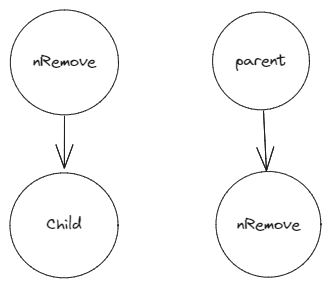

[# 백준 1068번](https://www.acmicpc.net/problem/1068)

##### 문제
트리에서 리프 노드란, 자식의 개수가 0인 노드를 말한다.
트리가 주어졌을 때, 노드 하나를 지울 것이다. 그 때, 남은 트리에서 리프 노드의 개수를 구하는 프로그램을 작성하시오. 노드를 지우면 그 노드와 노드의 모든 자손이 트리에서 제거된다.

##### 입력
```
n #node의 갯수
list #각 node의 부모노드(i=Node[i], list[i]=Node[i].parent)
nRemove #지울 노드
```

| node   | 0   | 1   | 2   | 3   | 4   |
| ------ | --- | --- | --- | --- | --- |
| parent | -1  | 0   | 0   | 1   | 1   |

parent가 -1인 노드가 Root노드임

##### 출력
입력으로 주어진 트리에서 입력으로 주어진 노드를 지웠을 때, 리프 노드의 개수를 출력한다.


Node를 지우려면 어떻게 할 지 고민해봤다.
- index가 Node의 이름이기 때문에 단순히 pop()을 해버리면 뒤의 노드들이 하나씩 앞으로 당겨지면서 노드들의 이름도 바뀌어 버린다.
- {Node : Parent} 쌍의 dictionary로 하면 해결될듯

- 기존의 인덱스는 유지한 채  지울 노드만 인식되지 않게 하는 것이 관건인데, 여기서 두가지 조건이 발생한다.
	1. 부모 Node로 인식되지 않을 것
	2. 자식 Node로 인식되지 않을 것





- list, dfs 사용

```
import sys
sys.setrecursionlimit(10**9)


n=int(sys.stdin.readline())
lParents=list(map(int,sys.stdin.readline().split()))

nRoot=lParents.index(-1) #nRemove가 nRoot인 경우를 대비해 미리 root 저장
nRemove=int(sys.stdin.readline())
lParents[nRemove]=n #nRemove가 자식으로 인식되지 않게 하기 위해 nRemove의 parents를 n으로 설정(node들의 이름은 0~n이므로 안겹침)

cnt = 0

def dfs(x):
    if x == nRemove:
        return #자기 자신이 nRemove면 리턴
    xChild=[i for i in range(n) if lParents[i]==x]
    #x노드의 child 계산

	#만약 child가 없으면 1 더함
	if len(xChild)==0:
        global cnt
        cnt+=1
        return

	#x의 child에 대하여 dfs 실행
    for c in xChild:
        dfs(c)

dfs(nRoot)

print(cnt)

```


### 후기
child, parent 양방향의 관점에서 생각해야 해서 그런지 까다로운 문제였다.