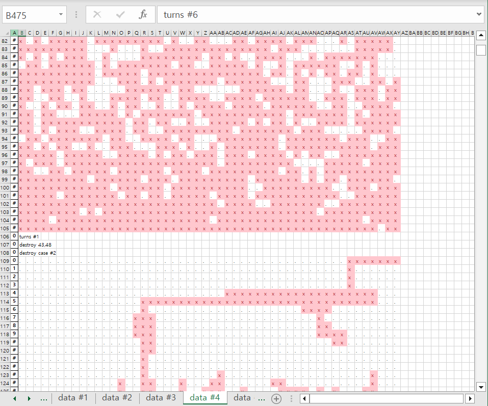

[백준 18500](https://www.acmicpc.net/problem/18500)

#### 문제 후기
예제는 다 맞는데 자꾸 답이 틀려서 별 짓을 다하다가 결국 해결했다... 
덕분에 어제 알고리즘 문제 하나 못올림...ㅎ 원래는 매일 올리는게 목표인뎅,,, 그래서 오늘 두개 올릴 예정

질문 게시판에 예제는 다 맞고 게시판에 있는 반례도 다 맞는데, 계속 오답이 나온다며  글을 올린 사람이 많았는데, 동질감을 느끼며 갑자기 오기가 발동했다. 고통의시작.

테스트케이스는 문제 출처에 있는 
Croatian Highschool Competitions in informatics 
사이트에서 찾았고, 모든 케이스를 돌리고 엑셀로 저장> 모든 결과를 확인해서 결국 해결했당...ㅎ
너무 감동적이라 구구절절 소감문 쓰는중

그나마 다행이라면 테케 4에서 해결했다는점...?
여기서 못찾으면 테케5에서 찾아야됐음..ㅎ


#### 틀린 이유 정리해드림(나만 해당될수도)
1. 오른쪽에서 던질 때 

```
if 홀수번:
mult=-1
for i in range(col):
	if cave[height][i*mult]=='x'
	
```

이 방법을 사용하면 오른쪽에서 시작하긴 하지만, 시작 인덱스가 col-1이 아닌 0이 되어 결과가 달라진다.
2. cluter가 분리되어 아래로 떨어질 때 해당 cluster 내의 모든 mineral들을 확인해야됨.
	1. 만약 맨 아랫층의 미네랄들만 확인하면 내려가다가 중간에 멈추는 일이 생겨버림...ㅎ

#### 코드
```
import sys
from sys import stdin as s


row,col=map(int, s.readline().split())
cave=[]
for _ in range(row):
    cave.append(list(s.readline().rstrip()))
n=int(s.readline())
heights=list(map(int, s.readline().split()))
dr=[1,-1,0,0]
dc=[0,0,1,-1]
    
visited=[[False]*col for _ in range(row)]
def clear():
    for i in range(row):
        for j in range(col):
            visited[i][j]=False
def gravity(clus): #클러스터가 떨어지는지 확인
    floor=0
    for c in clus:
        if floor<c[0]:
            floor=c[0] #맨 아랫층 확인
    if floor==row-1:
        # print(f"gravity case #1") #바닥에 붙어있는 경우
        return
    # print(f'gravity case #2') # 클러스터가 떠있는 경우
    down=True
    for [x,y] in clus:
        cave[x][y]='.'#일단 클러스터 삭제
    
    cnt=0
    while down: #내려감
        cnt+=1 #내려가는 횟수
        if floor+cnt==row-1:
            break #만약 가장 아랫층이 row-1이면 break
        for cl in clus:
            x,y=cl
            if cave[cl[0]+cnt+1][y]=='x': #다른 미네랄을 만나면
                down=False
    for cl in clus:
        cl[0]+=cnt #내려간 횟수만큼 더해주기
    for [x,y] in clus:
        cave[x][y]='x'#클러스터 복구


def destroy(x,y):
    clear()

    clus1=cluster(x,y)#부셔지는 미네랄 확인
    len1=len(clus1)
    cave[x][y]='.'
    if len1==1:
        # print("destroy case #1")#클러스터의 크기가 1이면 리턴
        return

    a,b=clus1[1]
    clear()
    clus2=cluster(a,b)
    len2=len(clus2)
    if len1==len2+1:#클러스터가 분리되지 않았으면 return
        # print("destroy case #2")
        return
    
    # print("destroy case #3")#클러스터가 분리된 경우
    clus3=[cl for cl in clus1 if cl not in clus2]
    clus3.remove([x,y])#기존 클러스터에서 clus2와 [x,y]를 제외하여 또다른 클러스터 확인

	#분리된 각 클러스터에 대해 중력 확인
    gravity(clus2)
    gravity(clus3)

def cluster(x,y):#아마 여기까지 온사람은 bfs에서는 안막혔을 것 같으니 더이상의 자세한 설명은 생략한다.
    queue=[[x,y]]
    visited[x][y]=True
    clus=[]
    while queue:
        i,j=queue.pop(0)    
        clus.append([i,j])
        for d in range(4):
            nr, nc = i+dr[d], j+dc[d]
            if 0<=nr<row and 0<=nc<col and not visited[nr][nc] and cave[nr][nc]=='x':
                visited[nr][nc]=True
                queue.append([nr,nc])
                    
    return clus

for i in range(n):
    h=row-heights[i]
    # print(f'turn #{i}, height: {h}')
    if i%2==0:
        for j in range(col):
            if cave[h][j]=='x':
                # print(f"distroy {h},{j}")
                destroy(h,j)
                break
    else:
        for j in range(col-1,-1,-1):
            if cave[h][j]=='x':
                # print(f"destroy {h},{j}")
                destroy(h,j)
                break

# print("result")
for i in range(row):
    print("".join(cave[i]))
```


만약 이 글을 보고 안풀린다면 댓글로 질문주세요....