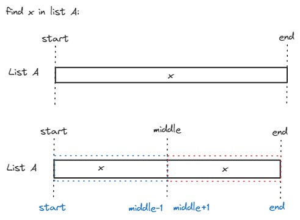

[백준 1920번](https://www.acmicpc.net/problem/1920)
대표적인 이진탐색 문제이다.
##### 이진탐색이란?
정렬된 List에서 탐색 범위를 절반씩 좁혀가며 데이터를 탐색하는 방법.

예를 들어 A라는 list에서 x라는 값을 찾는다고 치자.
만약 x가 A(middle)보다 작다면 x는 start와 middle 사이에 있을 것이고(파란 영역), x가 A(middle)보다 크다면 x는 middle과 end 사이에 있을 것이다(빨간 영역).
A(middle)이 x와 일치하면 탐색을 중단한다.



### 문제 풀이

##### 입력
```
n #len(A)
list A
m #len(B)
list B
```

#### 코드
```
import sys
n=int(sys.stdin.readline())
A=list(map(int,sys.stdin.readline().split()))
m=int(sys.stdin.readline())
B=list(map(int,sys.stdin.readline().split()))
A.sort()

def bs(x):
    start = 0
    end=n-1

    while start<end:
        middle=(start+end)//2
        # print(f"{start}, {middle}, {end}")
        if A[middle]==x:
            start=middle
            break
        if A[middle]<x:
            start=middle+1
            #middle은 이미 확인했으니 범위에서 제외
        else:
            end=middle-1
            #middle은 이미 확인했으니 범위에서 제외
    res=1 if A[start]==x else 0
    print(res)
for i in range(m):
    bs(B[i])
```

