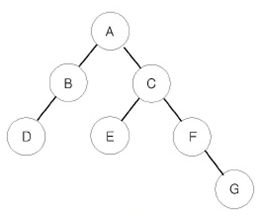

[백준 1991](https://www.acmicpc.net/problem/1991)

##### 문제
이진 트리를 입력받아 전위 순회(preorder traversal), 중위 순회(inorder traversal), 후위 순회(postorder traversal)한 결과를 출력하는 프로그램을 작성하시오.

예를 들어 위와 같은 이진 트리가 입력되면,

- 전위 순회한 결과 : ABDCEFG // (루트) (왼쪽 자식) (오른쪽 자식)
- 중위 순회한 결과 : DBAECFG // (왼쪽 자식) (루트) (오른쪽 자식)
- 후위 순회한 결과 : DBEGFCA // (왼쪽 자식) (오른쪽 자식) (루트)

##### 입력
```
n #node의 개수
for _ in range(n):
	노드, 왼쪽 자식노드, 오른쪽 자식노드 #자식노드가 없으면 .으로 표시함
```

##### 문제 풀이
- 전위, 중위, 후위는 부모 노드 기준, 자식 노드는 항상 왼->오로 진행
1. 전위 순회: 노드->왼쪽 자식->오른쪽 
2. 중위 순회: 왼쪽 자식->노드->오른쪽 자식
3. 후위 순회: 왼쪽 자식-> 오른쪽 자식->노드

```
import sys

sys.setrecursionlimit(10)

  

n = int(sys.stdin.readline())

  

tree={} #index로 노드를 찾기 위해 tree를 dictionary로 선언

for i in range(n):

    a,b,c=sys.stdin.readline().split()

    tree[a]=[b,c]


def preord(x):

    print(x,end='') #우선 자기자신부터 출력

    if tree[x][0]!='.':

        preord(tree[x][0]) #왼쪽이 있으면 preord함수 실행

    if tree[x][1]!='.':

        preord(tree[x][1]) #오른쪽이 있으면 preord 실행

  

def inord(x):

    if tree[x][0]!='.':

        inord(tree[x][0])

    print(x,end='')

    if tree[x][1]!='.':

        inord(tree[x][1])

  

def postord(x):

    if tree[x][0]!='.':

        postord(tree[x][0])

    if tree[x][1]!='.':

        postord(tree[x][1])

    print(x,end='')

  

preord('A')

print()

inord('A')

print()

postord('A')
```

