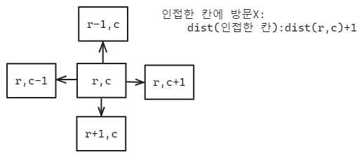

[백준 2178](https://www.acmicpc.net/problem/2178)

##### 미로 탐색
N×M크기의 배열로 표현되는 미로가 있다.
미로에서 1은 이동할 수 있는 칸을 나타내고, 0은 이동할 수 없는 칸을 나타낸다. 이러한 미로가 주어졌을 때, (1, 1)에서 출발하여 (N, M)의 위치로 이동할 때 지나야 하는 최소의 칸 수를 구하는 프로그램을 작성하시오. 한 칸에서 다른 칸으로 이동할 때, 서로 인접한 칸으로만 이동할 수 있다.

| 1   | 0   | 1   | 1   | 1   | 1   |
| --- | --- | --- | --- | --- | --- |
| 1   | 0   | 1   | 0   | 1   | 0   |
| 1   | 0   | 1   | 0   | 1   | 1   |
| 1   | 1   | 1   | 0   | 1   | 1   |

위의 예에서는 15칸을 지나야 (N, M)의 위치로 이동할 수 있다. 칸을 셀 때에는 시작 위치와 도착 위치도 포함한다.

##### 입력
```
n,m # 행: n, 열: m
for i in range(n):
	graph[i]
```

##### 문제 풀이
1. (0,0)에서 (r,c) 사이의 거리는 (r,c)와 인접한 4개의 칸의 거리의 최소값+1이다.


2. 시작점이 주어져 있으므로 (r,c)에서 인접한 칸들의 거리를 계산하며 bfs를 시행했다.


3. bfs에서 먼저 queue에 추가될 수록 가까움


```
import sys

sys.setrecursionlimit(10**2)

n,m = map(int, sys.stdin.readline().split()) #row, columns

  

graph = []

for i in range(n):

    graph.append(list(map(int,sys.stdin.readline().rstrip())))

dr=[-1,1,0,0]

dc=[0,0,-1,1] 


def bfs(x,y):

    queue=[[x,y]]

    while queue:

        a,b=queue.pop(0)

        for i in range(4): #4개의 인접한 칸까지의 거리 업데이트

            nr=a+dr[i]

            nc=b+dc[i]

            if 0<=nr<n and 0<=nc<m and graph[nr][nc]!=0:  #nr,nm이 갈 수 있는 칸인 경우

                if graph[nr][nc]==1: #n,m에 아직 방문한 적이 없으면

                    queue.append([nr,nc])

                    graph[nr][nc]=graph[a][b]+1

bfs(0,0)

print(graph[n-1][m-1])
```

### 후기
인접한 칸과의 관계를 생각하면 풀 수 있었다.