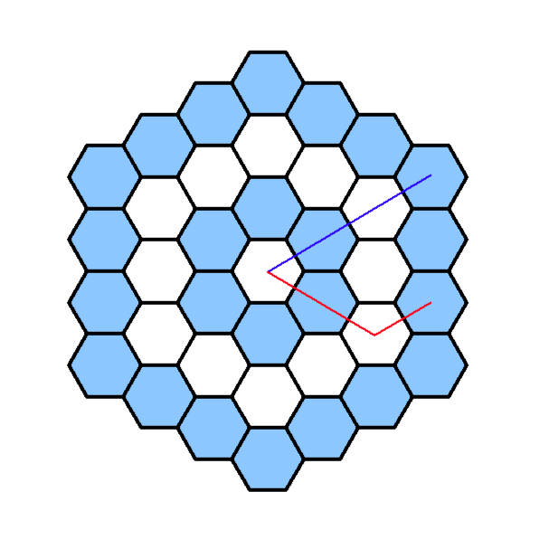

사용 개념: 반복문(for loop)



i번째 껍데기에 있는 벌집들은 모두 거리가 같다. 
위의 그림에서 살펴보면 파란색의 거리 = 빨간색의 거리임을 알 수 있음(정육각형을 6개로 쪼개면 정삼각형이니까)
따라서 이 문제는 몇 번째 껍질에 있는 벌집인지 계산을 하면 답을 구할 수 있다.


0부터 시작하여 각 껍질의 마지막 방 번호를 계산해보면 

| 0   | 1   | 2   | 3   | ... | n             |
| --- | --- | --- | --- | --- | ------------- |
| 0   | 6   | 18  | 36  | ... | 3 x n x (n+1) |

임을 알게 된다.(간단한 수학임)


```
import sys

n = int(sys.stdin.readline())

n-=1 #입력은 1부터 수를 세지만 0부터 세는게 편하므로 1 빼줌

x = 0

while(3 * x * (x+1) < n):
    x+=1

print(x+1)

```

### 후기
처음에는 이걸 어떻게 구해야 할지 막막했는데, 껍데기를 기준으로 거리를 구해보니 생각보다 금방 풀 수 있었다.