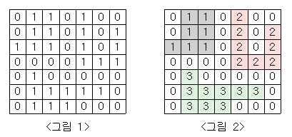

[백준 2667](https://www.acmicpc.net/problem/2667)

#### 문제
<그림 1>과 같이 정사각형 모양의 지도가 있다. 1은 집이 있는 곳을, 0은 집이 없는 곳을 나타낸다. 철수는 이 지도를 가지고 연결된 집의 모임인 단지를 정의하고, 단지에 번호를 붙이려 한다. 여기서 연결되었다는 것은 어떤 집이 좌우, 혹은 아래위로 다른 집이 있는 경우를 말한다. 대각선상에 집이 있는 경우는 연결된 것이 아니다. <그림 2>는 <그림 1>을 단지별로 번호를 붙인 것이다. 지도를 입력하여 단지수를 출력하고, 각 단지에 속하는 집의 수를 오름차순으로 정렬하여 출력하는 프로그램을 작성하시오.



#### 입력
```
n#지도의 크기
for i in range(n):
	i행의 정보
```


#### 풀이 과정
1. 1을 찾는다.
2. 인접한 4개의 칸을 조사하여 1이면 인접한 칸을 다시 조사한다.(bfs)
3. 방문한 칸의 값은 -1로 바꾸어 중복을 피한다.

```
import sys

sys.setrecursionlimit(10**9)

  

n = int(sys.stdin.readline())

graph = []

for _ in range(n):

    graph.append(list(map(int,sys.stdin.readline().rstrip())))

  

dr = [1,-1,0,0]

dc = [0,0,1,-1]

  

danji=[]

  

def bfs(r,c):

    queue=[[r,c]]

    cnt=0

    graph[r][c]=-1

    while queue:

        x,y=queue.pop(0)

        cnt+=1

        for i in range(4):

            nr=x+dr[i]

            nc=y+dc[i]

            if 0<=nr<n and 0<=nc<n and graph[nr][nc]==1:

                graph[nr][nc]=-1

                queue.append([nr,nc])

    danji.append(cnt)

  

for i in range(n):

    for j in range(n):

        if graph[i][j]==1:

            bfs(i,j)

print(len(danji))

for d in sorted(danji):

    print(d)
```