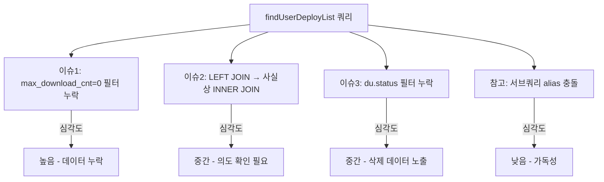

## 증상

배포 파일 목록 조회 쿼리(`findUserDeployList`)에서 `max_download_cnt = 0`(무제한 다운로드)인 배포 건이 조회되지 않는 문제.

## 추적 과정

### 문제 쿼리

```sql
AND du.download_cnt < d.max_download_cnt
```

`max_download_cnt = 0`이면 `download_cnt < 0`은 항상 false → 무제한 배포인데 결과가 0건.

### 서비스 레이어와의 비교

Java 코드(`DeployService.updateUserDeploymentStatus`)에서는 가드 조건이 있었음:

```java
if (deploy.getMaxDownloadCnt() > 0 && d.getDownloadCnt() >= deploy.getMaxDownloadCnt()) {
    // maxDownloadCnt > 0 일 때만 체크
}
```

하지만 MyBatis 쿼리에는 이 가드가 누락됨.

## 원인

SQL에서 `max_download_cnt = 0`(무제한)에 대한 예외 처리 없이 단순 비교만 수행.

## 수정

```sql
-- Before
AND du.download_cnt < d.max_download_cnt

-- After
AND (d.max_download_cnt = 0 OR du.download_cnt < d.max_download_cnt)
```

## 함께 발견된 이슈



### LEFT JOIN이 사실상 INNER JOIN

```sql
LEFT JOIN tb_asfs_attach a ON a.auth_key = CONCAT(...)
...
AND a.status = 'A'   -- WHERE 절에서 LEFT JOIN 테이블 필터 → NULL 행 제거
```

LEFT JOIN 의도 유지 시 ON절로 이동 필요.

### du.status 필터 누락

동일 목적의 `userDeployment` fragment에는 `status NOT IN ('E','R','S')` 필터가 있지만, `findUserDeployList`에는 없음.
