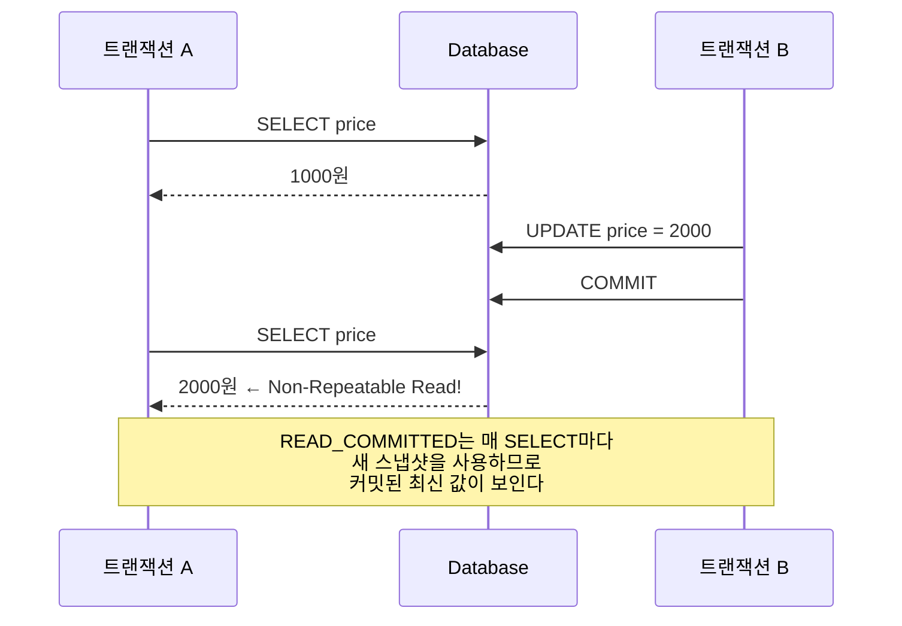

## 질문

READ_COMMITTED는 커밋된 데이터만 읽는다는 건데, 왜 같은 트랜잭션 안에서 같은 데이터를 두 번 읽으면 값이 달라지는가?

## 핵심 원리

READ_COMMITTED가 보장하는 것은 **"커밋 안 된 데이터는 안 보여준다"**뿐이다. **"한 트랜잭션 안에서 읽기 결과가 항상 같다"**는 보장하지 않는다.

READ_COMMITTED는 **매 SELECT마다 새로운 스냅샷**을 사용한다. 따라서 두 번의 SELECT 사이에 다른 트랜잭션이 커밋을 완료하면, 두 번째 SELECT에서는 커밋된 최신 값이 보인다.

## 시나리오

T3에서 B가 커밋을 완료했으므로, T4 시점에서 READ_COMMITTED 입장에서 2000원은 정당한 커밋된 데이터다. 그래서 읽을 수 있다. 결과적으로 A는 같은 쿼리를 두 번 날렸는데 값이 다르다.

## 격리 수준별 스냅샷 시점 차이

| 격리 수준 | 스냅샷 기준 | 결과 |
|---|---|---|
| READ_COMMITTED | 매 쿼리마다 새 스냅샷 | 중간 커밋 반영됨 |
| REPEATABLE_READ | 트랜잭션 시작 시점 고정 | 중간 커밋 무시됨 |

REPEATABLE_READ는 트랜잭션이 시작된 시점의 스냅샷을 고정하므로, T4에서도 여전히 1000원이 보인다.

## 관련 문서
- [[TRANSACTION|트랜잭션]]
- [[ACID 원칙]]
- [[Propagation & Isolation|Spring 전파행위 & 격리수준]]
