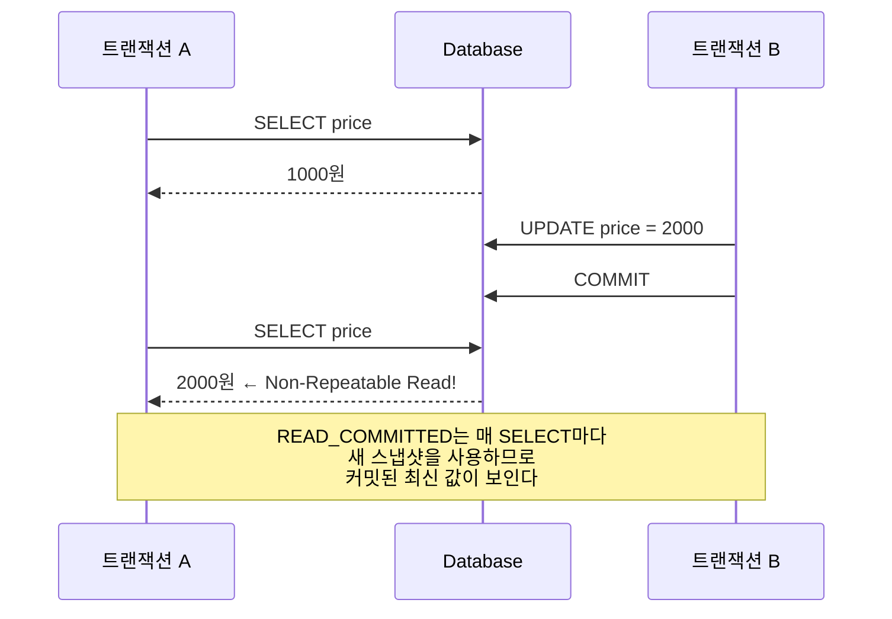

## 질문

READ_COMMITTED는 커밋된 데이터만 읽는다는 건데, 왜 같은 트랜잭션 안에서 같은 데이터를 두 번 읽으면 값이 달라지는가?

## 핵심 원리

READ_COMMITTED가 보장하는 것은 **"커밋 안 된 데이터는 안 보여준다"**뿐이다. **"한 트랜잭션 안에서 읽기 결과가 항상 같다"**는 보장하지 않는다.

READ_COMMITTED는 **매 SELECT마다 새로운 스냅샷**을 사용한다. 따라서 두 번의 SELECT 사이에 다른 트랜잭션이 커밋을 완료하면, 두 번째 SELECT에서는 커밋된 최신 값이 보인다.

## 시나리오

T3에서 B가 커밋을 완료했으므로, T4 시점에서 READ_COMMITTED 입장에서 2000원은 정당한 커밋된 데이터다. 그래서 읽을 수 있다. 결과적으로 A는 같은 쿼리를 두 번 날렸는데 값이 다르다.

## 격리 수준별 스냅샷 시점 차이

| 격리 수준 | 스냅샷 기준 | 결과 |
|---|---|---|
| READ_COMMITTED | 매 쿼리마다 새 스냅샷 | 중간 커밋 반영됨 |
| REPEATABLE_READ | 트랜잭션 시작 시점 고정 | 중간 커밋 무시됨 |

REPEATABLE_READ는 트랜잭션이 시작된 시점의 스냅샷을 고정하므로, T4에서도 여전히 1000원이 보인다.

## 트랜잭션 격리 수준 4종과 부작용

격리 수준은 동시성 제어 강도를 단계별로 정의한 표준(SQL-92)이다. 강도가 올라갈수록 부작용은 줄지만 동시성·성능은 떨어진다.

| 격리 수준 | Dirty Read | Non-Repeatable Read | Phantom Read | 비고 |
|---|:---:|:---:|:---:|---|
| READ_UNCOMMITTED | 발생 | 발생 | 발생 | 커밋 전 데이터까지 읽음 |
| READ_COMMITTED | 차단 | 발생 | 발생 | 대부분 DB의 기본값 (Oracle, PostgreSQL 등) |
| REPEATABLE_READ | 차단 | 차단 | 발생* | MySQL/MariaDB의 기본값. InnoDB는 갭 락으로 Phantom도 사실상 차단 |
| SERIALIZABLE | 차단 | 차단 | 차단 | 트랜잭션을 직렬화. 동시성 가장 낮음 |

### 세 가지 부작용

- **Dirty Read**: 다른 트랜잭션이 **아직 커밋하지 않은** 데이터를 읽는다. 그 트랜잭션이 롤백되면 존재하지 않은 값을 본 셈이 된다.
- **Non-Repeatable Read**: 같은 트랜잭션 안에서 **같은 행**을 두 번 읽었을 때 값이 달라진다. 사이에 다른 트랜잭션이 UPDATE/DELETE 후 커밋했기 때문이다. (이 글의 주제)
- **Phantom Read**: 같은 트랜잭션 안에서 **같은 조건의 범위 쿼리**를 두 번 실행했을 때 행 개수가 달라진다. 사이에 다른 트랜잭션이 INSERT 후 커밋했기 때문이다.

Non-Repeatable Read는 "이미 읽은 행의 값이 바뀌는 문제"이고, Phantom Read는 "조건에 맞는 행이 새로 생기거나 사라지는 문제"라는 점에서 구분된다.
