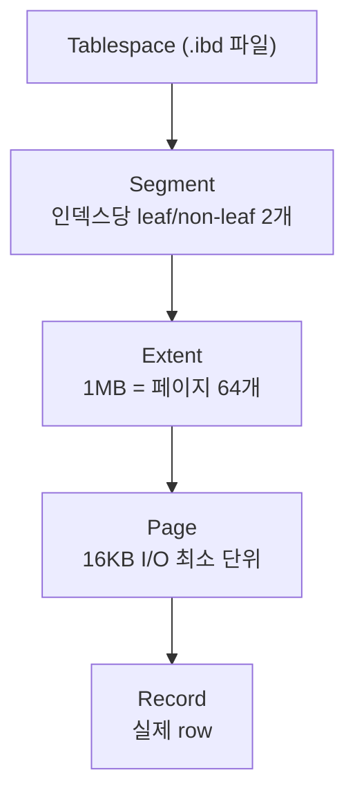
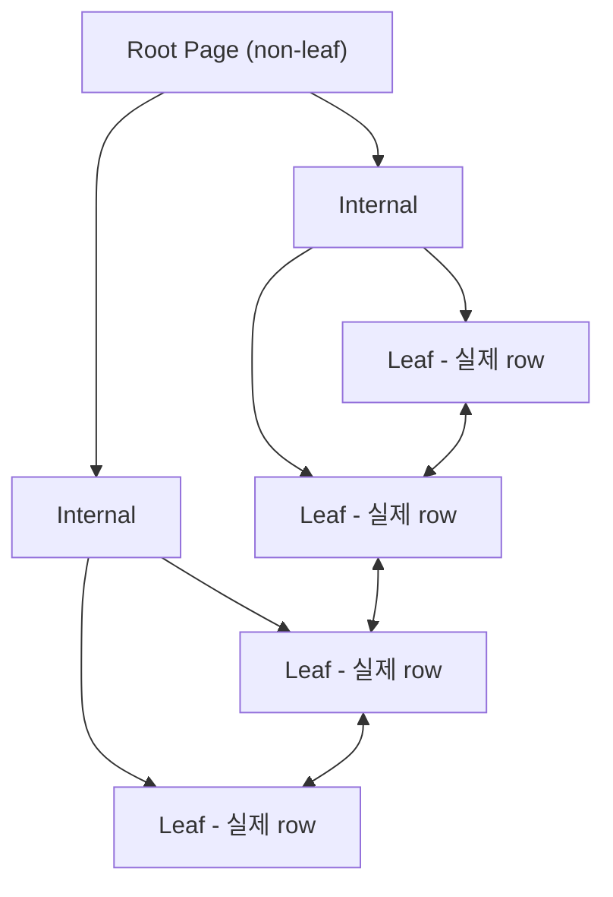
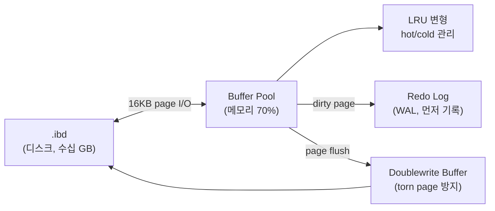

> 관련 사건 기록: Docker 컨테이너 로그가 2TB까지 차오른 디스크 풀 장애 추적기 — [[index|Docker/disk-log-trouble]] (Phase별 상세) / [[007_incident_postmortem]] (종합 포스트모템).

## 발단: DB 테이블이 전부 사라졌다

Docker 컨테이너로 띄워둔 MariaDB가 재기동 후 이상해졌다. DB 자체에는 접속이 되는데, **사용자가 만든 테이블이 전부 사라져 있었다.** 동료 한 명은 "도커 볼륨 오버레이 어쩌구 문제로 데이터가 날아간 것 같다"고 했다. 정황상 그게 맞아 보였지만, 정확히 어떤 메커니즘으로 사라진 건지, 복구는 정말 불가능한지 직접 확인해보기로 했다.

## 1. 복구 가능성 — 어디서 찾을 수 있나

도커 환경에서 DB 데이터가 살아남을 수 있는 위치는 크게 네 군데다.

| 후보 | 검사 방법 |
|---|---|
| **현재 컨테이너의 마운트** | `docker inspect`로 어떤 볼륨을 쓰는지 확인 |
| **dangling volume** | `docker volume ls -f dangling=true` |
| **stopped 컨테이너의 R/W 레이어** | `docker ps -a`에서 옛 컨테이너가 살아있는지 |
| **호스트 bind mount 경로** | `find / -name "ibdata1"` 등으로 직접 탐색 |

이 네 군데를 순서대로 훑어봤다.

### 1-1. 컨테이너 상태와 현재 마운트 확인

먼저 살아있는 컨테이너의 상태와 어떤 볼륨을 쓰고 있는지부터.

```bash
# 컨테이너 상태 (stopped 포함)
docker ps -a | grep -iE 'maria|mysql'

# 컨테이너 로그에서 에러 단서
docker logs <컨테이너명> --tail 100

# 현재 마운트 구성 (Mounts 섹션)
docker inspect <컨테이너명> | grep -A 30 Mounts

# 외부 인증 문제 vs 내부 문제 분리 — 컨테이너 안으로 들어가서 직접 시도
docker exec -it <컨테이너명> mariadb -u root -p
```

현재 컨테이너는 떠 있고 DB 접속도 됐다. 다만 사용자 테이블만 없는 상태였다 → "마운트 자체가 잘못된 게 아니라, 마운트한 볼륨이 빈 새 볼륨일 가능성"이 떠올랐다.

### 1-2. anonymous volume 스캔

```bash
# 해시 이름의 익명 볼륨만 추리기
docker volume ls -q | grep -E '^[a-f0-9]{64}$'
```

해시 이름의 익명 볼륨들이 잔뜩 떠다니고 있었다. 익명 볼륨은 `-v /var/lib/mysql`처럼 호스트 경로 없이 mount path만 적었을 때 도커가 자동으로 만드는 볼륨이다. 컨테이너 recreate 시점에 새 해시로 다시 만들어지면서 이전 볼륨은 dangling 상태로 남는다 — 잃어버린 데이터가 여기 남아있을 가능성이 있다.

각 해시 볼륨을 마운트 포인트까지 따라가 `ibdata1`, `mysql/` 디렉터리가 있는지 한 번에 스캔.

```bash
for v in $(docker volume ls -q | grep -E '^[a-f0-9]{64}$'); do
  mp=$(docker volume inspect $v -f '{{.Mountpoint}}')
  if sudo test -f "$mp/ibdata1" || sudo test -d "$mp/mysql"; then
    echo "=== MariaDB 데이터 발견: $v ==="
    sudo ls "$mp" | head
    sudo stat -c '%y' "$mp/ibdata1" 2>/dev/null
  fi
done
```

결과는 **빈손**. 해시 볼륨 어디에도 MariaDB 데이터는 없었다.

### 1-3. dangling volume 확인

```bash
docker volume ls -f dangling=true
```

```
DRIVER    VOLUME NAME
local     mariadb_data
```

`mariadb_data`라는 named 볼륨 하나가 dangling 상태로 남아있다. inspect로 메타데이터(라벨, 마운트 경로, 생성 시각)를 확인.

```bash
docker volume inspect mariadb_data
```

```json
{
  "CreatedAt": "2026-05-19T15:28:47+09:00",
  "Driver": "local",
  "Labels": {
    "com.docker.compose.project": "mariadb",
    "com.docker.compose.version": "2.21.0",
    "com.docker.compose.volume": "data"
  },
  "Mountpoint": "/home/.../docker/overlay/volumes/mariadb_data/_data",
  "Name": "mariadb_data"
}
```

라벨이 단서를 모두 준다.

- `com.docker.compose.project: "mariadb"` — compose 프로젝트명이 "mariadb"
- `com.docker.compose.volume: "data"` — compose 파일 안에서는 `data`라는 이름의 named volume이었고, 도커가 `<project>_<volume>` 규칙으로 `mariadb_data`로 만든 것
- `Mountpoint`의 `/home/.../docker/overlay/...`는 **도커 storage driver의 overlay와 무관**하다. 단지 `/etc/docker/daemon.json`의 `data-root`가 그렇게 설정돼있을 뿐이다. "overlay 문제" 가설은 여기서 약간 잘못 짚었던 것

## 2. dangling volume 안을 들여다보다

`Mountpoint` 경로로 직접 들어가 안의 파일을 살핀다. 크기와 파일 목록 둘 다 확인.

```bash
sudo ls -la /home/.../docker/overlay/volumes/mariadb_data/_data
sudo du -sh /home/.../docker/overlay/volumes/mariadb_data/_data
```

```
drwxr-xr-x 5 root    root       4096 May 19 15:28 .
-rw-rw---- 1 polkitd input    417792 May 19 15:28 aria_log.00000001
-rw-rw---- 1 polkitd input  12582912 May 19 11:10 ibdata1
-rw-rw---- 1 polkitd input 100663296 May 19 11:10 ib_logfile0
-rw-r--r-- 1 polkitd input        14 May 19 11:10 mariadb_upgrade_info
drwx------ 2 polkitd input      4096 May 19 11:10 mysql
-rw-rw---- 1 polkitd input       328 May 19 11:10 mysql-bin.000001
...
drwx------ 2 polkitd input        28 May 19 11:10 performance_schema
drwx------ 2 polkitd input      8192 May 19 11:10 sys
-rw-rw---- 1 polkitd input  10485760 May 19 11:10 undo001
```

```
du -sh: 143M
```

크기는 143MB라 데이터가 있어 보이지만, 자세히 보면 의심스럽다.

- `ib_logfile0` 100MB, `undo001~003` 30MB, `ibdata1` 12MB — 모두 **InnoDB가 빈 상태에서 만드는 기본 크기**
- 디렉터리는 `mysql/`, `performance_schema/`, `sys/` 세 개뿐
- 모두 같은 시각 `May 19 11:10`에 생성됨 = **오늘 처음 부팅된 빈 인스턴스**
- `mariadb_upgrade_info`가 11:10에 만들어진 것도 결정적 단서 (MariaDB 첫 부팅 시 한 번 생성)

**여기에 잃어버린 데이터는 없다.** 이 볼륨은 오늘 새로 부팅된 빈 MariaDB이고, 실제 사라진 데이터는 다른 곳(이전 컨테이너의 R/W 레이어 또는 사라진 bind mount 경로)에 있었다가 GC된 것으로 보인다.

마지막 시도로 stopped 컨테이너와 호스트 파일시스템도 훑었다.

```bash
# stopped 컨테이너에 옛 마운트 흔적이 남아있는지
docker ps -a --filter status=exited | grep -iE 'maria|mysql'
docker inspect <stopped-컨테이너ID> | grep -A 30 Mounts

# 호스트 어디든 ibdata1이 남아있는지 직접 검색
sudo find /home /opt /data /var -name "ibdata1" 2>/dev/null
sudo find /home /opt /data /var -type d -name "mysql" 2>/dev/null

# compose 파일이 git 관리됐다면 이전 버전에서 원래 마운트 확인
git log --all -- docker-compose.yml
git show HEAD~1:docker-compose.yml
```

여기까지도 빈손이면 데이터는 사실상 복구 불가다.

그런데 이 빈손 결과를 들여다보다가 다른 의문이 생겼다. **왜 시스템 DB 세 개는 디렉터리고, 만약 사용자 테이블이 있었다면 어떤 모양으로 남아있어야 했는가?**

## 3. 발견: DB = 폴더, 테이블 = 파일

MariaDB/MySQL의 datadir은 다음 규칙을 따른다.

```
/var/lib/mysql/                  datadir
├── mysql/                       시스템 DB "mysql" (계정/권한)
├── performance_schema/          시스템 DB
├── sys/                         시스템 DB
├── myapp/                       CREATE DATABASE myapp → 폴더
│   ├── users.ibd                ├ CREATE TABLE users(...) → 파일
│   └── orders.ibd               └ CREATE TABLE orders(...) → 파일
├── ibdata1                      InnoDB 시스템 tablespace (공용)
├── ib_logfile0                  InnoDB redo log
└── undo001~003                  undo tablespace
```

계층은 단순하다.

| 레벨 | 디스크 표현 |
|---|---|
| **Database (schema)** | 디렉터리 1개 |
| **Table** | 디렉터리 안의 파일들 |

테이블이 만드는 파일은 엔진에 따라 다르다.

| 엔진 | 테이블 1개가 만드는 파일 |
|---|---|
| **InnoDB** (기본) | `테이블명.ibd` (`innodb_file_per_table=ON`, 기본) |
| **MyISAM** | `테이블명.MYD` + `테이블명.MYI` (+ 구버전은 `.frm`) |
| **Aria** | `테이블명.MAD` + `테이블명.MAI` |

> 참고: 원래 InnoDB는 모든 테이블 데이터를 `ibdata1` 하나에 욱여넣었다(system tablespace). MySQL 5.6 이후 `innodb_file_per_table=ON`이 기본이 되어 지금은 테이블마다 `.ibd` 파일이 분리된다.

이 시점에서 아까 본 dangling 볼륨의 상태가 명확해졌다. **사용자 DB 디렉터리가 단 하나도 없다 = 사용자 테이블이 만들어진 흔적이 없다.** "테이블이 사라졌다"는 표현이 실제로는 "사용자 DB 폴더 자체가 없다 = `.ibd` 파일이 한 번도 만들어지지 않았거나, 그 폴더가 통째로 사라졌다"는 사실로 정확히 환원된다.

## 4. 따라온 의문 1: SHOW DATABASES도 폴더 스캔인가?

DB가 폴더라면 `SHOW DATABASES`는 그냥 datadir 디렉터리 목록을 보여주는 것일까. MariaDB에서는 거의 그렇다.

```
1. datadir 안의 디렉터리 목록을 readdir로 읽음
2. 권한 필터 적용
3. information_schema 같은 가상 DB는 코드에서 별도로 추가
4. 결과 반환
```

그래서 다음 동작이 실제로 일어난다.

| 행동 | 결과 |
|---|---|
| 서버 정지 후 `mkdir /var/lib/mysql/foo` | 서버 켜면 `SHOW DATABASES`에 `foo` 등장 |
| `rmdir /var/lib/mysql/mydb` | 다음 조회에서 `mydb` 사라짐 |

물론 모든 DB가 폴더는 아니다.

| DB 이름 | 디스크에 폴더? | 정체 |
|---|---|---|
| `information_schema` | ❌ | 가상 DB. 쿼리마다 메모리에서 동적 생성 |
| `performance_schema` | ✅ (빈 껍데기) | 실제 데이터는 PFS storage engine (메모리) |
| `mysql`, `sys` | ✅ | 시스템 DB |
| 사용자 DB | ✅ | `CREATE DATABASE`로 생긴 폴더 |

> 단, **MySQL 8.0**부터는 디렉터리 스캔이 아니다. Data Dictionary가 도입되어 메타데이터를 `mysql.schemata`, `mysql.tables` 같은 InnoDB 시스템 테이블에 보관한다. `mkdir`로 폴더만 만들어도 인식되지 않는다.

## 5. 따라온 의문 2: 폴더만 복사해 옮기면 외부에서 읽을 수 있는가?

직관적으로는 될 것 같다. DB가 폴더고 테이블이 파일이라면, 폴더 통째 복사해서 다른 MariaDB datadir에 넣으면 그대로 인식되어야 하지 않을까. **엔진에 따라 다르다.**

| 엔진 | 폴더 복사로 이식? | 이유 |
|---|---|---|
| **MyISAM** | ✅ 거의 그냥 됨 | 테이블 파일 안에 모든 정보가 자기완결적 |
| **Aria** | ✅ 거의 그냥 됨 | 위와 동일 |
| **InnoDB** | ❌ 깨짐 | 메타데이터/트랜잭션 정보가 외부 파일과 묶임 |

InnoDB가 단순 복사로 안 되는 이유는 `.ibd` 파일이 자기완결적이지 않기 때문이다.

```
mydb/users.ibd          space_id, table_id만 들고 있음
        ↑↓ 참조
ibdata1                 Data Dictionary: "table_id 42 = mydb.users, 스키마=..."
ib_logfile0             Redo log: 마지막 트랜잭션 상태
undo001~003             Undo log: 진행 중이던 트랜잭션
```

`users.ibd` 하나만 복사하면 받는 쪽 InnoDB는 그 `table_id`가 자기 `ibdata1`에 없어서 인식하지 못한다.

InnoDB에서 데이터를 옮기는 공식 방법은 셋이다.

1. **전체 datadir cold copy** — 양쪽 정지 후 통째 복사 (같은 버전·옵션 필수)
2. **`EXPORT/IMPORT TABLESPACE`** — `.ibd` + `.cfg`를 함께 옮김. `.cfg`에 `table_id`/스키마 fingerprint가 들어있어 매핑 가능
3. **`mysqldump`** — logical dump. 가장 안전, 운영 표준

여기서 자연스럽게 다음 단계로 넘어간다. 그러면 `.ibd` 파일 **안쪽**은 정확히 어떻게 생긴 건가?

## 6. InnoDB 페이지 — 모든 것의 단위

InnoDB의 모든 디스크 I/O는 **페이지(page) 단위**다. 기본 **16KB**. row 1개를 읽든 100개를 읽든, 디스크에서는 그 row가 속한 페이지 1개(16KB)가 통째로 메모리로 올라간다.

저장은 4단계 계층이다.



| 레벨 | 역할 | 크기 |
|---|---|---|
| **Tablespace** | 물리 파일. `users.ibd` 한 파일 = 한 tablespace | 가변 |
| **Segment** | 논리 묶음. B+트리의 leaf / non-leaf 페이지가 각각 별도 segment | — |
| **Extent** | 연속 할당 단위. 작은 테이블은 페이지 32개까지, 커지면 extent 단위 | 1MB |
| **Page** | 모든 read/write 단위 | **16KB** (기본) |
| **Record** | 페이지 안의 row | 가변 |

페이지는 한 종류가 아니다.

| 페이지 타입 | 역할 |
|---|---|
| **FIL_PAGE_INDEX** | 테이블/인덱스 데이터 (가장 흔함) |
| **FIL_PAGE_UNDO_LOG** | undo 정보 (이전 버전, MVCC/롤백용) |
| **FIL_PAGE_INODE** | segment 메타데이터 |
| **FIL_PAGE_TYPE_FSP_HDR** | tablespace 첫 페이지 (공간 관리) |
| **FIL_PAGE_TYPE_BLOB** | TEXT/BLOB이 한 페이지를 넘을 때 |

## 7. INDEX 페이지 내부

가장 흔한 INDEX 페이지의 16KB 안쪽 구조.

```
┌──────────────────────────────────────────┐  offset 0
│ FIL Header (38 bytes)                    │   페이지 번호, 타입, LSN, checksum
├──────────────────────────────────────────┤
│ Page Header (56 bytes)                   │   레코드 수, free space 위치
├──────────────────────────────────────────┤
│ Infimum + Supremum (가상 레코드 2개)     │   페이지의 "맨 앞/맨 뒤" 경계
├──────────────────────────────────────────┤
│ User Records ↓ (위→아래로 자람)          │
│   ├ Record 1                             │
│   ├ Record 2                             │
│   ├ ...                                  │
│                                          │
│        Free Space (가운데)               │
│                                          │
│   ↑ Page Directory (아래→위로 자람)      │
│   ├ slot N                               │
│   ├ slot N-1                             │
├──────────────────────────────────────────┤
│ FIL Trailer (8 bytes)                    │   checksum, LSN 끝 (헤더와 매치)
└──────────────────────────────────────────┘  offset 16384
```

- **User Records는 위→아래, Page Directory는 아래→위로 자란다.** 가운데 free space에서 만나면 페이지 full.
- **Page Directory**는 페이지 내 검색을 빠르게 하는 sparse 인덱스 (4~8 레코드마다 슬롯 1개). 페이지 안에서 binary search가 가능해진다.
- **Infimum/Supremum**은 페이지의 시작·끝 경계를 표시하는 가상 레코드. 레코드 linked list의 head/tail.
- **FIL header LSN ↔ FIL trailer LSN이 일치**해야 valid한 페이지. 둘이 다르면 "torn page" — 16KB가 디스크에 절반만 기록된 상태. 이걸 막기 위해 **doublewrite buffer**가 존재한다.

## 8. 레코드 한 줄 — MVCC가 숨어있다

row 1개의 디스크 표현은 단순히 컬럼 값이 늘어선 것이 아니다. **MVCC를 위한 숨겨진 시스템 필드**가 같이 붙어있다.

```
[ 가변길이 컬럼 길이 리스트 ] [ NULL 비트맵 ] [ 5-byte 헤더 ]
   [ TX_ID(6B) ] [ ROLL_PTR(7B) ] [ PK ] [ 컬럼1 ] [ 컬럼2 ] ...
                                  ↑
                          여기가 record origin
```

| 필드 | 역할 |
|---|---|
| **TX_ID** (6 bytes) | 이 버전을 만든 트랜잭션 ID — MVCC 핵심 |
| **ROLL_PTR** (7 bytes) | undo log 포인터 — 이전 버전을 찾아가는 링크 |
| **next_record offset** | 페이지 내 다음 레코드 위치 (linked list) |
| **NULL bitmap** | 어떤 컬럼이 NULL인지 |
| **가변길이 리스트** | VARCHAR 같은 가변 컬럼의 실제 길이 |

핵심: **모든 row가 자기 트랜잭션 ID와 undo 포인터를 함께 들고 다닌다.** 다른 트랜잭션은 `ROLL_PTR`을 따라 undo log를 거슬러 자기 시점의 버전을 재구성한다. 락 없이 동시성을 보장하는 MVCC가 이렇게 동작한다.

## 9. B+ 트리로 묶이는 페이지들

InnoDB는 **모든 테이블이 PK 기준 B+ 트리** (clustered index). 트리의 각 노드 = 페이지 1개.



- **Leaf 페이지에만 실제 row 데이터가 있다.**
- Non-leaf 페이지는 key + 자식 페이지 번호만 들고 있다.
- **Leaf끼리 양방향 linked list로 연결** → range scan(`WHERE x BETWEEN 10 AND 100`)이 빠른 이유.
- Secondary index도 같은 B+ 트리지만 leaf에 PK 값이 들어있다. 그래서 secondary index 조회는 PK 트리를 한 번 더 타는 "double lookup"이 발생한다.

## 10. Page Split / Merge

페이지가 가득 차서 INSERT가 못 들어가면 split이 일어난다.

```
Page A (full)              Page A (절반)    Page A_new (절반)
[1,2,3,4,5,6,7,8]    →    [1,2,3,4]       [5,6,7,8]
                           ↓ insert 9
                          [1,2,3,4]       [5,6,7,8,9]
```

이 동작이 만드는 실무 영향이 크다.

| PK 패턴 | 효과 |
|---|---|
| **AUTO_INCREMENT (순차)** | 새 row가 항상 마지막 페이지 끝에 붙음 → split 거의 없음 |
| **UUIDv4 (랜덤)** | 새 row가 페이지 중간에 끼어듦 → split 폭증, fill factor 낮아짐 |
| **UUIDv7 (시간순)** | 시간 prefix 덕에 거의 순차 → split 적음 |

DELETE로 페이지가 너무 비면 임계치 아래에서 인접 페이지와 **merge**된다. 자주 비워지는 테이블의 디스크 크기가 실제 데이터보다 큰 이유.

## 11. 디스크 ↔ 메모리 — Buffer Pool



- 모든 read/write는 buffer pool을 거친다 (write-back).
- 메모리에서 수정됐는데 디스크 미반영인 **dirty page**는, 디스크 반영 전에 변경 사항이 **redo log에 먼저** 기록된다 (Write-Ahead Logging). 크래시가 나도 redo replay로 복구된다 — ARIES 알고리즘의 구현체.
- **doublewrite buffer**가 torn page를 방지한다. 16KB 페이지를 디스크에 쓰는 도중 OS 크래시 → 절반만 기록되는 사고를 막기 위해, doublewrite 영역에 먼저 쓰고 성공하면 본래 위치에 쓴다.

## 페이지 관점에서 본 흔한 운영 이슈

| 증상 | 페이지 관점 원인 | 대응 |
|---|---|---|
| INSERT 느림 (UUIDv4 PK) | 페이지 split 폭증 | 순차 PK 또는 UUIDv7 |
| 테이블 크기 > 실제 데이터 | 페이지 fill factor 낮음, DELETE 후 공간 미회수 | `OPTIMIZE TABLE` |
| `ibdata1` 계속 커짐 | undo segment가 여기 쌓임. 긴 트랜잭션으로 undo 정리 안 됨 | 긴 트랜잭션 제거, undo tablespace 분리 |
| BLOB 컬럼 쓸 때 느림 | row가 한 페이지에 못 담겨 **off-page**로 분리 저장 | 큰 컬럼은 별도 테이블 |
| `SELECT *` 시 인덱스 효과 약함 | secondary index → PK B+ 트리 lookup 두 번 | covering index |

## 정리: 사고에서 페이지까지

"테이블이 다 사라졌다"는 단순한 증상에서 출발했다. 추적 흐름과 그 과정에서 드러난 사실을 묶으면 이렇다.

| 단계 | 행동 | 드러난 사실 |
|---|---|---|
| 1 | 익명 볼륨(해시) 스캔 | 잃어버린 데이터 없음 |
| 2 | dangling volume inspect | 라벨로 출처(compose 프로젝트/볼륨명) 확인 |
| 3 | 볼륨 내부 ls | 시스템 DB 3개만 있고 사용자 DB 폴더 없음 → 새 빈 인스턴스 |
| 4 | "DB = 폴더" 구조 발견 | 사라진 데이터의 본질은 "`.ibd` 파일/사용자 폴더의 부재" |
| 5 | `SHOW DATABASES` 메커니즘 | MariaDB는 디렉터리 스캔, MySQL 8.0은 Data Dictionary |
| 6 | 폴더 복사 이식 가능성 | MyISAM은 가능, InnoDB는 메타데이터 분산으로 불가 |
| 7 | `.ibd` 안 들여다보기 | **16KB 페이지의 연속** |
| 8 | 페이지 안 | User Records ↓ + Page Directory ↑ + Infimum/Supremum |
| 9 | Record 안 | TX_ID / ROLL_PTR (MVCC가 여기 숨어있음) |
| 10 | 페이지 간 관계 | PK B+ 트리. Leaf끼리 linked list |
| 11 | 메모리 ↔ 디스크 | Buffer Pool + redo log + doublewrite buffer |

처음 사고는 "테이블이 다 날아갔다"는 식의 모호한 표현으로 시작했지만, 끝에 가서는 **"사용자 DB 디렉터리가 datadir에 존재하지 않는다 = `.ibd` 파일이 한 번도 생성되지 않았거나 사라졌다"**는 구체적인 명제로 정리된다. 그 `.ibd` 파일은 단순한 데이터 덤프가 아니라 **16KB 페이지가 정교하게 묶인 B+ 트리**이며, `ibdata1` / redo log / undo log와 함께 묶여서만 의미를 가진다. 데이터를 옮기거나 복구하려면 이 묶음을 통째로 고려해야 한다는 점이 이번 추적의 가장 중요한 결론이다.

재발 방지로는 다음 두 가지가 가장 효과적이다.

- **named volume 또는 명확한 bind mount**를 명시적으로 선언 (익명 볼륨 회피)
- **정기 `mysqldump`** — 페이지 레벨이 아닌 logical dump로 백업하면 엔진/버전 변경에도 안전

## 더 깊게

- **Jeremy Cole의 InnoDB internals 시리즈** — `.ibd` 파일을 바이너리로 분해해 페이지 한 장씩 시각화 (검색: "jeremy cole innodb")
- **innodb_ruby** — `.ibd` 파일의 페이지 구조를 dump하는 Ruby 툴
- **ARIES 논문 (Mohan et al., 1992)** — redo/undo, WAL의 이론적 기반. InnoDB 복구 로직의 출처
