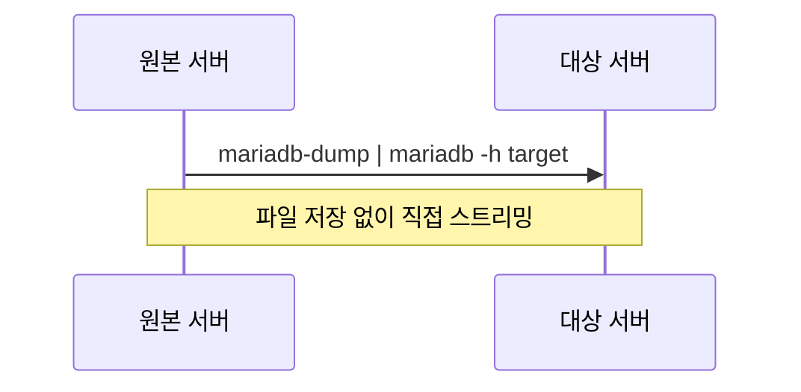

## 개요

MariaDB에서 `mariadb-dump`로 데이터베이스를 백업하고, 다른 서버에 `mariadb` 클라이언트로 import하는 전체 과정을 정리한다.

## 전체 흐름


## 1. Dump (Export)

### 단일 데이터베이스

```bash
mariadb-dump -u [사용자명] -p [데이터베이스명] > [파일명].sql
```

### 여러 데이터베이스

```bash
mariadb-dump -u root -p --databases db1 db2 db3 > all_databases.sql
```

`--databases` 옵션을 사용하면 `CREATE DATABASE` + `USE` 구문이 자동으로 포함된다.

### 전체 데이터베이스

```bash
mariadb-dump -u root -p --all-databases > full_backup.sql
```

### 주요 옵션

| 옵션 | 설명 |
|------|------|
| `--single-transaction` | InnoDB 테이블을 락 없이 일관성 있게 dump |
| `--routines` | 스토어드 프로시저, 함수 포함 |
| `--triggers` | 트리거 포함 (기본값 ON) |
| `--events` | 이벤트 스케줄러 포함 |
| `--no-data` | 스키마만 dump |
| `--no-create-info` | 데이터만 dump |
| `--quick` | 대용량 테이블 dump 시 메모리 절약 |

### 운영 환경 권장 명령어

```bash
mariadb-dump -u root -p \
  --single-transaction \
  --routines \
  --triggers \
  --events \
  [데이터베이스명] > [파일명].sql
```

## 2. Import

### 기본 Import

```bash
mariadb -u root -p [데이터베이스명] < [파일명].sql
```

dump 파일에 `CREATE DATABASE` 구문이 없는 경우, 먼저 대상 DB를 생성해야 한다:

```bash
mariadb -u root -p -e "CREATE DATABASE IF NOT EXISTS mydb CHARACTER SET utf8mb4 COLLATE utf8mb4_general_ci;"
```

### --databases 옵션으로 dump한 경우

DB 생성문이 포함되어 있으므로 DB명 없이 바로 import 가능:

```bash
mariadb -u root -p < all_databases.sql
```

## 3. 원격 서버 이관 방법

### 방법 A: 파이프로 직접 전송 (파일 저장 없이)

```bash
mariadb-dump -u root -p [DB명] | mariadb -h [대상호스트] -u root -p [DB명]
```



### 방법 B: scp 전송 후 import

```bash
# 파일 전송
scp backup.sql user@target:/tmp/

# 원격 서버에서 import
ssh user@target "mariadb -u root -p mydb < /tmp/backup.sql"
```

### 방법 C: SSH 파이프

```bash
mariadb-dump -u root -p mydb | ssh user@target "mariadb -u root -p mydb"
```

## 4. Import 검증

```bash
# 테이블 목록 확인
mariadb -u root -p -e "SHOW TABLES;" mydb

# 테이블별 행 수 확인
mariadb -u root -p -e "
  SELECT TABLE_NAME, TABLE_ROWS 
  FROM information_schema.TABLES 
  WHERE TABLE_SCHEMA = 'mydb';"
```

## 참고사항

- `mysqldump`, `mysql` 명령어도 MariaDB에서 동일하게 동작한다
- 대용량 import 시 `--max_allowed_packet=512M` 옵션 추가 권장
- 여러 DB 간 FK 의존성이 있으면 import 순서에 주의해야 한다
