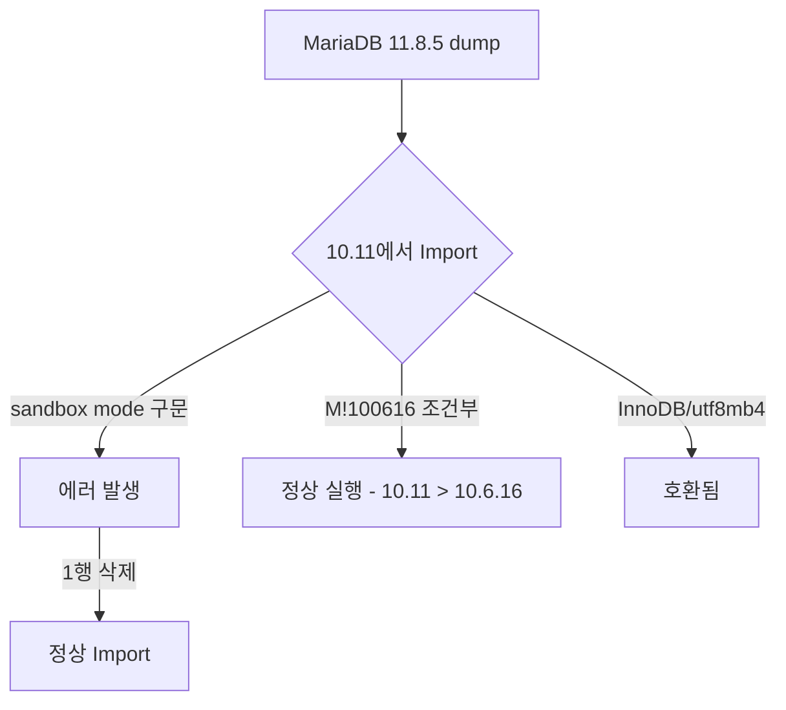

## 개요

MariaDB 11.8.5에서 dump한 SQL 파일을 10.11에 import할 때 발생할 수 있는 버전 호환성 문제를 정리한다.

## 버전 간 호환성 흐름



## 문제가 되는 부분

### sandbox mode 지시자

MariaDB 11.4+의 `mariadb-dump`는 파일 첫 줄에 다음 구문을 자동 추가한다:

```sql
/*M!999999\- enable the sandbox mode */
```

이 구문은 MariaDB 11.4 미만 버전에서는 인식하지 못해 파싱 에러가 발생한다.

#### 해결 방법

각 dump 파일의 1행을 삭제한다:

```bash
# Linux
sed -i '1d' *.sql

# macOS
sed -i '' '1d' *.sql
```

## 문제 없는 부분

### M!100616 조건부 주석

```sql
/*M!100616 SET @OLD_NOTE_VERBOSITY=@@NOTE_VERBOSITY, NOTE_VERBOSITY=0 */;
```

`M!VVVRRR` 형식은 "해당 버전 이상에서만 실행"이라는 의미이다. `100616`은 MariaDB 10.6.16을 뜻하며, 10.11은 이보다 높으므로 정상 실행된다.

### 테이블 구조

- ENGINE: InnoDB → 10.11에서 완전 지원
- CHARSET: utf8mb4 → 10.11에서 완전 지원
- 11.x 전용 타입(INET6 등): 미사용

## 버전별 주의사항 정리

| 항목 | 11.8 → 10.11 | 비고 |
|------|:---:|------|
| sandbox mode 1행 | 삭제 필요 | 11.4+ dump에서 자동 추가 |
| `M!100616` 조건부 | 호환 | 10.11 > 10.6.16 |
| InnoDB 엔진 | 호환 | 양쪽 모두 기본 엔진 |
| utf8mb4 charset | 호환 | 양쪽 모두 지원 |
| DEFINER (VIEW) | 주의 | 동일 유저가 대상 서버에 존재해야 함 |

## 결론

MariaDB 11.8 → 10.11 다운그레이드 import 시 dump 파일 첫 줄의 sandbox mode 구문만 제거하면 정상 import가 가능하다.
