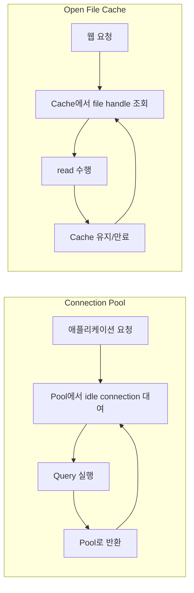

## 의문의 출발

"DB는 폴더, table은 파일과 매칭된다"는 비유는 직관적이다. 그런데 이 비유를 좀 더 밀어붙이면 의문이 생긴다.

> 그럼 **connection pool**은 파일 시스템에 매칭되는 개념이 있을까?

DB의 핵심 컴포넌트인 connection pool에 대응되는 파일 시스템 개념이 있다면, 둘이 같은 패턴이라는 뜻이고, 없다면 비유는 거기서 끝난다는 뜻이다.

결론부터: **있다.** 연결(connection) 자체는 OS의 **파일 디스크립터(FD)**에, connection pool은 **"open file cache / file handle pool"**에 대응된다. 더 나아가 리눅스 관점에서는 TCP socket도 파일이라, DB connection은 진짜로 FD 하나를 점유하는 자원이다.

## 매칭 표

비유를 끝까지 밀어붙이면 다음과 같이 정리된다.

| DB 개념 | 파일 시스템 / OS 개념 | 본질 |
|---|---|---|
| Database | Directory (폴더) | 데이터 컨테이너 |
| Table | File | 실제 데이터 저장 단위 |
| Row | File 안의 record / line | 데이터 단위 |
| Index | inode 메타데이터, B-tree 등 | 빠른 lookup용 보조 구조 |
| **Connection** | **File descriptor** (열린 핸들) | 자원에 접근하는 핸들 |
| **Connection pool** | **Open file cache / FD pool** | 비용 큰 핸들을 재사용하는 캐시 |
| Transaction | 파일 lock + journaling | 일관성 보장 단위 |
| Query | read / write syscall | 자원에 대한 작업 단위 |

핵심 매칭은 굵게 표시한 두 줄이다.

## 왜 같은 패턴인가

Connection pool과 file handle cache가 같은 패턴인 이유는, 둘 다 같은 문제를 풀기 때문이다.

> **"여는 비용이 큰 자원을 미리 열어두고 재사용하는 캐시"**

비용을 구체적으로 보면 이렇다.

- **DB connection**: TCP 3-way handshake + (TLS handshake) + 인증 + 세션 초기화 → 매번 하면 수십 ms 단위로 누적된다.
- **파일 open**: `open()` syscall + 경로 traversal + inode lookup + 권한 체크 → 자주 열면 syscall 오버헤드가 누적된다.

그래서 둘 다 **"열어두고 재사용"**이라는 동일한 전략을 채택한다.

| 영역 | 대표 구현 |
|---|---|
| DB connection pool | HikariCP, DBCP, c3p0 |
| 파일 핸들 캐시 | Nginx `open_file_cache`, Apache `mod_file_cache` |
| OS 차원 | page cache의 inode 캐싱, dentry 캐시 |

## 리눅스 관점: connection도 결국 파일이다

이 매칭이 그냥 "비유"에 그치지 않는 이유는, 리눅스에서는 **모든 것이 파일이다 (everything is a file)**라는 철학 때문이다. TCP socket도 파일이고, DB connection이 사용하는 socket도 파일이다.

실제로 프로세스의 열린 자원을 보면 같은 FD 테이블 안에 일반 파일과 socket이 나란히 등장한다.

```bash
$ lsof -p <pid>
COMMAND   PID FD   TYPE             NAME
java     1234  3r  REG              /var/log/app.log     # 일반 파일
java     1234  4u  IPv4 TCP         10.0.0.1:54321->db:5432  # DB connection (socket)
java     1234  5u  IPv4 TCP         10.0.0.1:54322->db:5432  # 또 다른 DB connection
```

즉, OS 입장에서 보면 다음 두 가지는 **같은 자원의 다른 사용처일 뿐**이다.

- 로그 파일을 미리 `open()`해두고 재사용 → file handle pool
- DB에 TCP 연결을 미리 맺어두고 재사용 → connection pool

둘 다 결국 "FD를 미리 잡아두고 큐에 넣어두는" 동일한 패턴이다.

## 흐름으로 보는 비교



두 그림의 노드 이름만 바꾸면 그대로 겹친다는 점이 핵심이다.

## 비유가 멈추는 지점

물론 1:1 매칭이 완벽한 건 아니다.

- DB connection은 **stateful**하다 (트랜잭션 컨텍스트, 세션 변수, prepared statement 캐시 등). 파일 핸들은 보통 stateless에 가깝다.
- 그래서 connection pool은 단순한 캐시가 아니라 **상태 정리(rollback, reset)**까지 책임진다. 파일 핸들 캐시에는 이 단계가 없다.
- Pool 크기 튜닝(`maximumPoolSize`)도 DB 쪽이 훨씬 민감하다. 파일 핸들은 OS의 `ulimit -n`이 주된 제약이지만, DB 쪽은 DB 서버의 동시 연결 수까지 함께 고려해야 한다.

비유는 "같은 패턴을 다른 자원에 적용한 것"이라는 통찰까지만 가져가면 충분하다.

## 정리

- Connection ≈ File descriptor (열린 핸들)
- Connection pool ≈ Open file cache / FD pool
- 둘 다 "비용 큰 자원을 미리 열어두고 재사용"하는 동일 패턴
- 리눅스에서는 socket도 파일이라, OS 입장에서 connection은 진짜로 FD를 점유하는 자원이다

"DB는 폴더, table은 파일"이라는 비유가 connection pool까지 확장되는 이유는, 결국 **모든 자원이 OS 레벨에서는 같은 종류의 핸들**이기 때문이다.
