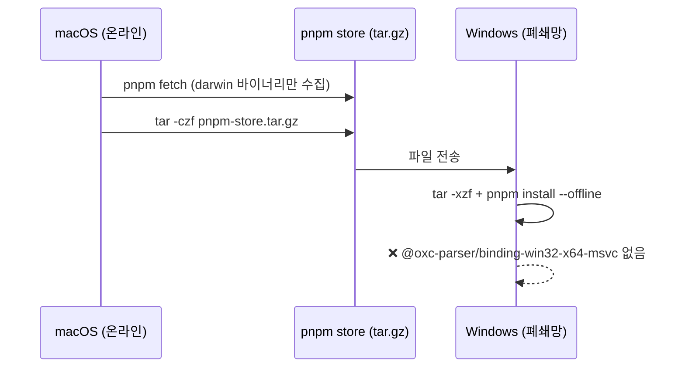
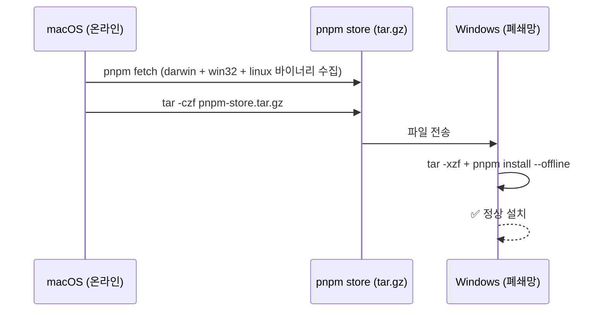

## 에러 메시지

```
ERROR  Cannot find native binding.
[cause]: Cannot find module '@oxc-parser/binding-win32-x64-msvc'
[cause]: Cannot find module './parser.win32-x64-msvc.node'
```

## 상황

macOS 온라인 환경에서 `pnpm fetch`로 store를 준비하고 tar.gz로 압축한 뒤, Windows 폐쇄망에 옮겨 `pnpm install --offline`을 실행했을 때 발생했다.

## 원인

`oxc-parser`, `esbuild`, `@parcel/watcher` 같은 Rust/C++ 기반 패키지는 플랫폼별 네이티브 바이너리를 **optional dependency**로 분리해서 배포한다.

```
oxc-parser
├── @oxc-parser/binding-darwin-arm64    ← macOS Apple Silicon
├── @oxc-parser/binding-darwin-x64     ← macOS Intel
├── @oxc-parser/binding-win32-x64-msvc ← Windows x64
├── @oxc-parser/binding-linux-x64-gnu  ← Linux x64
└── ...
```

pnpm은 기본적으로 **현재 실행 중인 플랫폼의 바이너리만** fetch한다. macOS에서 `pnpm fetch`를 실행하면 `darwin` 바이너리만 store에 담기고, `win32-x64-msvc` 바이너리는 아예 포함되지 않는다.

따라서 이 store를 그대로 Windows에 옮기면 네이티브 바이너리가 없어서 설치가 실패한다.



## 해결

모노레포 루트 `package.json`에 `pnpm.supportedArchitectures`를 추가한다. 이 설정이 있으면 `pnpm fetch` 실행 시 현재 플랫폼 외에 지정한 플랫폼의 바이너리도 함께 수집한다.

```json
{
  "pnpm": {
    "supportedArchitectures": {
      "os": ["current", "win32", "linux"],
      "cpu": ["current", "x64", "arm64"],
      "libc": ["current", "glibc", "musl"]
    }
  }
}
```

설정 추가 후 store를 다시 만들면(`pnpm fetch` 재실행 + 압축) Windows·Linux 바이너리가 모두 포함된다.



## 부작용

store에 담기는 바이너리가 늘어나므로 **store 크기가 상당히 증가**한다. 대상 환경이 특정 플랫폼으로 고정되어 있다면 필요한 플랫폼만 지정하는 것이 효율적이다.

| 설정 | 수집 바이너리 | store 크기 |
|---|---|---|
| 기본 (설정 없음) | 현재 플랫폼만 | 최소 |
| `os: ["current", "win32"]` | macOS + Windows | 중간 |
| `os: ["current", "win32", "linux"]` | macOS + Windows + Linux | 최대 |

## 관련

- `Ignored build scripts: @parcel/watcher, esbuild, ...` 경고가 함께 나온다면 `pnpm approve-builds`로 허용 목록을 관리해야 한다. 이 패키지들도 플랫폼별 네이티브 바이너리를 빌드 스크립트로 설치하는 경우가 많다.
