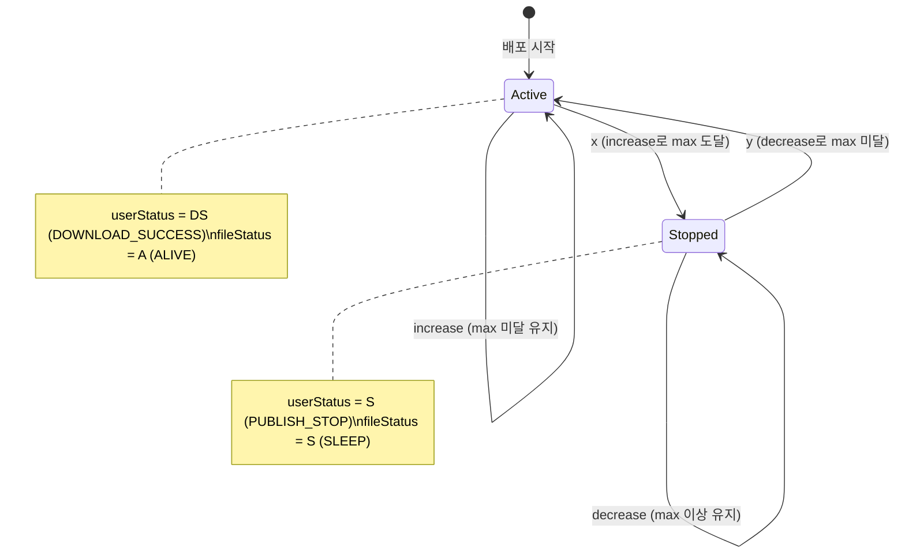

## 배경

배포 시스템에서 사용자별 다운로드 횟수를 관리하며, 최대 다운로드 횟수(maxDownloadCnt)에 도달하면 파일 접근을 잠그고, 관리자가 횟수를 줄이면 다시 풀어주는 로직이 필요했다.

## 핵심 로직

```java
Integer originalCnt = du.getDownloadCnt();
Integer newCnt = originalCnt + diff;
if (newCnt < 0) return;

boolean b1 = originalCnt < maxDownloadCnt;  // 변경 전: max 미달?
boolean b2 = newCnt >= maxDownloadCnt;      // 변경 후: max 도달?

boolean x = b1 && b2;   // 미달 → 도달 (잠금)
boolean y = !b1 && !b2; // 도달 → 미달 (해제)
```

## 상태 전환 다이어그램



## 시나리오별 검증

| 시나리오              | originalCnt | maxCnt | diff | newCnt | b1  | b2  | x     | y     | 결과              |
| --------------------- | ----------- | ------ | ---- | ------ | --- | --- | ----- | ----- | ----------------- |
| increase, max 도달    | 4           | 5      | +1   | 5      | T   | T   | **T** | F     | 잠금 (S + SLEEP)  |
| decrease, max 미달    | 5           | 5      | -1   | 4      | F   | F   | F     | **T** | 해제 (DS + ALIVE) |
| increase, 아직 미달   | 3           | 5      | +1   | 4      | T   | F   | F     | F     | 변경 없음         |
| decrease, 여전히 도달 | 6           | 5      | -1   | 5      | F   | T   | F     | F     | 변경 없음         |
| maxCnt=0 (무제한)     | any         | 0      | ±N   | ≥0     | F   | T   | F     | F     | 변경 없음         |
| newCnt < 0            | 0           | 5      | -1   | -1     | -   | -   | -     | -     | early return      |

## 왜 이 패턴이 동작하는가

핵심은 **경계 교차 감지**다. b1과 b2는 각각 변경 전/후의 maxDownloadCnt 경계 위치를 판단한다.

- `x = b1 && b2`: 경계 아래 → 경계 이상으로 교차 (잠금 트리거)
- `y = !b1 && !b2`: 경계 이상 → 경계 아래로 교차 (해제 트리거)
- 그 외: 경계를 교차하지 않음 → 상태 변경 불필요

`maxDownloadCnt=0`인 경우, `b1 = originalCnt < 0`은 항상 false이므로 x가 절대 true가 될 수 없어 무제한 다운로드가 보장된다.

## 참고: 이력 저장 정책

상태 전환(x 또는 y)이 발생할 때만 `DeployUserHistory`에 기록된다. 단순 카운트 증감은 이력에 남지 않는다.
