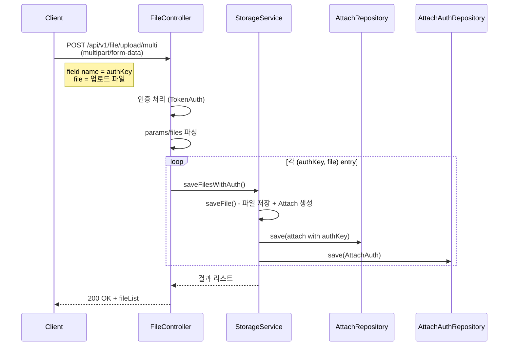
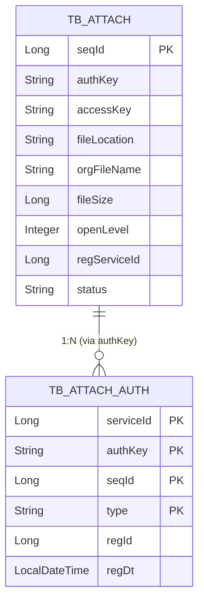

## 배경

파일 스토리지 관리 API 서버에서 여러 파일을 한 번에 업로드하면서, 각 파일에 고유한 `authKey`를 매핑하여 `Attach`(파일 메타데이터)와 `AttachAuth`(접근 권한) 레코드를 동시에 저장해야 하는 요구사항이 있었다.

기존에는 단일 파일 업로드(`/upload/{serviceKey}/{openLevel}`)만 지원하고 있었으며, `AttachAuth` 레코드는 별도의 auth update API를 통해서만 관리되었다.

## 구조



## 변경 내용

### 1. FileController - 엔드포인트 등록

```java
// 생성자에서 MultipartHelper로 핸들러 등록
MultipartHelper.INSTANCE.register("/api/v1/file/upload/multi", this::uploadMultiFiles);
```

Multipart 요청의 **파일 part field name을 authKey로 사용**하는 것이 핵심 설계:

```
POST /api/v1/file/upload/multi
Content-Type: multipart/form-data

serviceKey: "myService"       ← text part
openLevel: "0"                ← text part
authKey001: file1.pdf         ← file part (field name이 authKey)
authKey002: file2.jpg         ← file part
```

### 2. StorageServiceImpl - saveFilesWithAuth

```java
for (Map.Entry<String, List<AmspMultipart>> entry : fileMap.entrySet()) {
    String authKey = entry.getKey();
    for (AmspMultipart multipart : entry.getValue()) {
        // 1. 기존 saveFile 재사용 → Attach 저장
        Attach attach = saveFile(serviceKey, openLevel, multipart, uploadFile);
        
        // 2. authKey 설정
        attach.setAuthKey(authKey);
        attach = attachRepository.save(attach);
        
        // 3. AttachAuth 저장 (composite key: serviceId, authKey, seqId, type)
        AttachAuthKey key = new AttachAuthKey(serviceId, authKey, attach.getSeqId(), "R");
        attachAuthRepository.save(AttachAuth.builder()
                .attachAuthKey(key)
                .regId(authUserSeqId)
                .build());
    }
}
```

### 3. 데이터 모델 관계



## 결과

- `POST /api/v1/file/upload/multi` 엔드포인트 생성
- 각 파일에 대해 `Attach` + `AttachAuth` 원자적 저장 (`@Transactional`)
- 기존 `saveFile()` 로직 재사용으로 MIME 타입 검증, 썸네일 생성 등 기존 기능 유지
