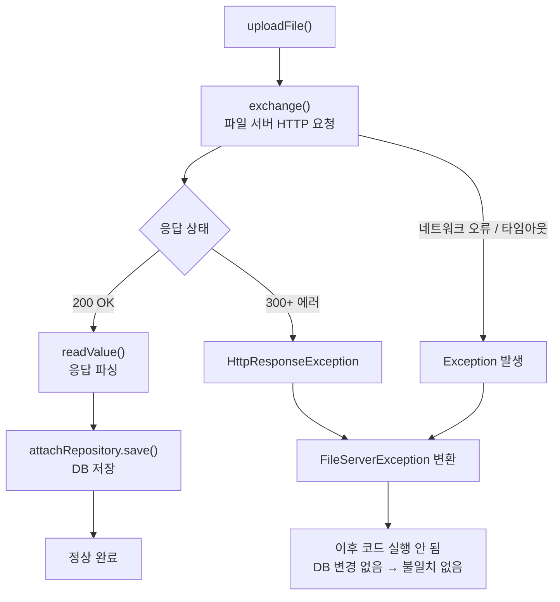

## 상황

`RestfulAPIServiceImpl.uploadFile()`에서 외부 파일 서버로 파일 업로드 HTTP 요청을 보낸 뒤 응답 결과로 DB(`attachRepository.save()`)를 업데이트하는 구조에서, 요청이 실패하면 어떻게 되는지 추적했다.

## 코드 흐름

```
uploadFile()
  → exchange(request, String.class)     // 파일 서버로 HTTP 요청
    → client.execute(request, handler)
      → handleResponse()                // 응답 코드 300+ 이면 HttpResponseException
  → readValue(response.getBody(), ...)  // 응답 파싱
  → attachRepository.save(attach)       // DB 저장
```



## 실패 경로

`exchange()` 메서드 내부에서 두 가지 경로로 예외가 발생한다:

### 1. HTTP 300 이상 응답

```java
private <T> ResponseEntity<T> handleResponse(ClassicHttpResponse response, Class<T> cls) {
    if (response.getCode() >= 300) {
        throw new HttpResponseException(response.getCode(), data);
    }
}
```

`exchange()`의 catch에서 `throwException()`을 통해 `FileServerException`으로 변환하여 던진다.

### 2. 네트워크 오류 / 타임아웃

```java
} catch (Exception e) {
    throw FileServerException.buildException(ErrorCode.FILE_SERVER_ERROR, HttpStatus.EXPECTATION_FAILED, e);
}
```

## 결과

- 예외가 발생하면 `exchange()` 이후 코드(`readValue`, `attachRepository.save()`)는 **실행되지 않음**
- 호출부인 `DeployService`에서도 `deployRepository.save(deploy)`가 실행되지 않음
- 따라서 **파일 업로드 실패 = DB 변경 없음** → 데이터 불일치 발생하지 않음

## 주의할 점

- **재시도 로직이 없음**: 일시적 네트워크 장애에도 바로 실패 응답 반환
- 예외가 컨트롤러까지 전파되어 클라이언트에 에러 응답으로 전달됨
