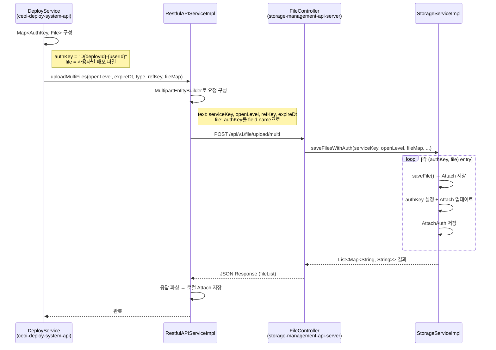

## 배경

배포 시스템(ceoi-deploy-system-api)에서 사용자별 파일을 파일 서버(storage-management-api-server)에 업로드할 때, 기존에는 사용자 수만큼 개별 HTTP 요청을 보내고 있었다. 새로 만든 `/api/v1/file/upload/multi` 엔드포인트를 활용해 한 번의 요청으로 모든 파일을 일괄 전송하도록 변경했다.

## 구조



## 변경 내용

### 기존 방식 (N번 HTTP 호출)

```java
for (UserFileDto uf : userFiles) {
    File file = deployTempStorageService.getFile(serverUuid, uf.getFilePath());
    String authKey = String.format("D%d-%d", deploy.getSeqId(), uf.getUserId());
    Pair<String, File> filePair = Pair.of(uf.getFileName(), file);
    // 사용자마다 개별 HTTP 요청
    restfulAPIService.uploadFile(openLevel, expireDt, type, refKey, authKey, false, filePair, null);
}
```

### 변경 후 (1번 HTTP 호출)

```java
// 1. 파일 목록 구성
Map<String, Pair<String, File>> fileMap = new LinkedHashMap<>();
for (UserFileDto uf : userFiles) {
    File file = deployTempStorageService.getFile(serverUuid, uf.getFilePath());
    String authKey = String.format("D%d-%d", deploy.getSeqId(), uf.getUserId());
    fileMap.put(authKey, Pair.of(uf.getFileName(), file));
}

// 2. 일괄 업로드
restfulAPIService.uploadMultiFiles(openLevel, expireDt, type, refKey, fileMap);
```

### Multipart 요청 구조

```
POST /api/v1/file/upload/multi
Content-Type: multipart/form-data

serviceKey: "EE1B67DE..."        ← text part
openLevel: "99"                   ← text part
refKey: "D123"                    ← text part
expireDt: "2026-04-30T00:00"     ← text part
D123-1: user1_file.pdf            ← file part (field name = authKey)
D123-2: user2_file.pdf            ← file part
D123-3: user3_file.pdf            ← file part
```

## 결과

- 사용자 N명에 대해 N번의 HTTP 요청 → 1번으로 감소
- 파일 서버에서 하나의 트랜잭션으로 Attach + AttachAuth 일괄 저장
- 배포 시스템에서는 응답의 fileList를 파싱하여 로컬 Attach 엔티티 저장
