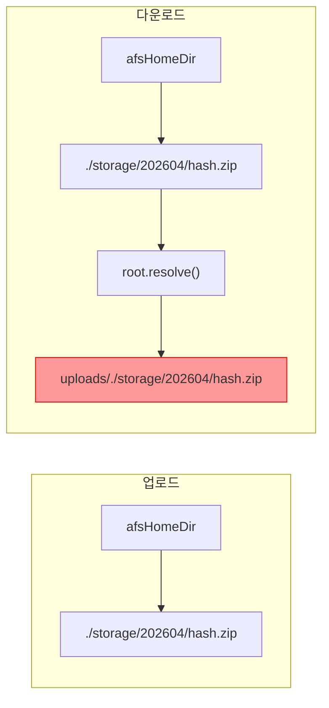

## 증상

파일 다운로드 시 `uploads/./storage/202604/hash.zip` 경로로 요청하여 파일을 찾지 못함. 업로드는 정상 동작.

## 추적 과정

### 업로드 경로 구성 (FileHandler)

```java
// FileHandler.fileUpload()
String targetPath = afsContext.getAfsHomeDir() + "/" + directory + "/";
// → ./storage/202604/
```

`afsHomeDir`만 사용하여 직접 경로를 조합. `root` 변수를 사용하지 않음.

### 다운로드 경로 구성 (StorageServiceImpl.loadFile)

```java
String path = afsContext.getAfsHomeDir() + attach.getFileLocation();
// → ./storage/202604/hash.zip

Path file = root.resolve(path);  // root = Paths.get("uploads")
// → uploads/./storage/202604/hash.zip  ← 불일치!
```

`root.resolve()`를 거치면서 `uploads/` prefix가 추가됨.

## 원인



**업로드는 `root`를 안 쓰고, 다운로드만 `root`를 쓰는 비대칭 구조.**

### Java Path.resolve() 동작

| afsHomeDir | resolve 결과 | 동작 |
|---|---|---|
| `./storage` (상대) | `uploads/./storage/...` | root prefix 추가 → 경로 불일치 |
| `/opt/storage` (절대) | `/opt/storage/...` | root 무시됨 → 정상 |

## 수정 내용

`application-local.yml`의 `asfs.file.home`을 상대경로에서 절대경로로 변경:

```yaml
# before
home: ./storage

# after
home: /Users/.../storage-management-api-server/storage
```

절대경로이면 `Path.resolve()`가 `root`를 무시하므로 업로드/다운로드 경로가 일치하게 됨.
