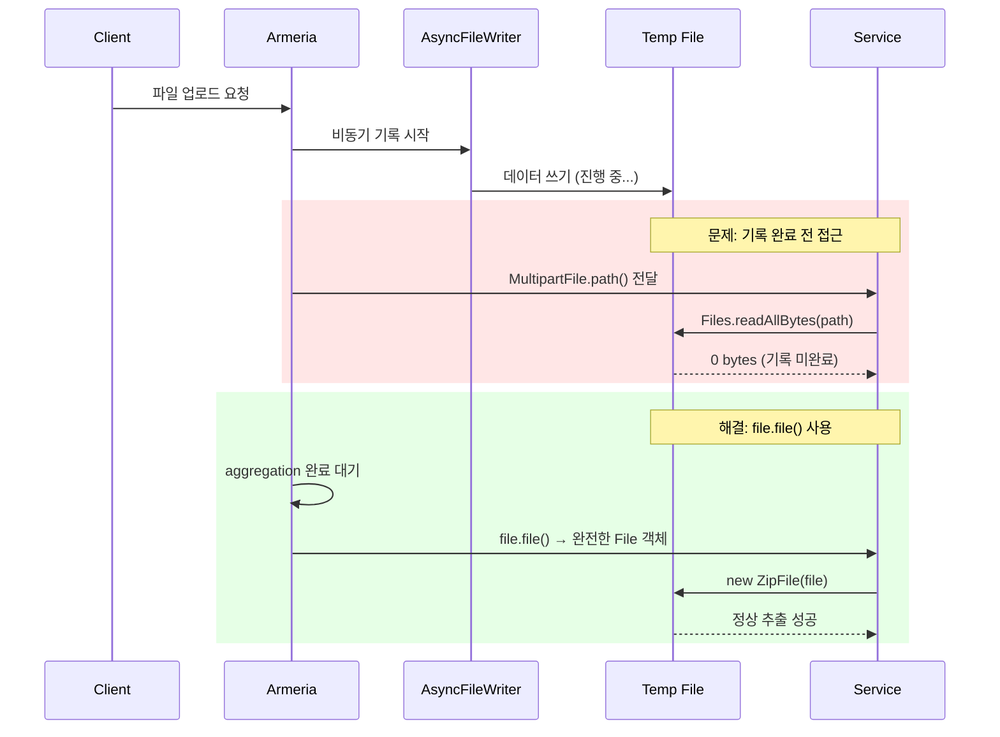

## 증상

Armeria 1.28 기반 REST API에서 `MultipartFile`로 받은 zip 파일을 `ZipInputStream`/`ZipFile`로 추출했으나, 추출된 파일이 0건(`Extracted: []`).

```
java.lang.IllegalArgumentException: mapping.csv not found in zip file. Extracted: []
```

## 추적 과정

### 1차 시도: FileInputStream으로 읽기
```java
try (InputStream is = new FileInputStream(zipFile.file());
     ZipInputStream zis = new ZipInputStream(is)) {
```
- 결과: `Extracted: []` — zip 엔트리 0건

### 2차 시도: Files.copy로 로컬 복사 후 읽기
```java
Files.copy(zipFile.path(), tempZipPath, StandardCopyOption.REPLACE_EXISTING);
try (InputStream is = Files.newInputStream(tempZipPath);
     ZipInputStream zis = new ZipInputStream(is)) {
```
- 결과: 동일하게 0건

### 3차 시도: readAllBytes로 바이트 직접 읽기
```java
byte[] zipBytes = Files.readAllBytes(zipFile.path());
log.info("bytesRead={}", zipBytes.length);
```
- 결과: 0 bytes

## 원인



**Armeria의 `MultipartFile`은 비동기(`AsyncFileWriter`)로 temp 파일에 기록한다.**

스택 트레이스에서 확인:
```
FileAggregatedMultipart.moveFile
AsyncFileWriter.onNext
AsyncFileWriter.completed
```

`MultipartFile.path()`/`file()`이 반환하는 temp 파일은 비동기 기록이 진행 중이거나 아직 완료되지 않은 상태일 수 있다. 따라서 `Files.readAllBytes()`나 `FileInputStream`으로 읽으면 0 bytes가 반환됨.

### 정상 동작하는 프로젝트와의 비교

동일 프레임워크를 사용하는 다른 프로젝트에서는 zip 추출이 정상 동작했다.

| 항목 | 정상 프로젝트 | 문제 프로젝트 |
|------|-------------|-------------|
| 파일 접근 방식 | `AggregatedMultipart` → `FileHttpData.file()` | `MultipartFile.path()` 직접 접근 |
| 데이터 상태 | 완전히 aggregated (buffered) | 스트리밍 중 (비동기 기록) |
| 핵심 차이 | `BodyPartAggregator.future().join()` 으로 blocking 대기 | 비동기 기록 완료 보장 없음 |

정상 프로젝트의 핵심 패턴:
```java
// MultipartHelper.convert() — blocking으로 전체 데이터 대기
BodyPartAggregator aggregator = new BodyPartAggregator(ctx);
multipart.bodyParts().subscribe(aggregator);
List<AggregatedBodyPart> p = aggregator.future().join(); // BLOCKING WAIT

// FileHttpData에서 file() 접근 — 이 시점에서 데이터 완전
FileHttpData data = (FileHttpData) bodyPart.content();
FilePartData p = FilePartData.builder()
    .file(data.file())        // aggregated된 File
    .inputStream(data.toInputStream())
    .build();
```

## 해결

Armeria annotated service에서 `MultipartFile` 파라미터로 받는 경우, **`file.file()`은 Armeria가 aggregation 완료 후 제공하는 `File` 객체**이므로 이를 직접 사용한다.

```java
// Controller
DeployTempData result = deployTempStorageService.stageDeployData(tempData, file.file());

// Service — File을 직접 ZipFile로 읽기
public DeployTempData stageDeployData(DeployTempData tempData, File zipFile) {
    ...
}

private List<UserFileDto> extractZipAndMapUsers(Path filesPath, File zipFile) {
    try (java.util.zip.ZipFile zf = new java.util.zip.ZipFile(zipFile)) {
        Enumeration<? extends ZipEntry> entries = zf.entries();
        while (entries.hasMoreElements()) {
            // 정상 추출
        }
    }
}
```

핵심: `MultipartFile`의 `path()`로 새 파일을 복사하지 말고, `file.file()`이 반환하는 **이미 aggregated된 File 객체**를 그대로 `ZipFile` 생성자에 전달.


## 추가 이슈: __MACOSX 및 메타 파일 처리

macOS에서 생성한 zip은 `__MACOSX/` 디렉토리와 `._` 접두사 파일이 포함될 수 있다.
추출 시 이들을 무시하도록 필터링 필요:

```java
if (entryName.startsWith("__MACOSX") || entryName.startsWith(".")) {
    continue;
}
```

## 전체 디버깅 타임라인

| 시도 | 접근 | 결과 |
|------|------|------|
| 1차 | `new FileInputStream(zipFile.file())` + ZipInputStream | Extracted: [] |
| 2차 | `Files.copy(zipFile.path(), temp)` + ZipInputStream | Extracted: [] |
| 3차 | `Files.readAllBytes(zipFile.path())` + ZipFile API | bytesRead=0 |
| 4차 | 정상 동작 프로젝트 비교 분석 | 근본 원인 발견 |
| 최종 | `file.file()` → File 파라미터 → ZipFile API | 성공 |

## 교훈

1. Armeria `MultipartFile.path()`는 비동기 기록 완료를 보장하지 않는다
2. `file.file()`은 Armeria annotated service에서 aggregation 후 제공되므로 안전하다
3. zip 추출 시 `ZipFile` API가 `ZipInputStream`보다 디스크 기반 랜덤 액세스로 더 안정적
4. 동일 프레임워크를 사용하는 다른 프로젝트의 패턴을 먼저 확인하는 것이 가장 효율적
5. 디버깅 시 "파일 크기 로그"를 가장 먼저 찍어보면 원인을 빠르게 좁힐 수 있다
