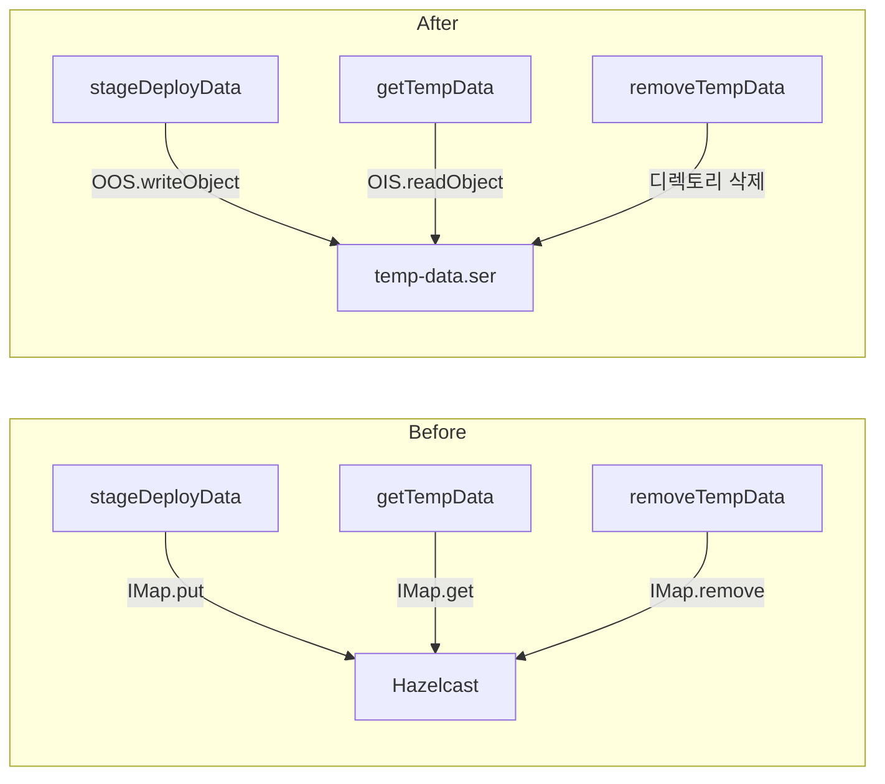

## 배경

배포 시스템에서 임시 데이터(`DeployTempData`)를 Hazelcast IMap으로 캐싱하고 있었다. 하지만 Hazelcast 클러스터 설정 이슈(DEPLOY 인스턴스 미등록, COMMON 폴백)로 인해 Java 기본 직렬화(`ObjectOutputStream`)를 사용한 파일 기반 캐싱으로 변경했다.

## 변경 전후 비교

| 항목 | Before (Hazelcast IMap) | After (OOS 파일) |
|------|------------------------|-------------------|
| 저장 | `IMap.put(uuid, tempData)` | `ObjectOutputStream` → `temp-data.ser` |
| 조회 | `IMap.get(tempPath)` | `ObjectInputStream` ← `temp-data.ser` |
| 삭제 | `IMap.remove()` + 디렉토리 삭제 | 디렉토리 삭제만 (ser 포함) |
| 의존성 | HazelcastInstances, Cluster | 없음 (순수 Java IO) |

## 변경 내용

### 저장 (ObjectOutputStream)

```java
private void saveTempDataToFile(Path stagingPath, DeployTempData tempData) {
    Path serFile = stagingPath.resolve("temp-data.ser");
    try (ObjectOutputStream oos = new ObjectOutputStream(new FileOutputStream(serFile.toFile()))) {
        oos.writeObject(tempData);
    } catch (IOException e) {
        throw new RuntimeException("직렬화 실패", e);
    }
}
```

### 조회 (ObjectInputStream)

```java
public DeployTempData getTempData(String tempPath) {
    Path serFile = getStagingPath(tempPath).resolve("temp-data.ser");
    try (ObjectInputStream ois = new ObjectInputStream(new FileInputStream(serFile.toFile()))) {
        return (DeployTempData) ois.readObject();
    } catch (IOException | ClassNotFoundException e) {
        throw new IllegalArgumentException("역직렬화 실패", e);
    }
}
```

### 디렉토리 구조

```
storage/deploy-staging/{uuid}/
├── temp-data.ser    ← DeployTempData 직렬화 파일
└── files/
    ├── file1.pdf
    └── file2.pdf
```

## 전제 조건

- `DeployTempData`, `UserFileDto` 클래스에 `Serializable` 인터페이스 구현 필수
- `serialVersionUID` 선언 필수 (필드 변경 시 역직렬화 호환성 유지)


