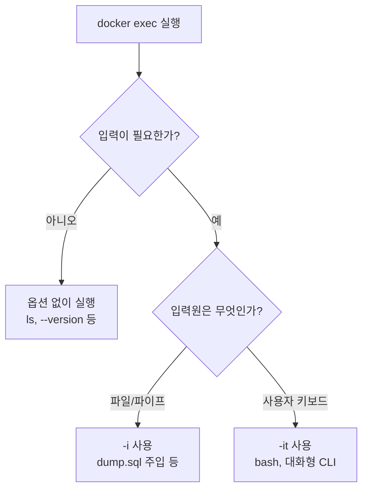

## 질문

`docker exec` 명령어를 사용할 때 어떤 경우엔 `-i`만 쓰고, 어떤 경우엔 `-it`를 붙이는지 헷갈린다. 두 옵션의 정확한 의미와 차이, 그리고 언제 무엇을 선택해야 하는지 정리하고 싶다.

## 각 옵션의 의미

| 옵션 | 풀네임 | 역할 |
|------|--------|------|
| `-i` | `--interactive` | 컨테이너의 STDIN을 열어둠 (호스트 입력 → 컨테이너로 전달) |
| `-t` | `--tty` | 의사 터미널(pseudo-TTY)을 할당해 컨테이너 프로세스에 연결 |

### `-i` 단독의 의미

- STDIN을 컨테이너 프로세스에 연결한다
- 하지만 터미널처럼 보이게 만들지는 않는다
- 즉 "프로그램이 표준 입력을 읽을 수 있도록" 통로를 열어주는 역할

### `-t` 단독의 의미

- 컨테이너 프로세스가 "내가 지금 터미널에서 실행 중이다"라고 인식하게 한다
- 터미널 기능: 프롬프트 표시, 줄 편집, 컬러 출력, 터미널 크기 인식 등
- 그러나 입력 통로가 없으면 의미가 크게 없어서 보통 `-i`와 함께 사용

## 언제 `-i`만 사용할까

**파일 리다이렉트나 파이프로 데이터를 주입**할 때 사용한다.

```bash
# SQL 덤프를 MariaDB 컨테이너에 주입
docker exec -i my-db mariadb -uroot -ppass < dump.sql

# JSON을 애플리케이션에 파이프로 전달
cat data.json | docker exec -i my-app ./import
```

이 경우 STDIN은 이미 파일이나 파이프로 채워져 있다. 여기에 `-t`를 붙이면

```
the input device is not a TTY
```

같은 에러가 날 수 있다. 리다이렉트 대상은 "터미널"이 아니기 때문이다.

## 언제 `-it`를 사용할까

**사람이 대화형으로 조작할 때** 사용한다.

```bash
# 컨테이너 안에서 셸 열기
docker exec -it my-app bash

# 데이터베이스 클라이언트 대화형 접속
docker exec -it my-db mariadb -uroot -p
```

이 경우 STDIN(`-i`)과 터미널 기능(`-t`)이 모두 필요하다.
- `-i` 없이는 키보드 입력이 컨테이너로 전달되지 않는다
- `-t` 없이는 프롬프트가 보이지 않거나 컬러/편집 기능이 동작하지 않는다

## 언제 옵션 없이 사용할까

**결과만 받아보면 되는 일회성 명령**일 때.

```bash
docker exec my-app ls /var/log
docker exec my-db mariadb --version
```

이때는 입력도, 터미널도 필요하지 없다. 표준 출력만 받아서 보면 된다.

## 흐름 비교



## 자주 하는 실수

### 1. 파일 주입에 `-it`를 쓴다

```bash
# 잘못된 예
docker exec -it my-db mariadb -uroot -p < dump.sql
```

- `-t`가 TTY를 요구하지만 STDIN은 파일 → TTY가 아님
- 환경에 따라 경고 또는 에러
- 올바른 예: `-i` 단독 사용

### 2. 대화형 셸에 `-i`만 쓴다

```bash
# 잘못된 예
docker exec -i my-app bash
```

- STDIN은 연결되지만 TTY가 없어서 프롬프트가 안 보임
- 화살표 키, 탭 완성, 컬러 출력도 동작하지 않음
- 올바른 예: `-it`

### 3. 결과만 보면 되는데 `-it`를 남용

```bash
# 불필요
docker exec -it my-app date
```

- 출력만 받으면 되는 명령에 TTY 할당은 낭비
- 스크립트나 CI 환경에서는 TTY 할당 자체가 실패 원인이 되기도 함
- 올바른 예: 옵션 없이 실행

## 핵심 요약

- `-i`는 **입력 통로 열기**
- `-t`는 **터미널처럼 꾸미기**
- **리다이렉트·파이프**로 값이 들어오면 `-i`만
- **사람이 직접 입력**하면 `-it`
- **출력만 받으면** 옵션 없이

명령어를 쓰기 전에 "지금 STDIN에 무엇이 연결되는가"와 "터미널 기능이 필요한가"를 나눠 생각하면 선택이 명확해진다.
