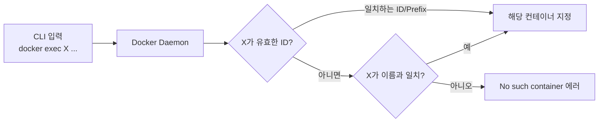

## 질문

`docker exec`, `docker stop` 같은 명령을 쓸 때 컨테이너를 지정하는 부분에 **이름을 써도 되고 ID를 써도 되는 것 같은데, 어느 게 맞는 방식인지** 헷갈린다. 둘 다 쓸 수 있다면 선택 기준이 있는가?

## 결론: 셋 다 쓸 수 있다

`docker exec <CONTAINER>` 의 `<CONTAINER>` 자리에는 아래 세 가지를 **전부 같은 의미로** 넣을 수 있다.

| 식별자 종류 | 예시 | 특징 |
|-------------|------|------|
| 컨테이너 이름 | `my-db` | 생성 시 `--name`으로 지정한 값. 유일해야 함 |
| Full ID (64자) | `a1b2c3d4e5f6...` | 전체 해시 문자열. 직접 쓰는 일은 드물다 |
| Short ID (12자) | `a1b2c3d4e5f6` | `docker ps` 첫 컬럼에 보이는 값 |
| ID Prefix (일부) | `a1b2c3` | 유일하게 식별되기만 하면 **앞 몇 글자만**도 OK |

즉 다음 네 명령은 같은 컨테이너를 가리킨다면 모두 동일하게 동작한다.

```bash
docker exec -it my-db bash
docker exec -it a1b2c3d4e5f6abcdef0123456789... bash   # full id
docker exec -it a1b2c3d4e5f6 bash                       # short id
docker exec -it a1b2c3 bash                             # prefix
```

## 내부적으로 어떻게 해석되는가



- Docker 데몬은 입력값을 **먼저 ID/Prefix로 매칭**하려 시도하고, 실패하면 **이름으로 매칭**한다
- prefix 매칭 시 일치하는 컨테이너가 **2개 이상이면 에러**
- 이름은 호스트 전체에서 **유일**해야 하므로 충돌이 없다

## 언제 무엇을 쓸까

### 1. 스크립트·문서·CI → **이름**
```bash
docker exec -i my-db mariadb -uroot -ppass < dump.sql
```

- 컨테이너 재생성 시에도 **이름은 유지**되지만 **ID는 새로 발급**된다
- `docker compose up/down`을 반복하는 환경에서 스크립트가 깨지지 않음
- 문서로 공유할 때도 이름은 고정값이므로 그대로 복붙 가능

### 2. 터미널에서 즉석 실행 → **Short ID 또는 Prefix**
```bash
docker exec -it a1b2 bash
```

- 타이핑이 짧아 빠르다
- 한 번 쓰고 말 임시 명령에 편리

### 3. 디버깅·로그 추적 → **Full/Short ID**
- 같은 이미지·같은 이름 패턴의 컨테이너가 여러 개 돌 때
- ID로 특정 인스턴스를 명확히 지칭해야 혼동이 없다

## 자주 마주치는 에러와 원인

### "No such container"
- 컨테이너가 종료됐거나, 이름을 잘못 적었거나, prefix가 아무것도 매칭하지 않음
- `docker ps -a` 로 중단된 컨테이너까지 확인

### "Multiple IDs found"
- 입력한 prefix에 해당하는 컨테이너가 2개 이상
- 더 긴 prefix를 사용하거나 이름으로 지정

### "name is already in use"
- `--name`으로 같은 이름 컨테이너를 만들려 할 때
- 기존 컨테이너를 `docker rm`으로 제거하거나 다른 이름 사용

## 모든 docker 명령에 동일 규칙

`exec`뿐 아니라 **`<CONTAINER>` 인자를 받는 거의 모든 명령**이 같은 규칙을 따른다.

```bash
docker stop my-db         # 또는 a1b2c3
docker logs my-db -f
docker inspect my-db
docker rm -f my-db
docker kill my-db
docker cp my-db:/tmp/x ./  # 파일 복사도 동일
```

## 핵심 요약

- **이름, Full ID, Short ID, prefix 모두 OK** — 같은 컨테이너를 가리키기만 하면 된다
- 매칭은 **ID/Prefix 먼저, 그다음 이름** 순으로 시도된다
- **재생성 시 ID는 바뀌고 이름은 유지**되므로, 스크립트·문서에는 **이름**이 안전
- prefix 충돌이 두렵다면 **이름** 또는 **Short ID 전체(12자)**를 쓰는 것이 무난

"짧게 치고 싶을 땐 prefix, 오래 남길 땐 이름" 정도로 정리해두면 선택이 단순해진다.
