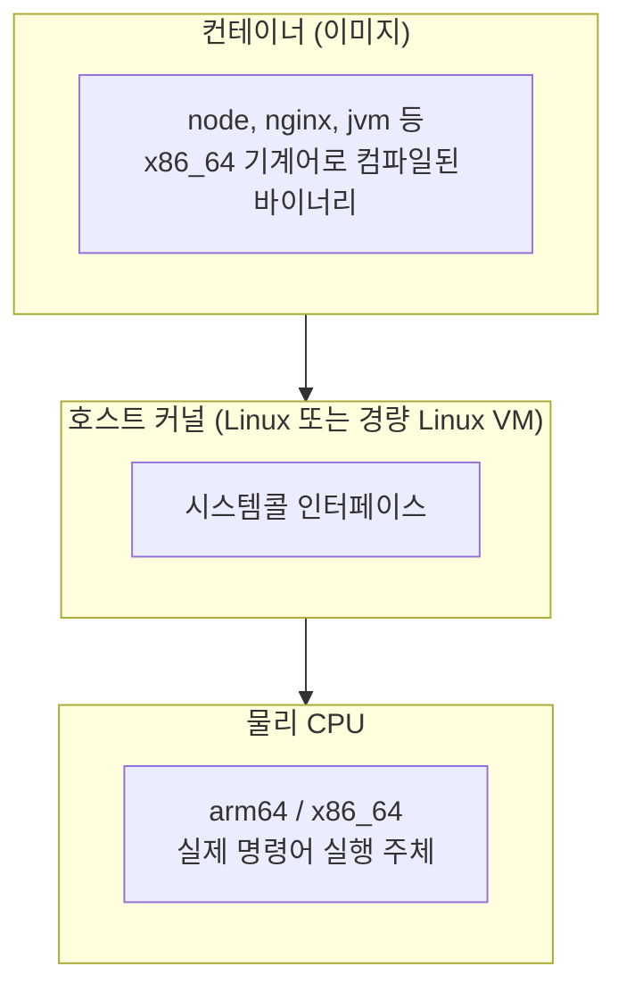
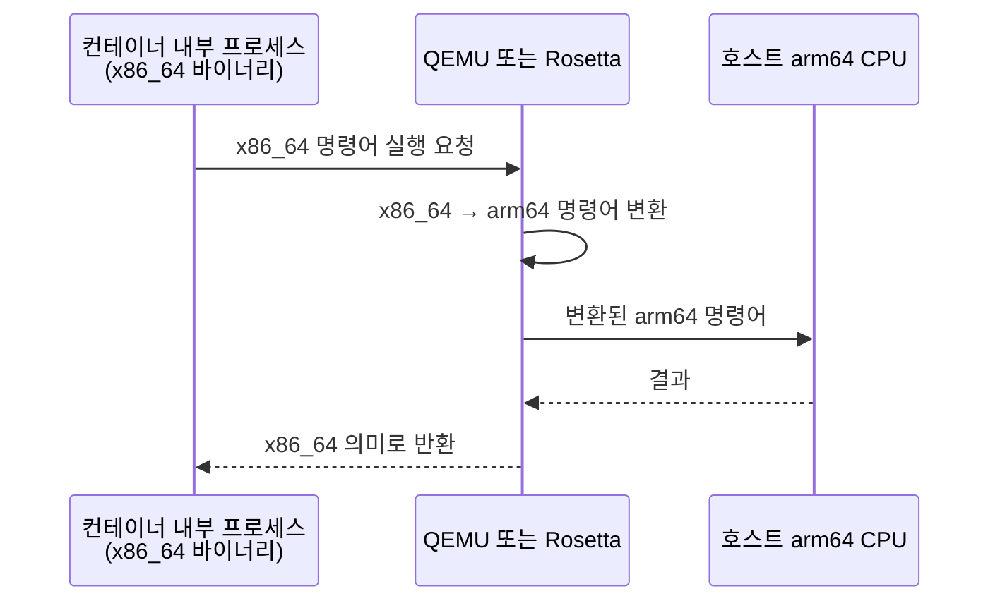

"Docker 이미지는 어디서든 똑같이 돌아간다"는 말을 자주 듣는다. 틀린 말은 아니지만 절반만 맞다. 정확히 말하면 Docker는 **OS 독립**이지 **CPU 아키텍처 독립은 아니다**. 이 차이를 모르면 Apple Silicon Mac에서 "왜 이렇게 느리지?" 하는 순간이 온다.

## 왜 아키텍처에 의존하는가

Docker 컨테이너는 VM이 아니다. 컨테이너는 **호스트 커널을 공유**하고, 이미지 안에는 "유저스페이스 바이너리"만 들어간다.



이미지 빌드 시점에 컴파일러는 특정 타겟 아키텍처용 기계어를 생성한다. 그래서 amd64 이미지 안의 `node` 바이너리는 **x86_64 명령어 시퀀스**로 고정되어 있고, arm64 CPU는 이걸 직접 실행할 수 없다.

## 그런데 macOS(arm64)에서 amd64 이미지가 일단 돌긴 한다

컨테이너 런타임이 뒤에서 **명령어 번역(에뮬레이션)**을 돌리기 때문이다.



QEMU는 명령어를 한 번에 하나씩 해석·번역한다. Rosetta는 translation cache와 AOT 기법이 들어가서 훨씬 빠르다.

## 실측 성능 비교

| 시나리오 | 상대 속도 |
|---|---|
| 네이티브 (arm64 이미지 × arm64 호스트) | 100% |
| Rosetta 에뮬 (amd64 × arm64 Mac) | 60–80% |
| QEMU 에뮬 (amd64 × arm64 Mac) | 10–30% |
| CPU 인텐시브 작업 (빌드 툴체인, JIT) QEMU | **5–10%**, 때때로 사실상 hang |

특히 Vite/esbuild/Webpack 같은 **빌드 도구**는 SIMD, 스레딩, 대량 메모리 할당이 조합된 CPU 인텐시브 작업이라 QEMU 에뮬 경로에서 20배 이상 느려지거나, 극단적으론 특정 명령어 처리 버그로 무한 루프처럼 보이는 증상을 만들기도 한다.

## 확인 방법

이미지 아키텍처:

```bash
docker image inspect <이미지명> --format '{{.Architecture}}/{{.Os}}'
# 예) amd64/linux
```

호스트 아키텍처:

```bash
uname -m
# 예) arm64
```

불일치이면 QEMU(또는 Rosetta)가 개입하고 있다는 뜻이다. `docker run` 시점에 아래 경고가 나오기도 한다.

```
The requested image's platform (linux/amd64) does not match
the detected host platform (linux/arm64/v8)
and no specific platform was requested
```

## 해결 전략

### 1. 정석 — 아키텍처 맞추기

이미지를 직접 빌드하는 경우 `docker buildx`로 호스트용 또는 멀티아키 이미지를 만든다.

```bash
docker buildx build --platform linux/arm64 -t myimg .
docker buildx build --platform linux/amd64,linux/arm64 -t myimg . --push
```

외부 이미지를 쓴다면 공식 이미지 대부분은 멀티아키를 지원한다. `docker pull`은 기본적으로 호스트 아키텍처에 맞는 매니페스트를 자동 선택한다.

### 2. 실용 — Rosetta 경로 사용

Apple Silicon이면 Docker Desktop 설정에서 "Use Rosetta for x86/amd64 emulation"을 켠다. QEMU 대비 수 배 빠르다. 완벽하진 않아도 당장은 체감 차이가 크다.

### 3. 디버깅 — 플랫폼 문제인지 분리 검증

빌드 hang 같은 증상이 라이브러리 조합 문제인지 에뮬레이션 문제인지 가르려면, **네이티브 이미지로 한 번 돌려본다**.

```bash
docker run --rm -it --platform linux/arm64 \
  -v "$PWD:/app" -w /app node:22-alpine \
  sh -c "corepack enable && pnpm install --frozen-lockfile && pnpm build"
```

네이티브에서 성공하면 플랫폼 이슈, 네이티브에서도 실패하면 코드/의존성 이슈.

## 정리

- Docker는 **커널 인터페이스 호환성**으로 OS 간 이식성을 해결한다. 아키텍처까지 해결하지는 않는다.
- 이미지는 빌드 타겟 아키텍처에 묶여 있고, 불일치 환경에선 에뮬레이션이 끼어든다.
- 에뮬레이션은 "돌긴 돈다"지만 CPU 인텐시브 작업에선 체감 10배 이상 느려지거나 기능적으로 깨지기도 한다.
- Apple Silicon에서 amd64 이미지가 필수면 Rosetta 옵션을 켜고, 가능하면 네이티브 이미지를 쓴다.

"Docker니까 어디서든 똑같이 돌겠지"라고 믿고 배포하거나 로컬에서 빌드를 돌리면, 이유를 모르고 하루를 날릴 수 있다. `--platform` 경고가 나오면 반드시 한 번은 멈춰서 확인하는 게 좋다.
