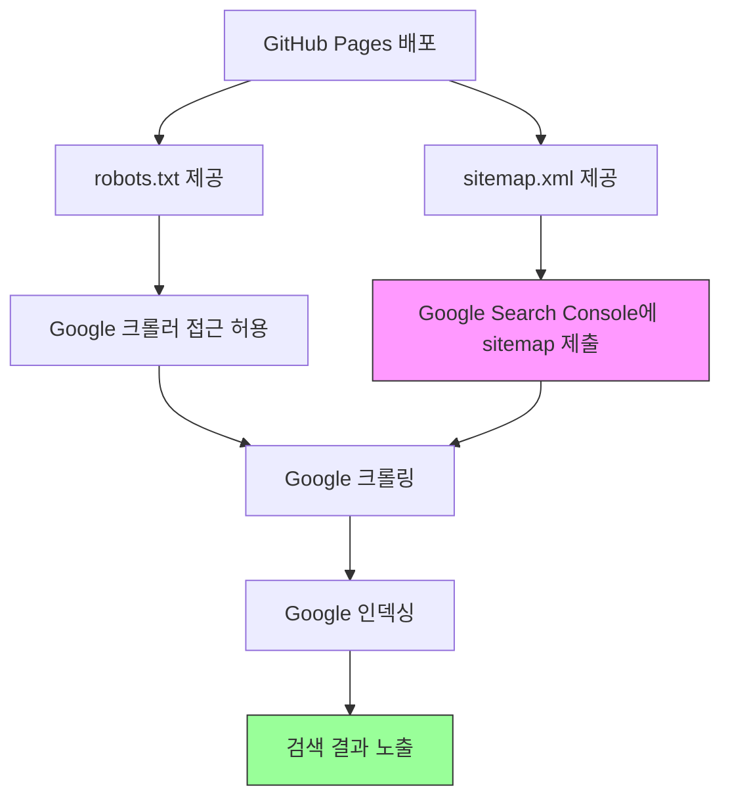

## 배경

GitHub Pages로 배포 중인 Quartz 블로그를 Google 검색에 노출시키고 싶었다.

## 핵심 요소

### 이미 갖춰진 것 (Quartz 기본 설정)
- **sitemap.xml**: `ContentIndex` 플러그인의 `enableSiteMap: true`로 자동 생성
- **RSS 피드**: `enableRSS: true`로 자동 생성
- **OG 메타태그**: `Head.tsx`에서 title, description, image 등 자동 설정
- **description 메타태그**: 각 페이지별 자동 생성

### 추가 필요 사항

#### 1. robots.txt 생성
검색 엔진 크롤러에게 사이트 구조를 안내하는 파일이다.

```
User-agent: *
Allow: /

Sitemap: https://1etterh.github.io/devlog/sitemap.xml
```

Quartz에서는 `ContentIndex` 플러그인의 `contentIndex.tsx`에서 sitemap 생성 로직 뒤에 robots.txt 생성 코드를 추가하면 빌드 시 자동 생성된다.

#### 2. Google Search Console 등록 (가장 중요)
sitemap이 있어도 Google에 직접 알려줘야 크롤링이 시작된다.

1. [Google Search Console](https://search.google.com/search-console) 접속
2. **속성 추가** → `URL 접두어` 방식 → 사이트 URL 입력
3. **소유권 확인** — HTML 메타태그 방식 추천
   - 제공되는 `<meta name="google-site-verification" content="..." />` 코드를 `Head.tsx`에 추가
4. 소유권 확인 후 **Sitemaps** 메뉴에서 `sitemap.xml` URL 제출

## Google 검색 노출 흐름



## 참고
- Search Console 등록 후 실제 검색 노출까지 며칠~몇 주 소요될 수 있음
- `draft: false`인 글은 Quartz의 `RemoveDrafts()` 필터에 의해 빌드에서 제외되므로 검색에도 노출되지 않음
- 개별 페이지 색인 요청은 Search Console의 **URL 검사** 도구에서 가능
