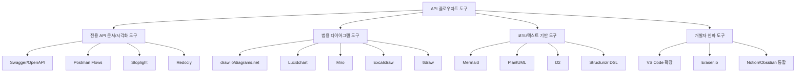
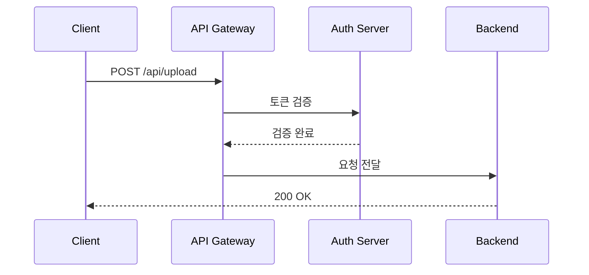
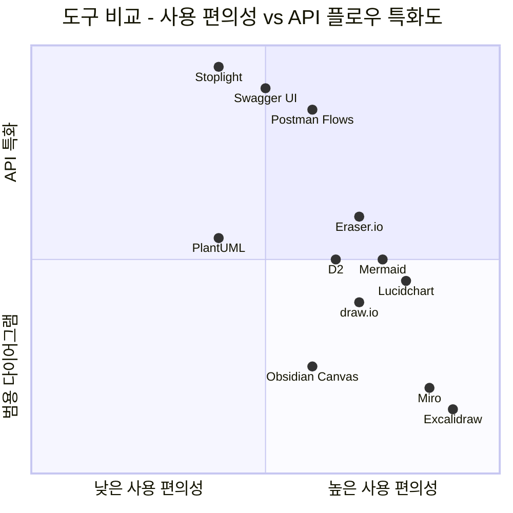

## 개요

API 플로우차트를 깔끔하게 정리하기 위한 도구들을 4가지 카테고리로 분류하여 비교 분석한다. 현재 Obsidian Canvas(.canvas) 포맷을 사용 중인 상황에서, 더 나은 대안이 있는지 탐색한다.

---

## 1. 전용 API 문서/시각화 도구

### 1-1. Swagger UI / OpenAPI Visualization

**설명**: OpenAPI(Swagger) 스펙을 기반으로 API를 시각화하고 테스트할 수 있는 표준 도구

| 항목 | 내용 |
|------|------|
| **장점** | - OpenAPI 표준 기반으로 업계 표준 - 자동 문서 생성 - Try-it-out 기능으로 즉시 테스트 가능 - Spring Boot, Express 등 대부분 프레임워크와 연동 |
| **단점** | - API 흐름(flow) 시각화보다는 개별 엔드포인트 문서화에 특화 - 복잡한 비즈니스 플로우 표현에 한계 - 커스텀 다이어그램 불가 |
| **가격** | 오픈소스 무료 (SwaggerHub Pro: $75/월~) |
| **포맷** | OpenAPI JSON/YAML 임포트/익스포트 |
| **최적 용도** | 개별 API 엔드포인트 문서화 및 테스트 |

### 1-2. Postman Flows

**설명**: Postman 내장 시각적 API 워크플로우 빌더. 여러 API 호출을 연결하여 플로우 구성 가능

| 항목 | 내용 |
|------|------|
| **장점** | - 드래그 앤 드롭으로 API 호출 흐름 구성 - 실제 API를 실행하면서 플로우 테스트 가능 - Postman 컬렉션과 직접 연동 - 조건 분기, 반복 등 로직 표현 가능 |
| **단점** | - Postman 생태계에 종속 - 정적 문서용 다이어그램으로는 부적합 - 무료 플랜 제한 있음 - 이미지 익스포트 제한적 |
| **가격** | 무료 (기본), Pro: $14/월 |
| **포맷** | Postman Collection JSON, 이미지 익스포트 제한적 |
| **최적 용도** | API 호출 체인을 실행 가능한 형태로 시각화할 때 |

### 1-3. Stoplight Studio

**설명**: API 설계 우선(Design-first) 접근의 시각적 OpenAPI 편집기

| 항목 | 내용 |
|------|------|
| **장점** | - GUI로 OpenAPI 스펙 편집 가능 - Mock 서버 자동 생성 - Git 연동 지원 - API 거버넌스(Spectral 린트) 내장 |
| **단점** | - 플로우차트 도구라기보다 API 설계 도구 - 학습 곡선 존재 - 유료 플랜이 비쌈 |
| **가격** | 무료(커뮤니티), Pro: $99/월~ |
| **포맷** | OpenAPI YAML/JSON, Git 연동 |
| **최적 용도** | API 스펙 설계 및 팀 협업 |

### 1-4. Redocly

**설명**: OpenAPI 기반의 고품질 API 문서 생성기. 깔끔한 3-패널 레이아웃으로 유명

| 항목 | 내용 |
|------|------|
| **장점** | - 매우 깔끔한 API 문서 렌더링 - CLI 도구로 CI/CD 파이프라인 통합 용이 - OpenAPI 린팅 기능 내장 - SSG(정적 사이트 생성) 지원 |
| **단점** | - 플로우차트/다이어그램 도구가 아님 - API 레퍼런스 문서 특화 - 흐름 시각화는 별도 도구 필요 |
| **가격** | 오픈소스(Redoc) 무료, Redocly Pro: 유료 |
| **포맷** | OpenAPI YAML/JSON |
| **최적 용도** | 아름다운 API 레퍼런스 문서 퍼블리싱 |

---

## 2. 범용 다이어그램 도구

### 2-1. draw.io (diagrams.net)

**설명**: 가장 널리 쓰이는 무료 웹 기반 다이어그램 도구

| 항목 | 내용 |
|------|------|
| **장점** | - 완전 무료, 오프라인 데스크톱 앱 지원 - 풍부한 API/네트워크 관련 도형 라이브러리 - VS Code 확장 존재 - Google Drive, OneDrive, GitHub 연동 - 다양한 포맷 임포트/익스포트(SVG, PNG, PDF, XML, Visio) |
| **단점** | - UI가 다소 올드한 느낌 - 실시간 협업은 제한적 - 대규모 다이어그램에서 성능 저하 |
| **가격** | **완전 무료** |
| **포맷** | XML(.drawio), SVG, PNG, PDF, Visio(.vsdx) 임포트/익스포트 |
| **최적 용도** | 무료로 상세한 API 플로우차트를 만들고 싶을 때 |

### 2-2. Lucidchart

**설명**: 전문적인 웹 기반 다이어그램/플로우차트 도구. 기업 환경에서 많이 사용

| 항목 | 내용 |
|------|------|
| **장점** | - 매우 세련된 UI와 사용 경험 - 실시간 팀 협업 우수 - 풍부한 템플릿(API 시퀀스, REST flow 등) - Confluence, Jira, Slack 연동 - 자동 레이아웃 기능 |
| **단점** | - 무료 플랜 매우 제한적(3개 문서, 60개 도형) - 유료 비용이 높은 편 - 오프라인 사용 불가 |
| **가격** | 무료(제한적), Individual: $7.95/월, Team: $9/월/인 |
| **포맷** | Visio, draw.io, PNG, SVG, PDF 임포트/익스포트 |
| **최적 용도** | 팀 협업이 중요한 프로페셔널 다이어그램 |

### 2-3. Miro

**설명**: 화이트보드 기반 협업 플랫폼. 다이어그램, 마인드맵, 플로우차트 등 다목적

| 항목 | 내용 |
|------|------|
| **장점** | - 무한 캔버스로 자유로운 배치 - 실시간 협업 최고 수준 - 다이어그램 외 브레인스토밍, 회고 등 다목적 - 풍부한 통합(Jira, Slack, Figma 등) |
| **단점** | - 전문 다이어그램 도구보다 정밀도 낮음 - API 특화 도형/템플릿 부족 - 무료 플랜 보드 3개 제한 - 복잡한 플로우차트에는 비효율적 |
| **가격** | 무료(3보드), Starter: $8/월/인 |
| **포맷** | PNG, SVG, PDF 익스포트 (임포트 제한적) |
| **최적 용도** | 팀 브레인스토밍 + 간단한 플로우 정리 |

### 2-4. Excalidraw

**설명**: 손그림 스타일의 오픈소스 화이트보드 도구. Obsidian 플러그인 존재

| 항목 | 내용 |
|------|------|
| **장점** | - 오픈소스 무료 - 손그림 스타일이 친근하고 깔끔 - Obsidian 플러그인으로 볼트 내 사용 가능 - 가볍고 빠른 로딩 - 실시간 협업 지원 |
| **단점** | - 정밀한 기술 다이어그램에는 부적합 - 도형 라이브러리가 제한적 - 자동 레이아웃 없음 - 복잡한 플로우에서 수동 정렬 필요 |
| **가격** | **완전 무료** (오픈소스) |
| **포맷** | PNG, SVG, JSON(.excalidraw) 익스포트 |
| **최적 용도** | 빠른 스케치, 개인 노트에 간단한 다이어그램 포함 |

### 2-5. tldraw

**설명**: Excalidraw와 유사한 무료 오픈소스 화이트보드. 더 깔끔한 UI가 특징

| 항목 | 내용 |
|------|------|
| **장점** | - 오픈소스 무료 - 매우 직관적인 UI - 컴포넌트 라이브러리로 임베드 가능 - 실시간 협업 지원 |
| **단점** | - API 다이어그램 특화 기능 없음 - 생태계가 Excalidraw보다 작음 - Obsidian 연동 약함 |
| **가격** | **완전 무료** (오픈소스) |
| **포맷** | PNG, SVG, JSON 익스포트 |
| **최적 용도** | 간단한 스케치와 빠른 다이어그램 |

---

## 3. 코드/텍스트 기반 다이어그램 도구

### 3-1. Mermaid

**설명**: 마크다운 친화적인 텍스트 기반 다이어그램 생성 도구. GitHub, Obsidian 네이티브 지원

| 항목 | 내용 |
|------|------|
| **장점** | - 마크다운 안에 인라인으로 작성 가능 - GitHub, GitLab, Obsidian, Notion 네이티브 렌더링 - Git으로 버전 관리 용이 (텍스트 기반) - 학습 곡선 낮음 - flowchart, sequenceDiagram, classDiagram 등 다양한 타입 |
| **단점** | - 복잡한 레이아웃 세밀 조정 어려움 - 자동 레이아웃에 의존 (수동 배치 불가) - 대규모 다이어그램에서 가독성 저하 - 스타일 커스텀 제한적 |
| **가격** | **완전 무료** (오픈소스) |
| **포맷** | 텍스트 → SVG/PNG 렌더링, Mermaid CLI로 이미지 변환 |
| **최적 용도** | Obsidian/GitHub에서 API 흐름을 문서와 함께 관리할 때 |

### 3-2. PlantUML

**설명**: Java 기반의 텍스트-to-다이어그램 도구. 시퀀스 다이어그램에 특히 강력

| 항목 | 내용 |
|------|------|
| **장점** | - 시퀀스 다이어그램 업계 표준급 - 매우 풍부한 다이어그램 타입 (20종 이상) - 상세한 스타일링 가능 - VS Code, IntelliJ 플러그인 존재 - 서버 호스팅 또는 로컬 렌더링 선택 가능 |
| **단점** | - Java/Graphviz 의존성 필요 (로컬 실행 시) - 문법이 Mermaid보다 복잡 - GitHub/Obsidian 네이티브 지원 없음 (플러그인 필요) - 렌더링 속도가 느릴 수 있음 |
| **가격** | **완전 무료** (오픈소스) |
| **포맷** | 텍스트 → PNG, SVG, EPS, PDF |
| **최적 용도** | 상세한 시퀀스 다이어그램, 복잡한 시스템 아키텍처 |

### 3-3. D2 (Declarative Diagramming)

**설명**: 2023년 등장한 모던 텍스트-to-다이어그램 언어. 깔끔한 렌더링이 특징

| 항목 | 내용 |
|------|------|
| **장점** | - 문법이 매우 직관적이고 깔끔 - 다양한 레이아웃 엔진 선택 가능 (dagre, elk, tala) - 아름다운 기본 테마 - 컨테이너(그룹핑) 지원 우수 - Watch 모드로 실시간 미리보기 - Go 기반으로 빠른 렌더링 |
| **단점** | - 비교적 신생 도구로 생태계 작음 - Obsidian/GitHub 네이티브 지원 없음 - TALA 레이아웃은 유료 - 커뮤니티 규모 작음 |
| **가격** | 무료 (오픈소스), TALA 레이아웃 엔진은 유료 |
| **포맷** | 텍스트 → SVG, PNG, PDF |
| **최적 용도** | 깔끔하고 모던한 아키텍처/플로우 다이어그램 |

### 3-4. Structurizr DSL

**설명**: C4 모델 기반의 소프트웨어 아키텍처 다이어그램 전문 도구

| 항목 | 내용 |
|------|------|
| **장점** | - C4 모델(Context, Container, Component, Code) 전문 - 시스템 아키텍처 문서화에 최적 - 하나의 DSL로 여러 뷰 생성 가능 - PlantUML, Mermaid로 익스포트 가능 |
| **단점** | - API 플로우차트 용도로는 과도한 도구 - C4 모델 이해 필요 - 학습 곡선 높음 |
| **가격** | 무료 (오픈소스 Lite), 클라우드: $5/월~ |
| **포맷** | DSL → PlantUML, Mermaid, draw.io, PNG 익스포트 |
| **최적 용도** | C4 모델 기반 시스템 아키텍처 문서화 |

---

## 4. 개발자 친화 도구

### 4-1. VS Code 확장 조합

| 확장 | 설명 | 가격 |
|------|------|------|
| **Draw.io Integration** | VS Code 내에서 .drawio 파일 편집 | 무료 |
| **Mermaid Preview** | Mermaid 다이어그램 실시간 미리보기 | 무료 |
| **PlantUML** | PlantUML 실시간 미리보기 + 익스포트 | 무료 |
| **D2** | D2 다이어그램 미리보기 | 무료 |

**장점**: 코드 에디터를 떠나지 않고 다이어그램 작성, Git 버전 관리 자연스러움
**단점**: 각 도구의 개별 단점 상속, 통합 경험은 전용 도구보다 떨어짐

### 4-2. Eraser.io

**설명**: 개발자를 위한 기술 다이어그램 + 문서 협업 도구

| 항목 | 내용 |
|------|------|
| **장점** | - 개발자 UX에 최적화 - 다이어그램 + 문서를 하나의 캔버스에서 관리 - AI 기반 다이어그램 자동 생성 - 코드에서 다이어그램 자동 추출 - 깔끔한 디자인 |
| **단점** | - 비교적 신생 서비스 - 무료 플랜 제한 - 오프라인 사용 불가 |
| **가격** | 무료(제한), Pro: $10/월 |
| **포맷** | PNG, SVG 익스포트, 코드 임포트 |
| **최적 용도** | 기술 문서와 다이어그램을 함께 관리하는 개발팀 |

### 4-3. Obsidian Canvas (현재 사용 중)

| 항목 | 내용 |
|------|------|
| **장점** | - Obsidian 볼트 내 통합 관리 - 마크다운 노트를 카드로 배치 가능 - 연결선으로 흐름 표현 - 로컬 저장, 프라이버시 우수 |
| **단점** | - 이미지/PDF 익스포트 불편 - 도형 종류 제한적 - 자동 레이아웃 없음 - 협업 기능 없음 - .canvas 포맷이 다른 도구와 호환 안 됨 |
| **가격** | **무료** (Obsidian 내장) |
| **포맷** | .canvas (JSON), 익스포트 제한적 |
| **최적 용도** | 개인 노트와 연결된 간단한 플로우 정리 |

---

## 종합 비교표

| 도구 | 가격 | API 특화 | 텍스트 기반 | Git 친화 | Obsidian 연동 | 협업 | 익스포트 |
|------|------|----------|-------------|----------|---------------|------|----------|
| Swagger UI | 무료 | ★★★★★ | ✅ (YAML) | ★★★★★ | ✗ | ★★☆ | ★★★ |
| Postman Flows | 무료~ | ★★★★☆ | ✗ | ★★☆ | ✗ | ★★★ | ★★☆ |
| draw.io | **무료** | ★★★☆☆ | ✗ | ★★★☆ | ✗ | ★★☆ | ★★★★★ |
| Lucidchart | 유료 | ★★★☆☆ | ✗ | ★★☆ | ✗ | ★★★★★ | ★★★★☆ |
| Miro | 유료 | ★★☆☆☆ | ✗ | ★☆☆ | ✗ | ★★★★★ | ★★★☆☆ |
| Excalidraw | **무료** | ★★☆☆☆ | ✗ | ★★★☆ | ✅ | ★★★★ | ★★★☆☆ |
| **Mermaid** | **무료** | ★★★☆☆ | ✅ | ★★★★★ | ✅ (네이티브) | ★★☆ | ★★★★ |
| PlantUML | **무료** | ★★★★☆ | ✅ | ★★★★★ | 플러그인 | ★★☆ | ★★★★ |
| D2 | **무료** | ★★★☆☆ | ✅ | ★★★★★ | ✗ | ★★☆ | ★★★★ |
| Eraser.io | 무료~ | ★★★★☆ | 부분 | ★★★☆ | ✗ | ★★★★ | ★★★☆ |
| Obsidian Canvas | **무료** | ★★☆☆☆ | ✗ | ★★★☆ | ✅ | ✗ | ★☆☆ |

---

## 추천 조합 (상황별)

### 시나리오 1: Obsidian 생태계 유지하면서 개선
> **Mermaid (Obsidian 네이티브) + Excalidraw (플러그인)**

- Mermaid: 시퀀스 다이어그램, 플로우차트 등 구조화된 다이어그램
- Excalidraw: 자유로운 스케치, 아키텍처 개요도
- 둘 다 Obsidian 볼트 내에서 관리 가능
- Git 버전 관리 자연스러움

### 시나리오 2: 전문적인 API 문서화가 필요한 경우
> **Swagger/OpenAPI + draw.io**

- Swagger: API 엔드포인트 레퍼런스 문서
- draw.io: 비즈니스 플로우, 시퀀스 다이어그램 (무료)
- VS Code 확장으로 draw.io 편집 가능

### 시나리오 3: 코드로 관리하며 깔끔한 결과물 원하는 경우
> **D2 + Mermaid**

- D2: 복잡한 아키텍처 다이어그램 (뛰어난 렌더링 품질)
- Mermaid: 간단한 플로우, GitHub/문서 내 인라인 다이어그램
- 둘 다 텍스트 기반이라 Git diff 가능

### 시나리오 4: 팀 협업이 핵심인 경우
> **Lucidchart 또는 Eraser.io**

- 실시간 협업, 코멘트, 버전 히스토리
- 비용 발생하지만 팀 생산성 향상

---

## 결론

현재 Obsidian Canvas를 사용 중이라면, 가장 자연스러운 업그레이드 경로는 **Mermaid 활용 확대**이다. Obsidian에서 네이티브로 렌더링되고, 텍스트 기반이라 Git 관리가 용이하며, GitHub/블로그에서도 그대로 표시된다.

더 복잡하고 세밀한 다이어그램이 필요하다면 **draw.io**(무료, VS Code 연동) 또는 **D2**(모던하고 깔끔한 렌더링)를 병행하는 것을 추천한다.
