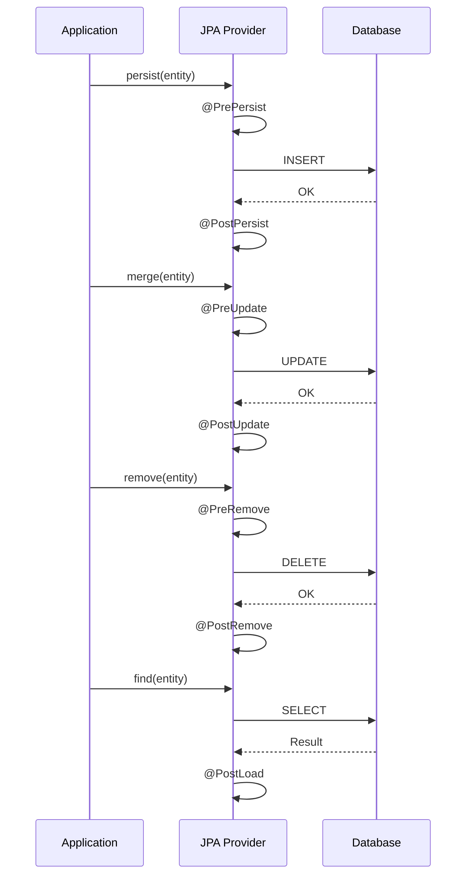

## EntityListener란

JPA 엔티티의 라이프사이클 이벤트(persist, update, remove, load)에 콜백을 걸 수 있는 메커니즘이다.

## 사용 가능한 어노테이션



| 어노테이션 | 시점 |
|---|---|
| `@PrePersist` | INSERT 전 |
| `@PostPersist` | INSERT 후 |
| `@PreUpdate` | UPDATE 전 |
| `@PostUpdate` | UPDATE 후 |
| `@PreRemove` | DELETE 전 |
| `@PostRemove` | DELETE 후 |
| `@PostLoad` | SELECT 후 |

## 사용 방식

### 1. 엔티티 내부에 직접 정의

```java
@Entity
public class Deploy {
    private LocalDateTime regDt;

    @PrePersist
    public void prePersist() {
        this.regDt = LocalDateTime.now();
    }
}
```

### 2. 별도 리스너 클래스 분리

```java
public class AuditListener {
    @PrePersist
    public void onPrePersist(Object entity) {
        if (entity instanceof Auditable a) {
            a.setRegDt(LocalDateTime.now());
        }
    }

    @PreUpdate
    public void onPreUpdate(Object entity) {
        if (entity instanceof Auditable a) {
            a.setModDt(LocalDateTime.now());
        }
    }
}

@Entity
@EntityListeners(AuditListener.class)
public class Deploy implements Auditable {
    // ...
}
```

## 대표적 활용 사례

### Auditing (가장 흔한 사용)

`regDt`, `modDt`, `regId`, `modId`를 자동 세팅한다. Spring Data JPA의 `@CreatedDate`, `@LastModifiedDate`가 내부적으로 EntityListener를 사용한다.

```java
@EntityListeners(AuditingEntityListener.class)
public class BaseEntity {
    @CreatedDate
    private LocalDateTime regDt;

    @LastModifiedDate
    private LocalDateTime modDt;
}
```

### 이력 저장

엔티티 변경 시 자동으로 history 테이블에 기록할 수 있다.

```java
public class DeployUserHistoryListener {
    @PostUpdate
    public void onUpdate(DeployUser du) {
        // history 테이블에 자동 기록
    }
}
```

단, 조건부 이력 저장(특정 상태 전환 시에만)이 필요한 경우에는 리스너보다 서비스 레이어에서 명시적으로 호출하는 것이 적합하다.

## 주의 사항

- `@PrePersist`, `@PreUpdate`에서 예외를 던지면 트랜잭션이 롤백된다
- EntityListener에서 다른 엔티티를 조회/수정하면 무한 루프 위험이 있다
- Spring Bean 주입이 기본적으로 안 되므로, `ApplicationContext`를 통해 수동 주입해야 한다
