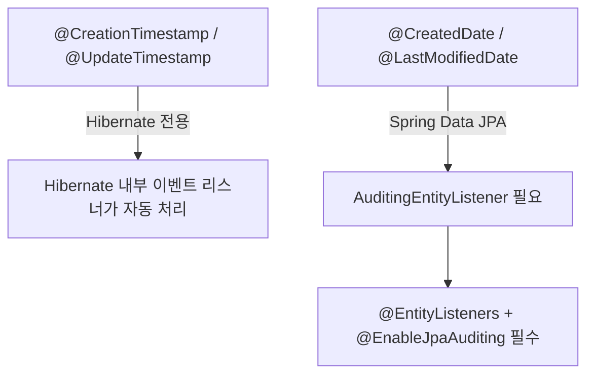

## 질문

`@CreationTimestamp`, `@UpdateTimestamp`는 `@EntityListeners` 없이도 동작하는가?

## 답변

둘 다 내부적으로 리스너 메커니즘을 사용한다. 차이는 누가 리스너를 등록하느냐이다.

## 동작 원리 비교



### Hibernate 전용: @CreationTimestamp / @UpdateTimestamp

```java
@Entity
public class Deploy {
    @CreationTimestamp
    private LocalDateTime regDt;    // INSERT 시 자동 세팅

    @UpdateTimestamp
    private LocalDateTime modDt;    // UPDATE 시 자동 세팅
}
```

- Hibernate가 `PreInsertEventListener`, `PreUpdateEventListener`를 내부적으로 등록
- 별도 설정 불필요, 선언만 하면 동작
- `org.hibernate.annotations` 패키지 소속

### Spring Data JPA: @CreatedDate / @LastModifiedDate

```java
@EntityListeners(AuditingEntityListener.class)  // 필수
@Entity
public class Deploy {
    @CreatedDate
    private LocalDateTime regDt;

    @LastModifiedDate
    private LocalDateTime modDt;
}
```

```java
@EnableJpaAuditing  // 필수
@Configuration
public class JpaConfig {}
```

- `@EntityListeners` 명시 + `@EnableJpaAuditing` 활성화 필수
- `org.springframework.data.annotation` 패키지 소속

## 상세 비교

| | `@CreationTimestamp` | `@CreatedDate` |
|---|---|---|
| 소속 | Hibernate | Spring Data JPA |
| 설정 | 없음 | `@EntityListeners` + `@EnableJpaAuditing` |
| `regId` 자동 세팅 | 불가 | `@CreatedBy` + `AuditorAware` 구현으로 가능 |
| JPA 구현체 종속 | Hibernate에만 동작 | 표준 JPA 스펙 기반 |
| 커스텀 확장 | 제한적 | `AuditorAware`로 사용자 정보까지 자동 주입 가능 |

## 결론

`@CreationTimestamp`는 Hibernate가 알아서 리스너를 등록하므로 개발자가 신경 쓸 게 없다. `@CreatedDate`는 개발자가 명시적으로 리스너를 선언해야 하지만, `@CreatedBy`를 통한 사용자 ID 자동 주입 등 확장성이 더 좋다.
