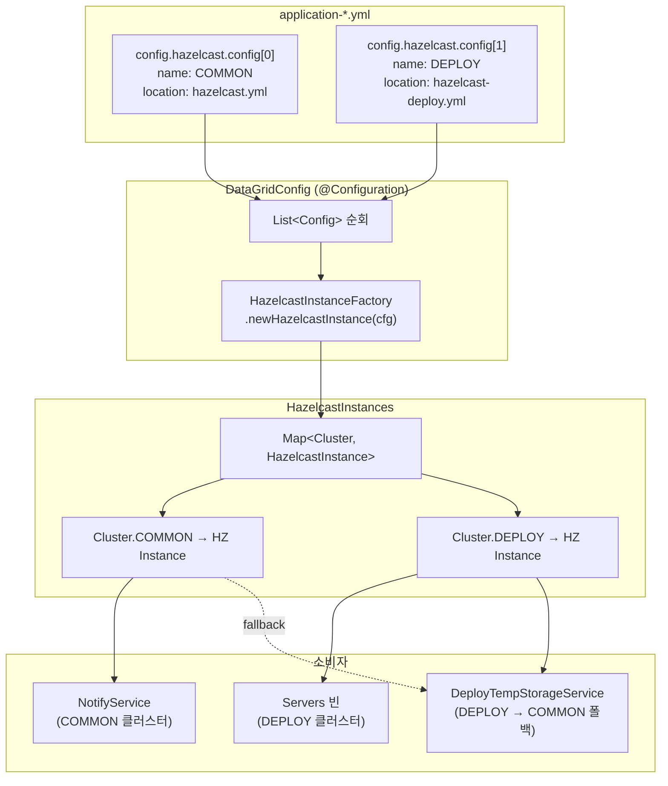

## 개요

하나의 Spring 애플리케이션에서 **용도별로 Hazelcast 인스턴스를 분리**해서 관리하는 구조를 정리한다. `Cluster` enum으로 인스턴스를 구분하고, `@ConfigurationProperties`로 yml 설정을 리스트 형태로 바인딩하는 패턴이다.

## 전체 아키텍처



## 핵심 구조

### 1. Cluster enum — 인스턴스 식별자

```java
public enum Cluster {
    COMMON, DEPLOY
}
```

단순 enum이지만, yml의 `name` 필드와 1:1 매핑되어 Hazelcast 인스턴스를 식별하는 키 역할을 한다.

### 2. DataGridConfig — 인스턴스 생성 및 등록

```java
@ConfigurationProperties(prefix = "config.hazelcast")
@Configuration
public class DataGridConfig {

    @Setter
    private List<Config> config;  // yml 리스트 바인딩

    @Bean
    public HazelcastInstances hazelcastInstances() {
        Map<Cluster, HazelcastInstance> map = new HashMap<>();
        for (Config c : config) {
            map.put(Cluster.valueOf(c.name), newInstance(c.name, c.location));
        }
        return new HazelcastInstances(map);
    }

    private static class Config {
        private String name;      // "COMMON" or "DEPLOY"
        private String location;  // "config/hazelcast.yml"
    }
}
```

**포인트**: `@ConfigurationProperties`가 yml의 리스트를 `List<Config>`로 바인딩한다. 각 항목마다 별도의 `HazelcastInstance`를 생성해서 `Map`에 넣는다.

### 3. HazelcastInstances — 래퍼 클래스

```java
public class HazelcastInstances {
    private Map<Cluster, HazelcastInstance> map;

    public HazelcastInstance get(Cluster name) {
        return map.get(name);
    }
}
```

단순 `Map` 래퍼. `get(Cluster.DEPLOY)`로 용도별 인스턴스를 꺼낸다.

### 4. 소비자 측 — 폴백 패턴

```java
// DeployTempStorageService
private IMap<String, DeployTempData> getStagingMap() {
    HazelcastInstance hz = hazelcastInstances.get(Cluster.DEPLOY);
    if (hz == null) {
        hz = hazelcastInstances.get(Cluster.COMMON);  // fallback
    }
    return hz.getMap(IMAP_NAME);
}
```

DEPLOY 인스턴스가 없는 환경(개발/로컬)에서는 COMMON으로 폴백한다.

## yml 설정 — 리스트 vs 문자열 주의

### 올바른 형식 (리스트)

```yaml
config:
  hazelcast:
    config:
      - name: COMMON
        location: config/hazelcast.yml
      - name: DEPLOY
        location: config/hazelcast-deploy.yml
```

### 잘못된 형식 (문자열)

```yaml
config:
  hazelcast:
    config: config/hazelcast.yml   # ❌ List<Config>에 바인딩 불가
```

`@ConfigurationProperties`는 타입에 맞게 바인딩하므로, `List<Config>`에 단순 문자열을 넣으면 파싱이 실패하거나 빈 리스트가 된다.

## DEPLOY 인스턴스 추가 방법

DEPLOY 전용 클러스터가 필요한 경우:

1. **별도 hazelcast yml 생성** (`config/hazelcast-deploy.yml`):
   ```yaml
   hazelcast:
     cluster-name: deploy-cluster   # COMMON과 다른 이름
     network:
       port:
         port: 23904               # COMMON과 다른 포트
   ```

2. **application yml에 항목 추가**:
   ```yaml
   config:
     hazelcast:
       config:
         - name: COMMON
           location: config/hazelcast.yml
         - name: DEPLOY
           location: config/hazelcast-deploy.yml
   ```

3. 별도 클러스터가 불필요하면 현재처럼 **COMMON 폴백으로 충분**하다.

## 정리

| 구성 요소 | 역할 |
|-----------|------|
| `Cluster` enum | 인스턴스 식별 키 |
| `DataGridConfig` | yml → `HazelcastInstance` 생성 + `Map` 등록 |
| `HazelcastInstances` | `Map<Cluster, HI>` 래퍼, Bean으로 주입 |
| yml `config` 리스트 | 클러스터별 이름 + hazelcast 설정 파일 경로 |
| 소비자 서비스 | `get(Cluster.XXX)`로 인스턴스 꺼내 사용, 필요시 폴백 |
