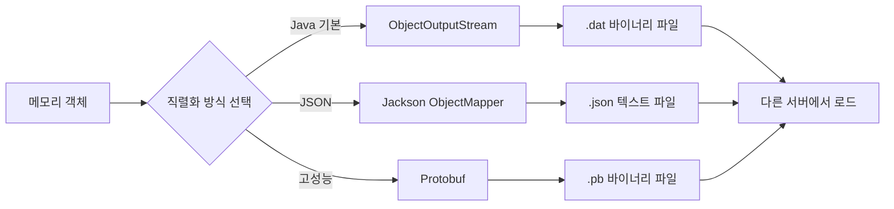

## 개요

Java에서 메모리에 있는 객체(`List<User>` 등)를 파일로 저장하고, 다른 서버에서 그대로 복원하는 3가지 방법을 비교한다.

## 1. Java Serialization (기본 내장)

`Serializable` 인터페이스를 구현하면 `ObjectOutputStream`/`ObjectInputStream`으로 객체를 바이너리 파일로 저장/로드할 수 있다.

```java
public class User implements Serializable {
    private static final long serialVersionUID = 1L;
    private String name;
    private int age;
}
```

```java
// 저장
try (ObjectOutputStream oos = new ObjectOutputStream(new FileOutputStream("users.dat"))) {
    oos.writeObject(users);
}

// 로드
try (ObjectInputStream ois = new ObjectInputStream(new FileInputStream("users.dat"))) {
    List<User> users = (List<User>) ois.readObject();
}
```

### 파일 확장자
확장자는 아무거나 상관없다. Java 직렬화는 확장자가 아닌 **매직 바이트(`0xACED 0005`)**로 직렬화 파일을 인식한다.

| 확장자 | 의미 |
|--------|------|
| `.ser` | serialized — 가장 흔한 관례 |
| `.dat` | data — 범용 바이너리 |
| `.bin` | binary |
| `.obj` | object |

### File 필드 직렬화 시 주의

`java.io.File`은 `Serializable`이지만, 내부적으로 `String path`만 보유한다. 직렬화 시 **경로 문자열만 저장**되고 파일 내용은 포함되지 않는다.

| 필드 타입 | 직렬화 시 저장되는 것 |
|-----------|---------------------|
| `File` | 경로 문자열만 (`"/data/a.pdf"`) |
| `byte[]` | 파일 내용 전체 (바이너리) |
| `InputStream` | 직렬화 불가 (`NotSerializableException`) |
| `transient File` | 무시됨 (null로 복원) |

파일 내용까지 포함하려면 `byte[]`로 변환하거나, 대용량이면 파일은 별도 전송(SCP, S3)하고 메타데이터만 직렬화하는 것이 일반적이다.

### 주의점
- 양쪽 서버에 **동일한 클래스**(같은 패키지, 같은 `serialVersionUID`)가 필요
- 필드 변경 시 역직렬화 실패 가능
- **보안 취약점** 존재 (신뢰할 수 없는 데이터 역직렬화 위험)

## 2. JSON (Jackson) — 추천

```java
ObjectMapper mapper = new ObjectMapper();

// 저장
mapper.writeValue(new File("users.json"), users);

// 로드
List<User> users = mapper.readValue(
    new File("users.json"),
    new TypeReference<List<User>>() {}
);
```

- 사람이 읽을 수 있는 텍스트 포맷
- 필드 추가/삭제에 유연
- 언어 무관 (Python, JS 등에서도 읽기 가능)
- Spring 프로젝트라면 이미 Jackson 의존성이 존재

## 3. Protocol Buffers (대용량/고성능)

Google Protobuf로 `.proto` 스키마를 정의하고 바이너리 직렬화한다. JSON보다 크기가 작고 빠르지만, 스키마 파일 관리가 필요하다.

## 비교표

| 항목 | Java 직렬화 | JSON (Jackson) | Protobuf |
|------|------------|----------------|----------|
| 가독성 | ✗ 바이너리 | ✓ 텍스트 | ✗ 바이너리 |
| 크기 | 큼 | 중간 | 작음 |
| 속도 | 보통 | 보통 | 빠름 |
| 타 언어 호환 | ✗ Java only | ✓ 전부 | ✓ 전부 |
| 필드 변경 유연성 | ✗ 깨지기 쉬움 | ✓ 유연 | ✓ 유연 |
| 보안 | ✗ 취약 | ✓ 안전 | ✓ 안전 |

## 결론

특별한 이유가 없으면 **Jackson JSON** 방식을 추천한다. Spring Boot 프로젝트에서는 이미 Jackson이 포함되어 있어 별도 의존성 추가 없이 바로 사용 가능하다.


