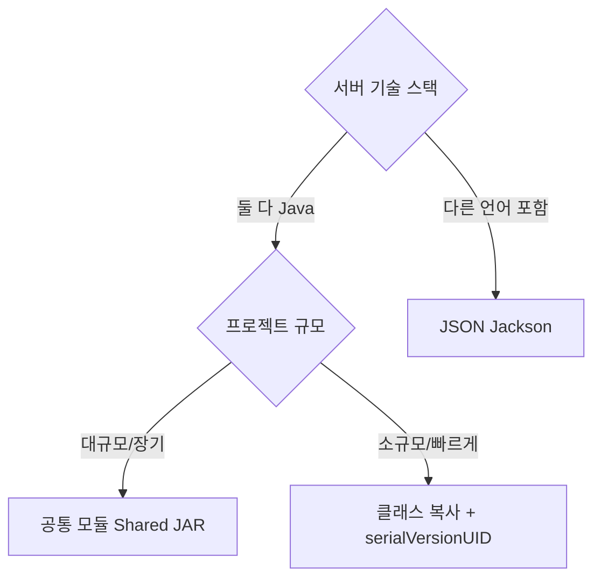

## 개요

Java 직렬화(`ObjectOutputStream`/`ObjectInputStream`)를 사용할 때, 직렬화하는 서버와 역직렬화하는 서버가 다르면 클래스 구조를 맞춰야 한다. 3가지 방법을 비교한다.

## 1. 공통 모듈 (Shared JAR) — 가장 일반적

DTO 클래스를 별도 모듈로 분리하여 양쪽 서버가 의존하게 한다.

```
project-root/
├── deploy-common/           ← 공통 모듈 (DTO만)
│   └── dto/
│       ├── DeployUploadDto.java
│       └── DeployUserDto.java
├── server-a/                ← 직렬화 서버
│   └── build.gradle → implementation project(':deploy-common')
└── server-b/                ← 역직렬화 서버
    └── build.gradle → implementation project(':deploy-common')
```

- 컴파일 타임에 불일치 감지 가능
- 모듈 간 버전 동기화 필요

## 2. JSON (Jackson)

Java 직렬화 대신 JSON으로 주고받으면 클래스 구조가 정확히 일치하지 않아도 동작한다.

```java
// 모르는 필드 무시 → 필드 추가/삭제에 유연
@JsonIgnoreProperties(ignoreUnknown = true)
public class DeployUploadDto { ... }
```

- 언어 무관 (Python, JS 등에서도 읽기 가능)
- 필드 변경에 유연
- Java 직렬화보다 느리고 큼

## 3. 클래스 복사

양쪽 서버에 동일한 클래스를 복사한다.

반드시 일치해야 하는 것:

- 패키지명 (`com.example.dto`)
- `serialVersionUID`
- 필드명, 필드 타입

한쪽만 수정하면 `InvalidClassException` 발생.

## 비교표

| 기준              | 공통 모듈   | JSON      | 클래스 복사 |
| ----------------- | ----------- | --------- | ----------- |
| 구조 동기화 보장  | 컴파일 타임 | 느슨      | 수동        |
| 필드 추가 시 호환 | 재배포 필요 | 자동 무시 | 깨짐        |
| 다른 언어 호환    | Java only   | 전부      | Java only   |
| 성능              | 빠름        | 보통      | 빠름        |

## 추천

- **같은 Java 프로젝트 그룹** → 공통 모듈 분리
- **기술 스택이 다를 수 있음** → JSON
- **빠르게 해야 함** → 클래스 복사 + `serialVersionUID` 고정


