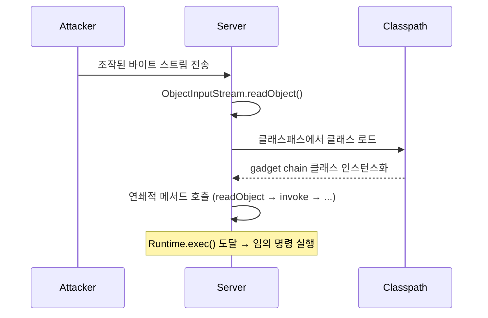
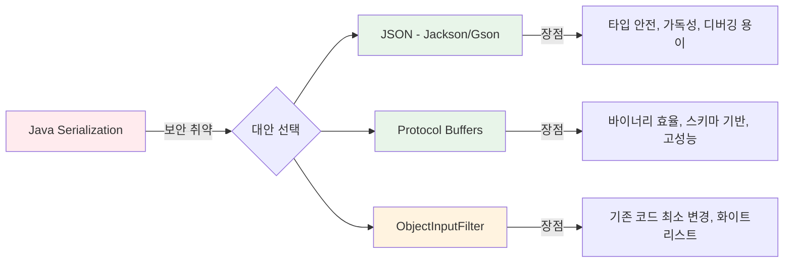

## 개요

Java의 `ObjectInputStream.readObject()`를 사용한 역직렬화는 대표적인 보안 취약점으로 분류된다. 공격자가 조작된 바이트 스트림을 전송하면 서버에서 임의 코드가 실행될 수 있다.

## 핵심 문제

`ObjectInputStream`은 바이트 스트림을 객체로 복원할 때 **클래스패스에 있는 아무 클래스나 인스턴스화**할 수 있다. 역직렬화 과정에서 `readObject()`, `readResolve()`, `finalize()` 등의 메서드가 자동 호출되며, 이를 악용한 gadget chain 공격이 가능하다.



## 주요 취약점 유형

### 1. RCE (Remote Code Execution)

가장 치명적인 취약점. Apache Commons Collections, Spring Framework 등 널리 쓰이는 라이브러리의 클래스들을 조합(gadget chain)하여 `Runtime.exec()`까지 도달시킬 수 있다.

```java
// 취약한 코드
ObjectInputStream ois = new ObjectInputStream(untrustedInput);
Object obj = ois.readObject(); // ← 악성 코드 실행 가능
```

대표적 공격 도구: ysoserial — 다양한 라이브러리별 gadget chain을 자동 생성해준다.

### 2. DoS (Denial of Service)

- `HashSet` 안에 해시 충돌을 유발하는 객체를 대량 삽입 → O(n²) 처리로 CPU 고갈
- 재귀 참조 객체 → 스택 오버플로우 유발
- 극도로 큰 배열 할당 → 메모리 고갈 (OOM)

### 3. 데이터 조작 (Tampering)

직렬화된 바이트 스트림에서 필드 값(권한 레벨, 금액, 사용자 ID 등)을 바이트 단위로 변조할 수 있다. 서명이나 MAC 검증이 없으면 변조된 값이 그대로 복원된다.

## 대안 비교



| 방식 | 보안 | 성능 | 가독성 | 마이그레이션 비용 |
|---|---|---|---|---|
| JSON (Jackson) | 안전 | 보통 | 높음 | 중간 |
| Protocol Buffers | 안전 | 높음 | 낮음 (바이너리) | 높음 |
| ObjectInputFilter (Java 9+) | 개선 | 동일 | 동일 | 낮음 |

### ObjectInputFilter 적용 예시 (Java 9+)

기존 직렬화를 유지하면서 허용 클래스를 화이트리스트로 제한하는 방법:

```java
ObjectInputFilter filter = ObjectInputFilter.Config.createFilter(
    "com.example.dto.*;!*"  // 허용할 패키지만 명시, 나머지 차단
);

ObjectInputStream ois = new ObjectInputStream(inputStream);
ois.setObjectInputFilter(filter);
Object obj = ois.readObject();
```

### JSON 전환 예시

```java
// Before: Java Serialization
ObjectOutputStream oos = new ObjectOutputStream(new FileOutputStream(file));
oos.writeObject(tempData);

// After: Jackson JSON
ObjectMapper mapper = new ObjectMapper();
mapper.registerModule(new JavaTimeModule());
mapper.writeValue(file, tempData);

// 역직렬화
DeployTempData data = mapper.readValue(file, DeployTempData.class);
```

## 판단 기준

- 입력 소스가 **외부(네트워크, 사용자 업로드)** → 즉시 대체 필요
- 입력 소스가 **서버 내부 생성 파일** → 위험도 낮지만 보안 감사 지적 대상
- 새 프로젝트 → Java Serialization 사용 자체를 피하는 것이 원칙
