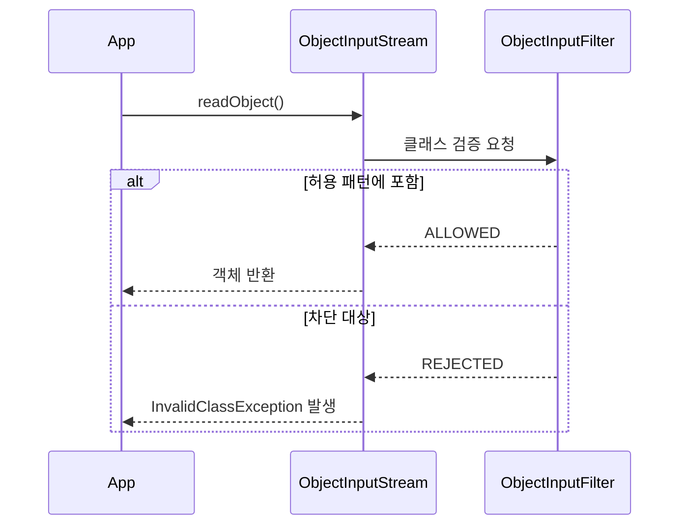

## 배경

Java Serialization을 어쩔 수 없이 유지해야 할 때, 역직렬화 공격을 방어하는 가장 실용적인 방법은 `ObjectInputFilter`(Java 9+)를 사용한 화이트리스트 방식이다.

## ObjectInputFilter란

`ObjectInputStream.readObject()` 호출 시 역직렬화될 클래스를 **사전 검증**하는 필터다. 허용된 클래스만 인스턴스화하고, 나머지는 차단(`REJECTED`)한다.



## 적용 방법

### 필터 패턴 문법

```
허용패턴1;허용패턴2;!*
```

- `com.example.dto.*` — 해당 패키지 클래스 허용
- `java.util.*` — java.util 패키지 허용
- `!*` — **나머지 전부 차단** (반드시 마지막에 위치)

### 코드 적용

```java
ObjectInputStream ois = new ObjectInputStream(inputStream);
ois.setObjectInputFilter(
    ObjectInputFilter.Config.createFilter(
        "com.example.dto.*;java.util.*;java.time.*;!*"
    )
);
Object obj = ois.readObject(); // 허용된 클래스만 역직렬화됨
```

## 다른 대안과의 비교

| 방식 | 코드 변경량 | 기존 파일 호환 | 보안 수준 |
|---|---|---|---|
| **ObjectInputFilter** | 최소 (1-2줄) | 호환 | gadget chain 차단 |
| JSON 전환 | 중간 (직렬화/역직렬화 전체 변경) | 비호환 | 근본적 해결 |
| 자체 직렬화 | 높음 | 비호환 | 근본적 해결 |

## 판단 기준

- 기존 직렬화 유지해야 하는 레거시 → `ObjectInputFilter`
- 신규 개발 또는 리팩토링 여유 있음 → JSON 전환 권장
- `!*` (전체 차단) 패턴은 반드시 포함해야 의미가 있음
