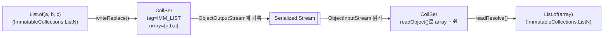

## 질문

ObjectInputStream 역직렬화 스택트레이스에서 `java.util.CollSer.readObject` 라는 낯선 클래스가 나왔다. `java.util` 패키지에 `CollSer` 같은 클래스는 본 적이 없는데 이게 뭔가?

```
at java.util.CollSer.readObject(ImmutableCollections.java:1439)
```

## 결론부터

`CollSer`는 **`List.of(...)`, `Set.of(...)`, `Map.of(...)` 같은 불변 컬렉션을 위한 직렬화 프록시 클래스**다. Java 9에서 불변 컬렉션 팩토리 메서드가 추가될 때 같이 들어왔고, `ImmutableCollections` 내부에 `package-private`로 숨겨져 있어서 일반 코드에서 직접 다룰 일은 없다.

## 왜 필요한가

### 문제 1 - 내부 구현 노출

`List.of("a", "b", "c")`가 실제로 반환하는 타입은 `ImmutableCollections.ListN`, 요소 수가 0~2개면 `List0`/`List12` 같은 내부 클래스다. 이 구현 클래스를 그대로 직렬화 가능하게 만들면 필드 레이아웃이 스트림 포맷의 일부가 되어버린다. 나중에 JDK가 내부 구조를 바꾸면 기존에 저장된 바이너리와 호환이 깨진다.

### 문제 2 - 불변 보장 파괴

`ImmutableCollections.ListN`이 `Serializable`을 직접 구현하면, 누군가 리플렉션이나 스트림 조작으로 내부 배열을 수정한 상태의 객체를 만들어 낼 수 있다. "불변"이라는 API 계약이 깨지는 경로가 생긴다.

### 해결책 - Serialization Proxy 패턴

Effective Java Item 90 "직렬화된 인스턴스 대신 직렬화 프록시 사용" 에 나오는 바로 그 패턴이다. 진짜 객체는 `writeReplace()`에서 프록시(CollSer)를 대신 반환하고, 역직렬화 시 프록시의 `readResolve()`가 공식 팩토리(`List.of`)를 호출해 정상 객체로 복원한다.



이 구조의 장점:

1. 스트림 안에는 `CollSer`라는 공식적으로 보장된 프록시 구조만 등장 → 내부 구현 변경과 무관
2. 역직렬화 경로가 항상 `List.of(array)`를 거침 → 불변 보장 유지
3. 요소가 몇 개든 같은 프록시로 처리 → 내부 구현 클래스(`List0`/`List12`/`ListN`) 분기를 스트림에서 감출 수 있음

## CollSer의 개략적인 구조

소스에서 본 내용을 정리하면 대략 아래와 같다.

```java
final class CollSer implements Serializable {

    static final int IMM_LIST       = 1;
    static final int IMM_SET        = 2;
    static final int IMM_MAP        = 3;
    static final int IMM_LIST_NULLS = 4;

    private final int tag;              // 어떤 컬렉션인지 식별
    private transient Object[] array;   // 요소들(또는 엔트리 key/value 페어)

    CollSer(int tag, Object... array) {
        this.tag = tag;
        this.array = array;
    }

    // 직렬화: tag + array 길이 + 요소들
    private void writeObject(ObjectOutputStream oos) throws IOException {
        oos.defaultWriteObject();
        oos.writeInt(array.length);
        for (Object o : array) oos.writeObject(o);
    }

    // 역직렬화: 길이 읽고 Object[] 할당 후 요소 채우기
    private void readObject(ObjectInputStream ois)
            throws IOException, ClassNotFoundException {
        ois.defaultReadObject();
        int len = ois.readInt();
        Object[] a = new Object[len];  // ← 여기서 checkArray 호출
        for (int i = 0; i < len; i++) a[i] = ois.readObject();
        this.array = a;
    }

    // 복원: 공식 팩토리를 통해 진짜 객체로 돌아감
    private Object readResolve() throws ObjectStreamException {
        switch (tag) {
            case IMM_LIST:       return List.of(array);
            case IMM_LIST_NULLS: return /* nulls 허용 내부 팩토리 */;
            case IMM_SET:        return Set.of(array);
            case IMM_MAP:        /* array를 key/value 페어로 해석해 Map.of 호출 */;
            default: throw new InvalidObjectException("invalid tag: " + tag);
        }
    }
}
```

핵심은 이 두 줄이다.

- `writeReplace()` (ImmutableCollections.ListN 쪽) → `new CollSer(IMM_LIST, elements)`
- `CollSer.readResolve()` → `List.of(array)`

## ObjectInputFilter와의 관계

JEP 290 ObjectInputFilter를 쓸 때 `CollSer`의 존재가 왜 중요한가?

역직렬화 시 `CollSer.readObject`는 내부에서 `Object[]`를 할당하며 `ObjectInputStream.checkArray(Object[].class, length)`를 호출한다. 이 호출이 우리가 등록한 필터를 타고 들어간다.

```mermaid
sequenceDiagram
    participant App
    participant OIS as ObjectInputStream
    participant CollSer
    participant Filter as ObjectInputFilter

    App->>OIS: readObject()
    OIS->>CollSer: readObject()
    CollSer->>OIS: readInt() → len
    CollSer->>OIS: Object[] 할당 요청
    OIS->>Filter: checkArray([Ljava.lang.Object;, len)
    alt 필터 허용
        Filter-->>OIS: ALLOWED
        loop len번
            CollSer->>OIS: readObject() (요소)
        end
        CollSer->>CollSer: readResolve() → List.of(...)
        CollSer-->>App: 복원된 List
    else 필터 거부
        Filter-->>OIS: REJECTED
        OIS-->>App: InvalidClassException
    end
```

그래서 필터를 설계할 때 "DTO만 허용" 수준으로 좁게 잡으면 이 경로에서 터진다. `Object[]` 배열 클래스, 혹은 그 component인 `java.lang.Object`를 허용해야 한다. `ObjectInputFilter.allowFilter`의 predicate는 배열을 자동으로 언래핑해 주지 않으므로 직접 처리해야 한다.

```java
Predicate<Class<?>> p = cls -> {
    Class<?> base = cls;
    while (base.isArray()) base = base.getComponentType();
    // ... 이 후 prefix 매칭
};
```

## 언제 이 이름을 만나는가

- `ObjectInputStream` / `ObjectInputFilter` 관련 스택트레이스
- 힙 덤프에서 불변 컬렉션을 추적할 때 직렬화 경로
- JEP 290 필터 REJECT 디버깅

평소 애플리케이션 코드에서 `java.util.CollSer`를 import할 일은 없고 import도 불가능하다(package-private). 이름을 아는 것만으로도 직렬화 스택을 해석하는 시야가 훨씬 넓어진다.

## 같이 보면 좋은 키워드

- **Serialization Proxy 패턴** — Effective Java Item 90
- **`ImmutableCollections.List0/List12/ListN/SetN/MapN`** — 진짜 구현체
- **`writeReplace` / `readResolve`** — 직렬화 프록시를 엮어주는 메서드
- **JEP 290 ObjectInputFilter** — 역직렬화 허용 클래스 제한
- **`Map.of`의 엔트리 직렬화** — key/value가 array에 번갈아 들어가는 점 주의
