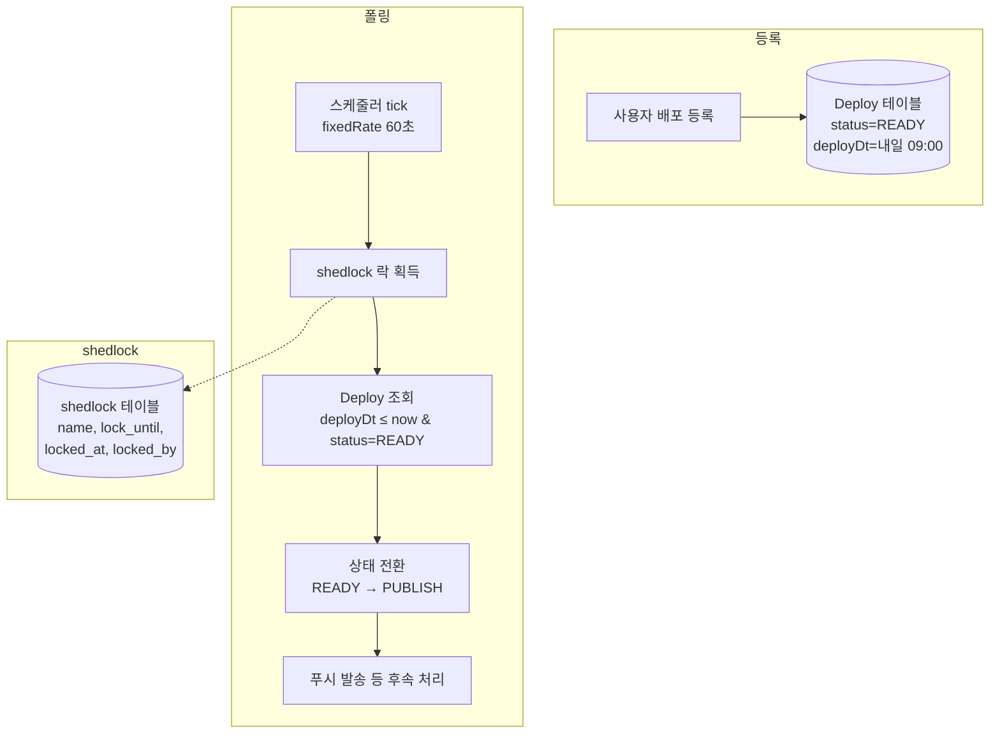
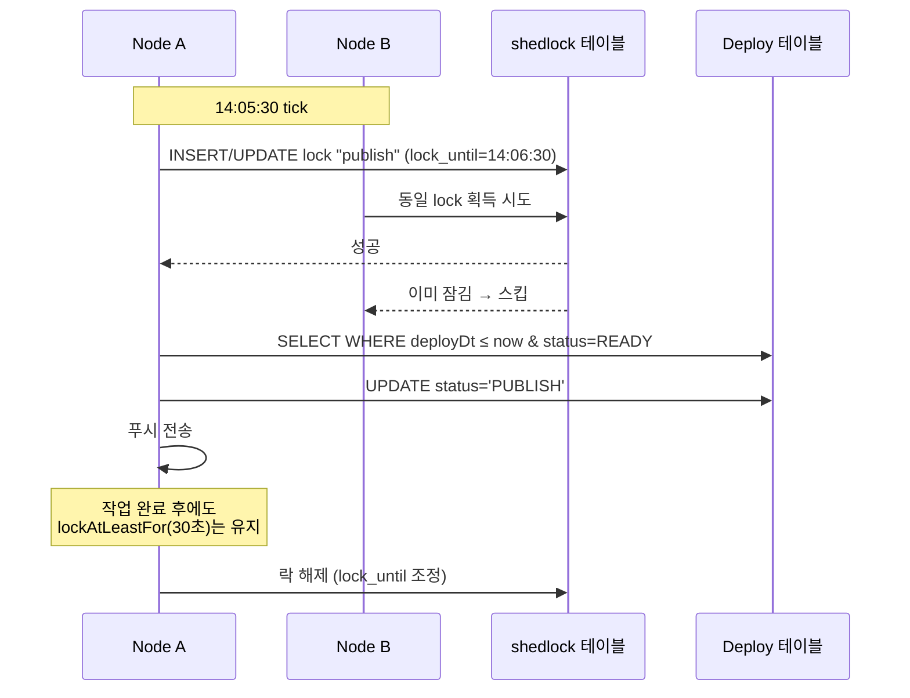

## 질문

예약 시각에 상태를 자동 전환하는 스케줄러를 도입하려고 한다. 이때 배포 정보를 저장할 때 스케줄러에 "이 시각에 실행해 줘" 하고 등록하는 건가? 아니면 DB의 shedlock 테이블에 저장했다가 스케줄러가 읽어가는 건가?

## 결론부터

**둘 다 아니다.** 이 오해는 ShedLock을 Quartz 같은 잡 스케줄러로 착각하면서 생긴다. 실제로는 이런 구조다.

- **도메인 데이터**(`Deploy` 같은 비즈니스 테이블)에 예약 시각(`deployDt`, `expireDt`)을 **컬럼으로** 저장한다.
- **스케줄러 자체**는 `@Scheduled(fixedRate = ...)` 로 주기적으로 깨어나서 **도메인 테이블을 폴링**하고, 조건에 맞는 row들을 처리한다.
- **ShedLock**은 여러 인스턴스가 같은 스케줄을 동시에 실행하지 못하도록 잠그는 "얇은 분산 락" 이다. **스케줄 일정이나 업무 데이터를 저장하지 않는다.**

## 전체 그림



- 등록 시점에는 스케줄러 쪽 어디에도 "이 시각에 이 작업을 해라" 라는 정보를 넣지 않는다. 그냥 `Deploy` 테이블 row에 시각만 적힌다.
- 스케줄러는 "예약된 시각" 이 아니라 **자기 자신의 고정 주기**(이 글에서는 60초)로 깨어난다.
- 깨어날 때마다 `deployDt <= now` 인 row 를 한 번에 묶어서 처리한다. 예약 시각과 실제 실행 시각 사이에는 최대 주기만큼의 지연이 있을 수 있다.

## ShedLock이 실제로 저장하는 것

`shedlock` 테이블 구조는 대략 이렇다.

| name | lock_until | locked_at | locked_by |
|---|---|---|---|
| deployStatusTransition.publish | 2026-04-13 14:06:30 | 2026-04-13 14:05:30 | node-a |
| deployStatusTransition.expire | 2026-04-13 14:06:30 | 2026-04-13 14:05:30 | node-b |

컬럼 의미:

- `name` — `@SchedulerLock(name = "...")` 로 붙인 식별자. 하나의 스케줄 작업당 하나의 row.
- `lock_until` — 이 시각까지는 다른 인스턴스가 이 스케줄을 실행하지 못한다.
- `locked_at` — 락 획득 시각.
- `locked_by` — 어떤 인스턴스가 점유 중인지 (호스트명 등).

**배포 정보, 예약 시각, 대상 사용자 같은 업무 데이터는 전혀 들어가지 않는다.** 이름 그대로 "스케줄의 락(lock) 상태" 만 담는 테이블이다.

## 다중 인스턴스 시나리오

노드 A, B 두 대가 동일한 Spring Boot 애플리케이션을 돌린다고 하자. 두 노드 모두 60초마다 `publishDueDeployments()` 를 실행하려고 한다.



핵심 포인트:

1. **누가 실행할지는 DB 원자적 연산으로 결정된다.** ShedLock 내부적으로 `UPDATE ... WHERE lock_until < now` 같은 조건부 갱신으로 한 노드만 성공하게 만든다.
2. **작업 본체는 항상 Deploy 테이블을 직접 읽고 쓴다.** shedlock 테이블은 절대 작업 대상을 알지 못한다.
3. `lockAtMostFor` 는 "작업이 이상하게 오래 걸리거나 노드가 죽어도, 이 시간 이후엔 다른 노드가 이어받을 수 있다" 는 최대 한도.
4. `lockAtLeastFor` 는 "빠르게 끝났더라도 최소 이 시간은 다른 노드가 이어받지 못하게 막아라" 는 최소 한도. tick 주기보다 짧은 작업이 두 번 실행되는 것을 막는다.

## Quartz와의 차이

ShedLock과 Quartz는 이름이 비슷해 보여도 설계 의도가 다르다.

| 항목 | ShedLock | Quartz (with JDBC JobStore) |
|---|---|---|
| 목적 | 분산 환경에서 `@Scheduled` 중복 실행 방지 | 완전한 스케줄/잡 관리 시스템 |
| DB에 저장하는 것 | 락 상태 (name, lock_until, ...) | Job 정의, Trigger, Cron 표현식, 실행 이력 |
| 실행 시각 결정 | 애플리케이션 설정(`fixedRate`, `cron`) | DB에 저장된 Trigger가 결정 |
| 예약 등록 API | 없음 (도메인 테이블에 컬럼으로 저장) | `scheduler.scheduleJob(jobDetail, trigger)` |
| 러닝 코스트 | 매우 가벼움 (어노테이션만 붙이면 끝) | 테이블 11개 내외, 학습 곡선 있음 |
| 적합한 경우 | "이미 있는 스케줄 메서드를 다중 노드에서 안전하게" | "런타임에 잡을 동적으로 등록/취소, 복잡한 트리거" |

이 프로젝트처럼 "정해진 주기로 도메인 테이블을 스캔해서 상태를 전환" 하는 패턴은 ShedLock + `@Scheduled` 조합이 가장 가볍고 적절하다. 런타임에 임의의 시점을 잡아 단발성 작업을 등록해야 한다면 Quartz 같은 잡 스케줄러가 필요해진다.

## 실제 코드에서의 모습

```java
@Component
@RequiredArgsConstructor
public class DeployStatusTransitionScheduler {

    private final DeployService deployService;

    @Scheduled(fixedRateString = "${scheduler.fixed-rate-ms:60000}")
    @SchedulerLock(
        name = "deployStatusTransition.publish",
        lockAtMostFor = "PT5M",
        lockAtLeastFor = "PT30S"
    )
    public void publishDueDeployments() {
        int count = deployService.publishDueDeployments();
        if (count > 0) log.info("[scheduler] publish {}건", count);
    }
}
```

서비스 메서드:

```java
@Transactional
public int publishDueDeployments() {
    LocalDateTime now = LocalDateTime.now();
    List<Deploy> due = deployRepository
        .findAllByStatusAndDeployDtLessThanEqual("READY", now);

    for (Deploy d : due) {
        d.setStatus("PUBLISH");
        // 푸시 발송 등 후속 처리
    }
    return due.size();
}
```

이게 전부다. "예약 등록" 같은 API는 없고, 시각 비교와 UPDATE 만 있을 뿐이다.

## 정리

- 배포 등록은 **도메인 테이블에 시각 컬럼을 저장**하는 것이 끝이다. 스케줄러는 이 데이터를 알지 못한다.
- 스케줄러는 **자기 고정 주기**로 깨어나 **도메인 테이블을 폴링**한다.
- ShedLock은 **스케줄 일정 저장소가 아니라 분산 락**이다. 여러 인스턴스 중 하나만 실행하도록 조율할 뿐이다.
- "언제 실행할지" 는 ShedLock이 아니라 **`@Scheduled`의 설정**과 **도메인 테이블의 시각 컬럼**이 함께 결정한다.
- 동적으로 잡을 등록하거나 복잡한 cron/trigger가 필요하면 Quartz 같은 풀 잡 스케줄러를 고려한다.
