## 질문

`@Scheduled(fixedRate = 60000)` 은 단순히 "60초마다 실행" 이라고만 알고 있었는데, 이 "60초마다"의 기준이 정확히 뭔가? 작업이 60초보다 오래 걸리면 어떻게 되나?

## 결론부터

- `fixedRate` = "이전 실행의 **시작** 시각 기준" 으로 N 밀리초마다 다음 실행 트리거
- `fixedDelay` = "이전 실행의 **종료** 시각 기준" 으로 N 밀리초 후 다음 실행 트리거
- `cron` = 벽시계 cron 표현식 기준
- `@Scheduled`는 기본적으로 **단일 스레드**로 도는 스케줄러라, 이전 작업이 주기보다 오래 걸리면 다음 실행이 **밀려서** 실행된다(병렬 실행 아님)

## fixedRate vs fixedDelay 시각적 비교

주기 60초, 작업 소요 10초인 상황.

```mermaid
gantt
    title fixedRate (period=60s, 작업 10s)
    dateFormat  X
    axisFormat  %Ss

    section fixedRate
    1회차 실행    :active, 0, 10
    대기         :crit,   10, 50
    2회차 실행    :active, 60, 10
    대기         :crit,   70, 50
    3회차 실행    :active, 120, 10
```

```mermaid
gantt
    title fixedDelay (period=60s, 작업 10s)
    dateFormat  X
    axisFormat  %Ss

    section fixedDelay
    1회차 실행    :active, 0, 10
    대기         :crit,   10, 60
    2회차 실행    :active, 70, 10
    대기         :crit,   80, 60
    3회차 실행    :active, 140, 10
```





- `fixedRate` → 매 60초 경계에 정확히 실행 시작 (00:00, 01:00, 02:00, ...)
- `fixedDelay` → 매 실행이 끝난 후 60초 대기 (00:00, 01:10, 02:20, ...)

같은 60초인데 시간이 지날수록 `fixedDelay` 쪽은 점점 밀리는 게 보인다.

## 함정 - 작업이 주기보다 오래 걸릴 때

`fixedRate`는 개념상 "시작 시각 기준" 이라 이런 의문이 든다:

> "그러면 작업이 80초 걸리는데 fixedRate가 60초면 중복 실행되나?"

**아니다.** Spring의 `@Scheduled`는 **기본적으로 단일 스레드 `ScheduledExecutorService` 하나로 모든 스케줄을 돌린다**. 이전 작업이 안 끝났으면 다음 트리거는 큐에 쌓이고, 끝난 다음에야 실행된다. 결과적으로:

- 작업 80초, `fixedRate=60000` → 사실상 80초 간격으로 실행 (고정 주기가 아니라 "가능한 한 빨리")
- 작업 5초, `fixedRate=60000` → 정확히 60초 간격으로 실행

즉 `fixedRate`는 "작업이 주기 안에 끝난다" 는 전제 하에서만 진짜 "고정 주기" 로 동작한다.

### 진짜 병렬 실행이 필요하다면

Spring의 스케줄러 스레드 풀을 늘리면 여러 스케줄 **메서드들**이 겹칠 수 있다. 하지만 **같은 메서드**가 병렬로 중첩 실행되려면 거기에 더해 `@Async` 조합이 필요하다.

```java
@Configuration
@EnableAsync
@EnableScheduling
public class SchedulerConfig implements SchedulingConfigurer {

    @Override
    public void configureTasks(ScheduledTaskRegistrar registrar) {
        ScheduledThreadPoolExecutor pool = new ScheduledThreadPoolExecutor(4);
        registrar.setScheduler(pool);
    }
}

@Scheduled(fixedRate = 60000)
@Async  // 매 트리거마다 별도 스레드에서 실행
public void heavyTask() { ... }
```

단, 이렇게까지 하는 경우는 드물다. 보통 스케줄 작업은 "짧게 끝나는 일괄 처리" 로 설계하는 게 맞고, 오래 걸리는 처리는 별도 워커/메시지 큐로 위임하는 편이 낫다.

## cron은 언제 쓰나

`fixedRate`/`fixedDelay`는 "서버가 뜬 시각 기준 상대 시간" 이다. 배포한 지 1초 뒤에 첫 실행이 일어날 수도 있고, 1분 뒤일 수도 있다. "매일 새벽 3시" 같은 벽시계 기반 트리거는 `fixedRate`로 표현할 수 없다.

```java
@Scheduled(cron = "0 0 3 * * *")  // 매일 03:00:00
@Scheduled(cron = "0 */5 * * * *")  // 매 5분마다 (초 0초에)
@Scheduled(cron = "0 0 9 ? * MON-FRI")  // 평일 09:00
```

Spring의 cron은 6필드(초 분 시 일 월 요일)인 점이 일반 유닉스 cron(5필드)과 다르니 주의.

## 실무에서 자주 쓰는 조합

### 1. 주기 상수를 yml에서 관리

```java
@Scheduled(fixedRateString = "${scheduler.transition.fixed-rate-ms:60000}")
public void publishDueDeployments() { ... }
```

```yaml
scheduler:
  transition:
    fixed-rate-ms: 30000  # 운영 환경에서 더 자주 돌리고 싶을 때
```

- `fixedRate` 대신 `fixedRateString` 을 쓰면 `${}` 표현식이 먹힌다
- `:60000` 은 프로퍼티 미존재 시 기본값
- 같은 코드로 개발/스테이징/운영 주기를 다르게 운영 가능

### 2. ShedLock과 함께

다중 인스턴스 환경에서는 같은 tick에 여러 노드가 동시 실행하면 중복 처리가 발생한다. `fixedRate`는 "언제 깨어날지" 만 정하고, "누가 실제로 실행할지" 는 [ShedLock](005_shedlock_distributed_scheduler_lock.md) 같은 분산 락이 정해준다.

```java
@Scheduled(fixedRateString = "${scheduler.fixed-rate-ms:60000}")
@SchedulerLock(name = "myTask", lockAtMostFor = "PT5M", lockAtLeastFor = "PT30S")
public void myTask() { ... }
```

- `@Scheduled` - 깨어남
- `@SchedulerLock` - 한 노드만 실행
- 서비스 로직 - 실제 도메인 처리

이 세 레이어는 직교(orthogonal)한다. 각자 책임이 분리되어 있어서 조합해도 충돌하지 않는다.

## 정리

| 속성 | 기준 | 주기가 고정적인가? |
|---|---|---|
| `fixedRate` | 이전 실행 시작 시각 | O (작업이 주기 안에 끝날 때만) |
| `fixedDelay` | 이전 실행 종료 시각 | X (작업 시간만큼 매번 밀림) |
| `cron` | 벽시계 cron | O (벽시계 기준) |

- 일괄 처리 / 폴링은 보통 `fixedRate` 로 충분하다
- 외부 서비스 호출처럼 언제 끝날지 모르는 작업은 `fixedDelay` 가 안전하다
- 벽시계 시각이 중요하면 `cron`
- 작업이 주기보다 오래 걸릴 가능성이 있다면 단일 스레드 스케줄러에서 뒤가 밀린다는 점을 반드시 고려해야 한다
