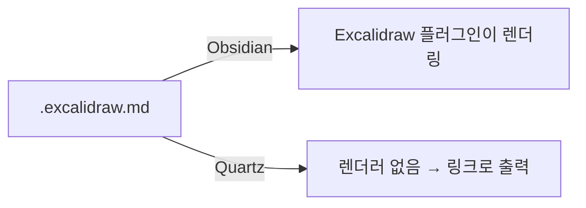
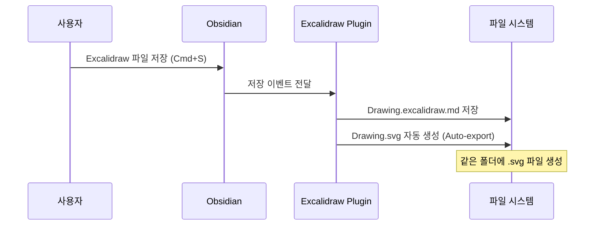
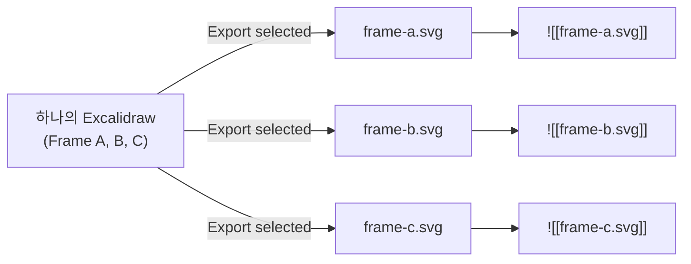
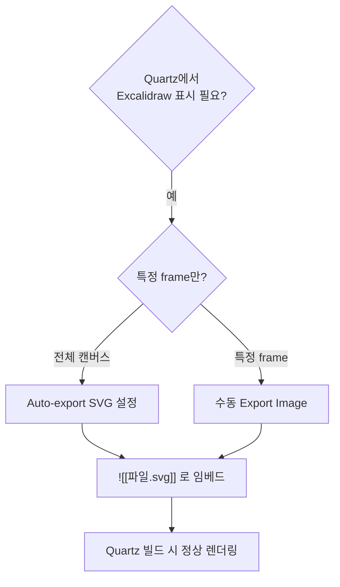

## 문제

Obsidian에서 Excalidraw 플러그인으로 그린 그림을 `![[파일.excalidraw.md]]` 문법으로 임베드하면, Obsidian 내에서는 정상 렌더링된다. 하지만 Quartz로 빌드하면 **링크 텍스트로만 출력**되고 그림이 보이지 않는다.

```markdown
<!-- Obsidian에서는 보이지만, Quartz 빌드 후에는 링크로만 표시됨 -->

![[Excalidraw/Drawing.excalidraw.md#^frame=Saf6io0o]]
```

## 원인



- Obsidian의 Excalidraw 렌더링은 **플러그인 전용 기능**
- Quartz의 `ObsidianFlavoredMarkdown` 플러그인은 `![[wiki-link]]` 임베드를 처리하지만, `.excalidraw.md` 파일의 compressed-json 데이터를 해석하지 못함
- `#^frame=` 문법도 Excalidraw 플러그인 전용이라 Quartz에서 무시됨

## 해결: SVG Export

Excalidraw 그림을 SVG로 내보낸 뒤, SVG 파일을 임베드하면 Quartz에서도 정상 렌더링된다.

### 방법 1: 수동 Export (특정 Frame 내보내기)

1. Obsidian에서 `.excalidraw.md` 파일 열기
2. 내보낼 영역 또는 frame 선택
3. **Cmd+P** (명령 팔레트) → `Excalidraw: Export Image` 실행
4. 저장 형식: **SVG** 선택
5. 저장 위치: 같은 폴더 또는 원하는 경로에 저장

```markdown
<!-- 변경 전: Quartz에서 렌더링 안됨 -->

![[Excalidraw/Drawing.excalidraw.md#^frame=Saf6io0o]]

<!-- 변경 후: SVG 임베드 → Quartz에서 렌더링됨 -->

![[Excalidraw/Drawing.svg]]
```

### 방법 2: Auto-export 설정 (자동화)

Excalidraw 파일을 저장할 때마다 SVG를 자동 생성하도록 설정한다.

1. **Obsidian 설정** → 좌측 메뉴에서 **Excalidraw** 플러그인 선택
2. **Embedding Excalidraw into your notes and Exporting** 섹션으로 이동
3. **Auto-export SVG** → 토글 ON



이후 `.svg` 파일을 임베드하면 Obsidian과 Quartz 모두에서 동일하게 표시된다.

### Auto-export 주의사항

| 항목          | 설명                                     |
| ------------- | ---------------------------------------- |
| 내보내기 범위 | 전체 캔버스 (특정 frame만 내보내기 불가) |
| 파일 위치     | `.excalidraw.md`와 같은 폴더에 생성      |
| 파일명        | `Drawing.excalidraw.svg` 형태            |
| 업데이트      | 저장 시마다 SVG도 자동 갱신              |

> 특정 frame만 필요한 경우에는 방법 1(수동 Export)을 사용해야 한다.

## 실제 렌더링 비교

### Before: `.excalidraw.md` 직접 임베드

Quartz 빌드 시 아래처럼 링크 텍스트만 출력된다.

> `Excalidraw/Drawing.excalidraw.md` ← 클릭 가능한 링크로만 표시

### After: SVG Export 후 임베드

Auto-export로 생성된 SVG를 임베드하면 Quartz에서도 그림이 정상 표시된다.

![[Excalidraw/Drawing 2026-04-09 11.35.55.excalidraw.svg]]

## SVG로 특정 Frame/Element만 표시할 수 있는가?

Excalidraw의 `#^frame=` 문법은 플러그인 전용이라 SVG에서는 작동하지 않는다. SVG 자체 스펙으로 부분 표시하는 방법은 있지만 실용성에 차이가 있다.

### 방법 A: SVG Fragment Identifier (비실용적)

SVG 스펙의 `#svgView(viewBox(...))` 로 특정 좌표 영역만 크롭할 수 있다.

```html
<!-- 좌표 (50,30)부터 200x100 영역만 표시 -->

```

| 장점 | 단점 |
|------|------|
| SVG 파일 하나로 여러 영역 표시 가능 | 좌표를 수동으로 계산해야 함 |
| 추가 파일 생성 불필요 | `![[wiki-link]]` 문법에서 사용 불가, HTML `` 필요 |
| | frame 추가/이동 시 좌표 재계산 필요 |

### 방법 B: Excalidraw Element ID (불가능)

Excalidraw SVG 내부의 `<g>` 그룹은 자체 ID를 사용하며, Obsidian의 `#^frame=Saf6io0o` 같은 frame ID와 **일치하지 않는다**. SVG의 `#elementId`로 특정 frame을 지정하는 것은 불가능하다.

### 방법 C: Frame별 개별 Export (권장)

가장 현실적인 방법. Excalidraw 플러그인에서 frame 단위로 따로 SVG를 내보낸다.

1. Excalidraw에서 원하는 frame 선택
2. **Cmd+P** → `Excalidraw: Export Image` → SVG
3. **"Export only selected"** 체크
4. frame마다 개별 SVG 파일 생성

```markdown
![[frame-overview.svg]]
![[frame-detail.svg]]
```



### 비교 요약

| 방법 | 실용성 | wiki-link 호환 | 유지보수 |
|------|--------|----------------|----------|
| SVG Fragment (`viewBox`) | 낮음 | X (`` 필요) | 좌표 재계산 필요 |
| SVG Element ID | 불가능 | - | - |
| **Frame별 개별 Export** | **높음** | **O** | **재export만 하면 됨** |

## 정리


