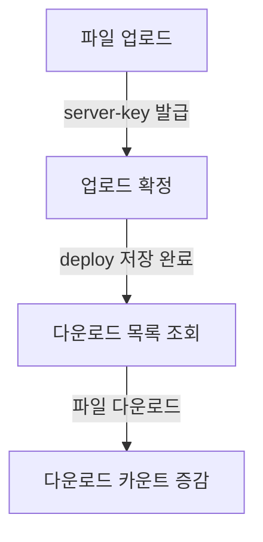
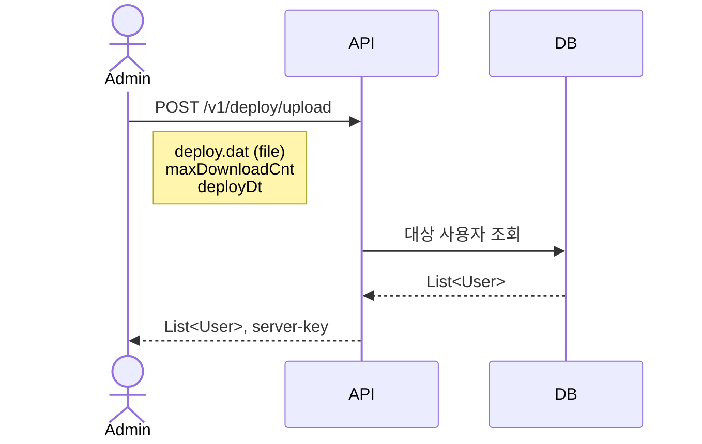
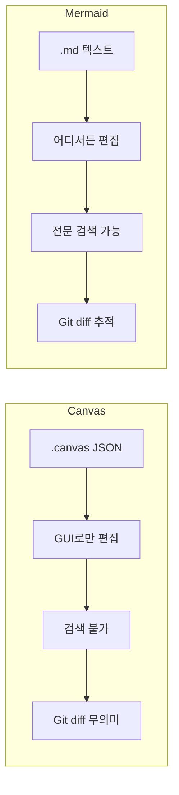

## 배경

Obsidian Canvas(.canvas)로 API 플로우차트를 관리하고 있었으나, 텍스트 기반이 아니라 검색/Git diff/재사용이 불편했다. Mermaid는 Obsidian에서 네이티브 렌더링을 지원하므로, 기존 플로우차트를 Mermaid로 전환하면 같은 환경에서 더 구조적으로 관리할 수 있다.

## 변경 내용

### 1. 전체 흐름 - flowchart

API 간의 관계를 한눈에 보여주는 개요도로 `flowchart TD`를 사용한다.

````markdown

````

### 2. 각 API별 상세 - sequenceDiagram

각 엔드포인트의 요청/응답/검증 로직을 시퀀스 다이어그램으로 표현한다.

````markdown

````

### 3. 주요 문법 정리

| 문법 | 용도 | 예시 |
|------|------|------|
| `actor` | 사용자 표시 | `actor Admin` |
| `participant` | 시스템 컴포넌트 | `participant API` |
| `->>` | 요청 (실선 화살표) | `Admin->>API: POST /upload` |
| `-->>` | 응답 (점선 화살표) | `API-->>Admin: 200 OK` |
| `Note right of` | 파라미터/설명 | `Note right of Admin: param1<br/>param2` |
| `alt / else / end` | 조건 분기 | 검증 성공/실패 분기 |
| `<br/>` | Note 내 줄바꿈 | 여러 파라미터 나열 |

### 4. Canvas vs Mermaid 비교



## 결과

- `flowchart/mermaid.md`에 DCC Deploy API 전체 플로우를 Mermaid로 작성
- 4개 API(upload, confirm, deploy/user, increase/decrease) 모두 sequenceDiagram으로 변환
- Obsidian에서 별도 플러그인 없이 네이티브 렌더링 확인
- 텍스트 기반이라 검색, 복사, Git 관리 모두 가능
