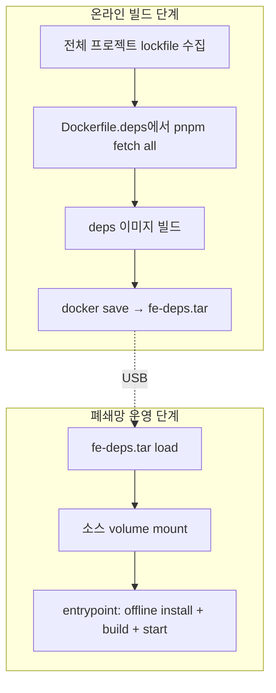

> 다중 Nuxt 프로젝트의 폐쇄망 배포 방식을 결정하면서 4단계 변형을 거쳤다. 단순히 “이렇게 하면 된다”가 아니라 “왜 다른 방식을 버렸는가”까지 정리한다.

## 결정 환경

- **여러 Nuxt 프로젝트** (5~6개) 가 한 base layer를 공유 (`extends: ['../base-layer']`)
- 각 프로젝트는 거의 동일한 의존성 트리를 가짐 (vue, vite, nuxt 등 핵심 + 일부 차이)
- 폐쇄망 PC는 인터넷 차단, USB로만 파일 전달
- Backend도 동일 폐쇄망에 함께 배포 → 같은 패턴을 적용해야 운영 단순화

이 환경에서 4가지 방식을 차례로 시도했다.

## 시도 1: 프로젝트별 단독 Docker 이미지 + 소스/빌드 bake-in

처음에는 각 프로젝트의 Dockerfile에서 `pnpm install` + `nuxt build`까지 모두 수행하고, 빌드 결과물을 이미지에 통째로 박제하는 방식이었다.

```dockerfile
FROM node:24-slim
WORKDIR /app
COPY . .
RUN pnpm install --frozen-lockfile
RUN pnpm build
CMD ["pnpm", "start"]
```

### 이 방식의 문제

| 문제 | 설명 |
|---|---|
| 디스크 폭증 | 5~6개 이미지가 거의 동일한 `node_modules` 통째로 포함. 이미지 1개당 800MB+ |
| 소스 변경 = 이미지 재빌드 | UI 한 줄 고치려고 전체 이미지 재빌드 → 수십 분 소요 |
| 폐쇄망 운영 불편 | 이미지 tar 전체를 매번 다시 전송해야 함 |
| base layer 변경 시 전부 재빌드 | base layer 한 줄 바뀌면 의존하는 5개 이미지 모두 재빌드 |

→ 단발 배포에는 OK지만 **반복 운영에는 부적합**.

## 시도 2: 공유 deps 이미지 (pnpm store 내장) + volume mount 소스

다음 시도는 “이미지에는 의존성만, 소스는 호스트에서 mount” 패턴이었다.

```dockerfile
# Dockerfile.deps — pnpm store만 내장
FROM node:24-slim
ENV PNPM_HOME="/pnpm"
ENV PATH="$PNPM_HOME:$PATH"
ENV PNPM_STORE_DIR=/pnpm/store

RUN npm i -g pnpm

# 모든 프로젝트의 lockfile을 모아서 fetch
COPY locks/ /locks/
RUN cd /locks && for proj in */; do \
      pnpm fetch --store-dir /pnpm/store; \
    done
```

```yaml
# docker-compose.yml
services:
  app:
    image: fe-deps:latest
    volumes:
      - ./source:/app                 # 호스트 소스 mount
      - /app/node_modules             # 컨테이너 전용 (host 무시)
    entrypoint: ["sh", "-c", "/app/entrypoint.sh"]
```

### 의도

- 의존성은 한 번 굽고, 소스 변경은 mount만 다시 — 빌드 시간 크게 절감
- 다수 프로젝트가 같은 deps 이미지 공유

### 발견한 문제

- 컨테이너 시작 시 `pnpm install --offline` 자동 실행 필요 → entrypoint에서 처리. **첫 실행 시간이 길어짐**.
- volume mount된 소스의 `pnpm-lock.yaml`이 이미지 내장 store와 약간이라도 달라지면 install 실패
- `node_modules`를 anonymous volume으로 잡아도, 호스트 작업 시 이상하게 꼬이는 케이스 발생

→ 운영은 가능했지만 “**소스와 store의 lockfile 동기**”가 휴먼 에러 매개체가 됐다.

## 시도 3: 빌드 완료 이미지 .tar 방식으로 회귀

“복잡한 거 다 빼고 그냥 이미지에 다 박제하자”로 잠시 회귀.

```sh
# 온라인에서
docker build -t fe-app:latest .
docker save -o fe-app.tar fe-app:latest

# 폐쇄망에서
docker load -i fe-app.tar
docker compose up -d
```

### 이 방식의 재발견된 문제

- 시도 1과 동일한 문제 (디스크, 재빌드, 전송)
- 한 가지 다른 점: backend는 “공유 base 이미지 + JAR mount” 패턴으로 전환했는데 frontend만 다른 패턴이면 운영 일관성이 깨짐

## 시도 4: 공유 deps 이미지 + volume mount 소스로 재확정 (최종)

Backend와 동일 패턴으로 통일.



### 시도 2와 다른 점

- **lockfile 수집을 자동화** — 빌드 스크립트가 `settings.yml`을 읽어 모든 lockfile을 한 곳에 모은 뒤 이미지에 굽는다
- **entrypoint를 단순화** — install 순서·실패 처리를 명시적으로 작성
- **테스트 스크립트 동반** — 폐쇄망 환경을 Docker로 시뮬레이션하는 `test-offline.sh`를 같이 작성해서 전송 전 검증

### 최종 결정의 근거

| 기준 | 시도 1 | 시도 2 | 시도 3 | **시도 4** |
|---|:---:|:---:|:---:|:---:|
| 디스크·전송 효율 | ❌ | ✅ | ❌ | ✅ |
| 소스 변경 빠른 반영 | ❌ | ✅ | ❌ | ✅ |
| BE/FE 운영 일관성 | ❌ | ⚠️ | ⚠️ | ✅ |
| 휴먼 에러 저항성 | ✅ | ❌ | ✅ | ✅ (자동화로 보강) |
| 첫 실행 속도 | ✅ | ❌ | ✅ | ⚠️ (entrypoint 캐시로 완화) |

## 핵심 교훈

1. **단일 “best” 방식은 없다.** 디스크·시간·휴먼 에러·운영 일관성이 모두 트레이드오프 관계. 환경 우선순위에 따라 답이 달라진다.
2. **휴먼 에러 가능성이 보이면 자동화·테스트 스크립트로 막아야 결정이 유지된다.** 시도 2의 결정은 “이론상 좋은 답”이었지만 자동화 부재로 운영에서 무너졌다. 시도 4는 같은 답에 자동화·테스트를 더해 안착시켰다.
3. **Backend·Frontend 운영 패턴은 일관시키는 것이 장기적으로 이득이다.** 한쪽만 다른 패턴이면 매번 같은 종류의 휴먼 에러가 양쪽에서 다른 모양으로 나타난다.
4. **돌고 돌아 같은 결정에 다시 도달했을 때, 그 사이의 시도들은 헛수고가 아니라 “왜 그게 답인가”의 근거가 된다.** 시도 3 없이 곧장 시도 4로 갔으면 자동화의 필요성을 충분히 인식하지 못했을 것이다.

다음 챕터에서는 시도 4 방식의 구체적 구현 — 온라인 단계에서 pnpm 실행 파일과 store를 어떻게 준비하는지를 다룬다.

→ [[002_online_preparation|02. 온라인 단계 — pnpm 실행파일 + store 준비]]
