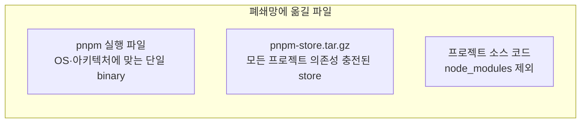

> 폐쇄망으로 옮기기 전, 온라인 PC에서 준비해야 할 두 가지: `pnpm` 실행 파일과 모든 의존성이 충전된 `pnpm store`.

## 무엇을 준비해야 하는가



각 파일의 역할:

| 파일 | 역할 |
|---|---|
| pnpm 실행 파일 | 폐쇄망 PC에서 install·build를 실행할 도구. Node.js 없이 단독 실행 가능 |
| pnpm-store.tar.gz | 모든 프로젝트의 의존성이 충전된 글로벌 저장소. 폐쇄망에서 이 store만으로 install 가능 |
| 프로젝트 소스 | `pnpm-lock.yaml`이 포함된 소스. `node_modules`는 폐쇄망에서 store로부터 hard link로 재구성 |

## 1. pnpm 실행 파일 다운로드

폐쇄망 PC에 npm·Node.js가 없을 수 있으므로 **standalone binary**를 받는다.

[pnpm releases](https://github.com/pnpm/pnpm/releases) 페이지에서 사용 중인 버전(예: v10.23.0)을 선택하고 OS·아키텍처에 맞는 파일을 다운로드.

| 대상 OS | 파일명 |
|----|--------|
| Windows x64 | `pnpm-win-x64.exe` |
| Linux x64 | `pnpm-linux-x64` |
| Linux arm64 | `pnpm-linux-arm64` |
| macOS arm64 | `pnpm-macos-arm64` |

### 폐쇄망 PC의 아키텍처 사전 확인

이 단계에서 잘못 받으면 폐쇄망에서 실행 자체가 안 되므로 미리 확인.

**Linux**:
```bash
uname -m
# x86_64 → x64 binary
# aarch64 → arm64 binary
```

**Windows** (PowerShell):
```powershell
$env:PROCESSOR_ARCHITECTURE
# AMD64 → x64 binary
# ARM64 → arm64 binary
```

> 휴먼 에러 포인트: 본사 서버는 x64이지만 일부 사이트는 arm64인 경우가 있다. 사이트별 아키텍처를 사전에 받아 두는 것이 안전.

## 2. 프로젝트별 lockfile 점검

`pnpm fetch`는 lockfile 기반으로 동작하므로, 모든 프로젝트에 **`pnpm-lock.yaml`이 반드시 있어야** 한다.

```bash
ls base-layer/pnpm-lock.yaml
ls primary-app/pnpm-lock.yaml
ls extension-app-a/pnpm-lock.yaml
ls extension-app-b/pnpm-lock.yaml
```

없으면 온라인에서 `pnpm install`을 한 번 돌려서 lockfile을 생성한다. **lockfile이 부정확하거나 의존성이 흔들린 상태로 store를 굽고 폐쇄망으로 보내면, 폐쇄망에서 install이 실패한다.**

## 3. 기존 store·node_modules 청소

이 단계가 의외로 중요하다. `pnpm fetch`는 캐시가 더러우면 일부 패키지를 “이미 있다”고 건너뛴다.

```bash
# pnpm store 초기화
rm -rf ~/pnpm/store

# 모든 프로젝트의 node_modules 삭제
rm -rf base-layer/node_modules \
       primary-app/node_modules \
       extension-app-a/node_modules \
       extension-app-b/node_modules
```

> 주의: `node_modules`가 남아 있으면 `pnpm fetch`가 "Already up to date"로 건너뛰는 케이스가 있다. **반드시 삭제 후 fetch**.

## 4. store에 의존성 충전 (`pnpm fetch`)

### 핵심 명령어

```bash
export STORE_DIR=~/pnpm/store

# 1. base-layer (공유 layer, 반드시 먼저)
cd base-layer
pnpm fetch --store-dir $STORE_DIR

# 2. primary-app
cd ../primary-app
pnpm fetch --store-dir $STORE_DIR

# 3. extension-app-a
cd ../extension-app-a
pnpm fetch --store-dir $STORE_DIR

# 4. extension-app-b
cd ../extension-app-b
pnpm fetch --store-dir $STORE_DIR
```

`pnpm fetch`는 lockfile에 명시된 모든 패키지를 **store에만** 다운로드한다 (`node_modules`는 만들지 않음). store에 없는 것만 받기 때문에 두 번째 프로젝트부터는 차분증분만 다운로드한다.

### 자동화 스크립트 예시

```bash
#!/bin/bash
# prepare-offline.sh

set -e

STORE_DIR="${STORE_DIR:-$HOME/pnpm/store}"
OUTPUT="${OUTPUT:-./pnpm-store.tar.gz}"

PROJECTS=(
  "base-layer"
  "primary-app"
  "extension-app-a"
  "extension-app-b"
)

# 1. 기존 store/node_modules 삭제
rm -rf "$STORE_DIR"
for proj in "${PROJECTS[@]}"; do
  rm -rf "$proj/node_modules"
done

# 2. fetch
for proj in "${PROJECTS[@]}"; do
  echo "→ Fetching deps for $proj"
  (cd "$proj" && pnpm fetch --store-dir "$STORE_DIR")
done

# 3. 압축
echo "→ Compressing store"
tar -czf "$OUTPUT" -C "$STORE_DIR" .

echo "✅ Done: $OUTPUT ($(du -sh "$OUTPUT" | cut -f1))"
```

### 멀티플랫폼 의존성 처리

`sharp`, `esbuild`, `sass-embedded` 같은 native binary 의존성은 **OS·아키텍처별로 별도 패키지**가 다운로드된다. 온라인 PC와 폐쇄망 PC의 OS가 다르면 빠진 채 fetch될 수 있다.

각 프로젝트의 `.npmrc`에 다음 설정을 추가하면 멀티플랫폼 패키지를 함께 받는다:

```ini
# .npmrc
supportedArchitectures.os=linux,win32,current
supportedArchitectures.cpu=x64,arm64,current
```

이 설정 없이 macOS에서 fetch하고 Windows 폐쇄망에 옮기면, 폐쇄망에서 `esbuild` 같은 패키지가 없어 빌드가 실패한다.

## 5. store 압축

```bash
PNPM_STORE_PATH=$(pnpm store path)
# 예: /home/user/.local/share/pnpm/store/v3 또는 ~/pnpm/store/v10

tar -czf pnpm-store.tar.gz -C "$PNPM_STORE_PATH" .
```

`-C` 옵션으로 store 디렉토리 안에서 압축해야, 압축 해제 시 디렉토리가 한 단계 더 깊어지지 않는다.

### 결과 확인

```bash
# store 크기 (정상: 수백 MB ~ 1GB+)
du -sh "$PNPM_STORE_PATH"

# 압축 파일 크기
du -sh pnpm-store.tar.gz
```

store가 수 MB 이하라면 fetch가 제대로 안 된 것 — 처음부터 다시 수행.

## 6. 폐쇄망으로 전송할 파일 목록

| 파일 | 출처 |
|---|---|
| `pnpm-store.tar.gz` | 위 5단계 결과 |
| `pnpm-{os}-{arch}` (실행파일) | 위 1단계 결과 |
| 프로젝트 소스 (4개 폴더) | git clone 또는 zip |

### 전송 시 제외 항목

```
*/node_modules/
*/.nuxt/
*/.output/
*/.cache/
```

이들은 폐쇄망에서 다시 만들어진다. 포함시키면 용량이 폭증하고, lockfile-store 불일치로 install이 실패할 수 있다.

## 7. 사전 검증 (옵션, 권장)

폐쇄망에 보내기 전에, 같은 머신에서 **네트워크를 끊은 상태로 install이 동작하는지** 검증할 수 있다.

```bash
# 임시로 별도 사용자/디렉토리에서 검증
cd /tmp/verify-offline
cp -r ../source/* .
cp ../pnpm-store.tar.gz .

# store 해제
mkdir -p ~/pnpm-verify/store
tar -xzf pnpm-store.tar.gz -C ~/pnpm-verify/store
pnpm config set store-dir ~/pnpm-verify/store

# 네트워크 차단 시뮬레이션 (예: docker로)
docker run --rm -it --network=none \
  -v "$(pwd):/work" \
  -v "$HOME/pnpm-verify:/root/pnpm-verify" \
  node:24-slim bash

# 컨테이너 안에서
cd /work/base-layer
pnpm install --frozen-lockfile --offline
```

`downloaded 0`로 끝나면 OK. 패키지가 누락되어 있으면 여기서 즉시 발견된다.

## 핵심 체크리스트

- [ ] 폐쇄망 OS·아키텍처에 맞는 pnpm 실행 파일 다운로드
- [ ] 모든 프로젝트에 `pnpm-lock.yaml` 존재 확인
- [ ] 기존 store·node_modules 완전 삭제
- [ ] `.npmrc`에 멀티플랫폼 아키텍처 설정 (필요시)
- [ ] 모든 프로젝트에서 `pnpm fetch` 실행
- [ ] store 크기가 수백 MB 이상인지 확인
- [ ] tar.gz 압축 성공
- [ ] (옵션) 네트워크 차단 환경에서 사전 검증

## 자주 놓치는 점

- **fetch 순서는 의미가 없다.** install 순서는 중요하지만 fetch는 단순 다운로드이므로 어느 프로젝트부터든 OK.
- **lockfile이 변경되면 store도 다시 굽는 게 안전하다.** lockfile-store 불일치는 폐쇄망에서 가장 흔한 실패 원인이다.
- **store 디렉토리 자체를 압축하지 말고 그 안 내용물을 압축하라.** `-C` 옵션을 빼먹으면 폐쇄망에서 경로가 한 단계 깊어져 헤맨다.

다음 챕터에서는 폐쇄망에 도착한 pnpm 실행 파일을 어떻게 설치하는지 — 4가지 방법을 비교한다.

→ [[003_pnpm_install_in_airgapped|03. 폐쇄망 pnpm 설치 — 4가지 방법 비교]]
