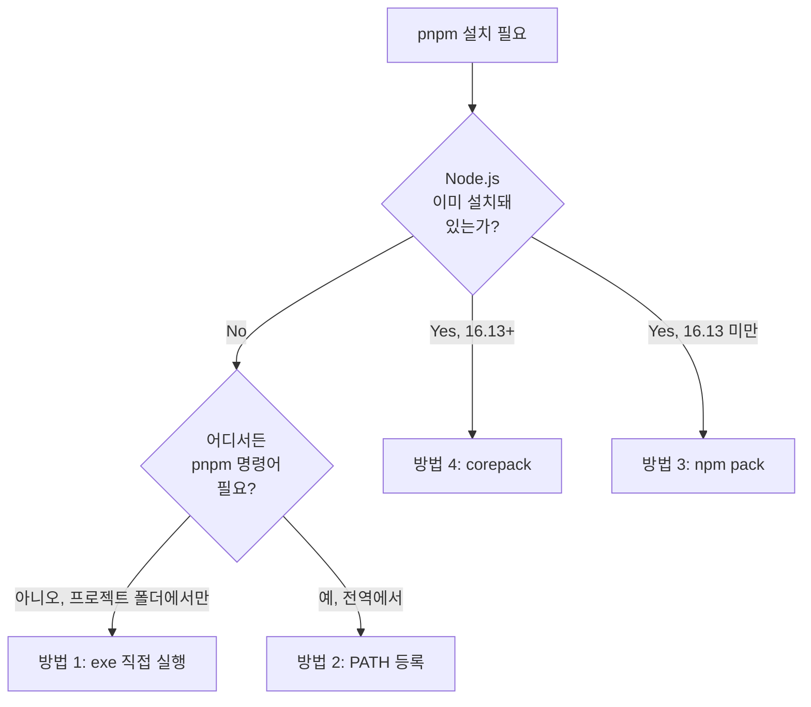

> 폐쇄망 PC에 pnpm을 설치하는 4가지 방법. 환경(Node.js 유무, 권한, OS, 운영자 숙련도)에 따라 적절한 선택지가 다르다.

## 결정 트리



## 방법 1: 실행 파일 직접 실행 (설치 불필요)

가장 간단한 방법. pnpm standalone binary를 프로젝트 폴더에 복사하고 직접 호출.

### Windows

```powershell
# 프로젝트 폴더에 exe 복사
copy pnpm-win-x64.exe C:\project\pnpm.exe

cd C:\project
.\pnpm.exe --version
.\pnpm.exe install --frozen-lockfile --offline
```

### Linux

```bash
# 프로젝트 폴더에 binary 복사 + 실행 권한
cp pnpm-linux-x64 /opt/project/pnpm
chmod +x /opt/project/pnpm

cd /opt/project
./pnpm --version
./pnpm install --frozen-lockfile --offline
```

### 장단점

| 항목 | 내용 |
|---|---|
| ✅ 장점 | 설치 단계가 없어 가장 빠름. 권한 이슈 없음. PATH 변경 없음 |
| ❌ 단점 | 매번 `./pnpm` 또는 `.\pnpm.exe` 형태로 호출. 다른 폴더에서는 못 씀 |
| 적합한 상황 | 일회성 설치, 권한이 제한적인 환경, 단일 프로젝트 운영 |

## 방법 2: PATH 등록 (어디서든 `pnpm` 명령어 사용)

### Windows — PowerShell

```powershell
# 1. 사용자 홈에 디렉토리 만들고 exe 복사
mkdir $HOME\pnpm-exe
copy pnpm-win-x64.exe $HOME\pnpm-exe\pnpm.exe

# 2. 사용자 PATH에 추가
[Environment]::SetEnvironmentVariable(
  "Path",
  [Environment]::GetEnvironmentVariable("Path", "User") + ";$HOME\pnpm-exe",
  "User"
)
```

새 PowerShell 창에서:

```powershell
pnpm --version
# 10.23.0
```

### Windows — CMD (PowerShell 권한 없을 때)

```cmd
mkdir %USERPROFILE%\pnpm-exe
copy pnpm-win-x64.exe %USERPROFILE%\pnpm-exe\pnpm.exe

setx PATH "%PATH%;%USERPROFILE%\pnpm-exe"
```

> `setx`는 **새 터미널부터** 적용된다. 현재 세션에서 바로 쓰려면:
> ```cmd
> set PATH=%PATH%;%USERPROFILE%\pnpm-exe
> ```

### Windows — GUI (명령어 권한이 전혀 없을 때)

1. `Win + R` → `sysdm.cpl` 입력 → 확인
2. **고급** 탭 → **환경 변수** 클릭
3. **사용자 변수** 영역에서 `Path` 선택 → **편집**
4. **새로 만들기** → `%USERPROFILE%\pnpm-exe` 입력 → **확인**
5. 새 터미널을 열고 `pnpm --version` 확인

### Linux

```bash
# 1. 디렉토리 만들고 binary 복사
mkdir -p ~/.local/bin
cp pnpm-linux-x64 ~/.local/bin/pnpm
chmod +x ~/.local/bin/pnpm

# 2. PATH 추가 (셸에 따라 .bashrc 또는 .zshrc)
echo 'export PATH="$HOME/.local/bin:$PATH"' >> ~/.bashrc
source ~/.bashrc

# 확인
pnpm --version
```

### 장단점

| 항목 | 내용 |
|---|---|
| ✅ 장점 | 어디서든 `pnpm` 명령어로 호출. 가장 일반적인 패턴 |
| ❌ 단점 | PATH 변경 권한 필요. GUI 방식이 익숙하지 않은 운영자에게 어려울 수 있음 |
| 적합한 상황 | 다수 프로젝트 운영, 장기적 사용 |

## 방법 3: npm pack (Node.js가 이미 있는 경우)

폐쇄망 PC에 Node.js와 npm이 이미 설치되어 있다면, npm 자체가 패키지 매니저이므로 npm으로 pnpm을 설치할 수 있다.

### 온라인에서 패키지 추출

```bash
# 원하는 pnpm 버전을 tarball로 받기
npm pack pnpm@10.23.0
# 결과: pnpm-10.23.0.tgz
```

이 tarball을 폐쇄망에 옮긴다.

### 폐쇄망에서 설치

```bash
npm install -g pnpm-10.23.0.tgz
pnpm --version
```

### 장단점

| 항목 | 내용 |
|---|---|
| ✅ 장점 | Node.js 표준 도구로 설치. 익숙한 흐름 |
| ❌ 단점 | Node.js·npm이 이미 폐쇄망에 있어야 함. 글로벌 설치라 권한 필요 |
| 적합한 상황 | Node.js 기반 다른 도구도 함께 운영하는 환경 |

## 방법 4: corepack (Node.js 16.13+ 이 있는 경우)

Node.js 16.13부터 표준 도구로 포함된 `corepack`을 사용하는 방법. **공식 권장 방식**에 가깝다.

### 온라인에서 패키지 준비

```bash
corepack pack pnpm@10.23.0 -o pnpm-10.23.0.corepack.tgz
```

이 tarball을 폐쇄망에 옮긴다.

### 폐쇄망에서 설치

```bash
corepack enable
corepack install -g pnpm-10.23.0.corepack.tgz
pnpm --version
```

### 장단점

| 항목 | 내용 |
|---|---|
| ✅ 장점 | Node.js 표준 도구 사용. 버전 관리가 깔끔. 프로젝트별 pnpm 버전 고정 가능 |
| ❌ 단점 | Node.js 16.13+ 필요. 일부 운영환경에서 corepack이 비활성화된 경우 있음 |
| 적합한 상황 | 최신 Node.js 환경, 프로젝트별 pnpm 버전 관리 필요 시 |

## 비교 요약

| 방법 | Node.js 필요 | 권한 필요 | 전역 사용 | 권장 상황 |
|---|:---:|:---:|:---:|---|
| 1. exe 직접 | ❌ | ❌ | ❌ | 일회성, 권한 제한 환경 |
| 2. PATH 등록 | ❌ | ⚠️ | ✅ | **다수 프로젝트, 장기 운영** |
| 3. npm pack | ✅ | ✅ | ✅ | Node 기반 환경, 익숙한 흐름 |
| 4. corepack | ✅ (16.13+) | ✅ | ✅ | 최신 Node, 프로젝트별 버전 관리 |

## 검증

어떤 방법이든 마지막에 동일하게:

```sh
pnpm --version
# 10.23.0 (또는 설치한 버전)
```

버전이 잘못 나오면 다른 pnpm이 PATH 우선순위에 끼어 있는 경우다. 다음으로 확인:

```bash
# Linux
which pnpm

# Windows PowerShell
Get-Command pnpm | Select-Object -ExpandProperty Source

# Windows CMD
where pnpm
```

## 자주 놓치는 점

- **PATH 등록 후에도 현재 세션에는 적용 안 됨.** 새 터미널을 열어야 한다. 운영자가 이걸 모르고 “설치 안 됨”으로 보고하는 케이스가 잦다.
- **Windows에서 사용자 변수 vs 시스템 변수 구분.** GUI에서 시스템 변수에 등록하려면 관리자 권한이 필요하다. 사용자 변수면 충분하다.
- **방법 4의 corepack은 Node.js 18~19에서 일부 환경 문제 보고가 있다.** Node.js 20 LTS 이상이 안전.
- **여러 방법을 동시에 적용하면 충돌**할 수 있다. 한 PC에는 한 방법만 사용.

설치 후 다음 챕터에서는 pnpm store를 압축 해제하고 4개 프로젝트를 오프라인으로 install·build하는 단계를 다룬다.

→ [[004_offline_install_and_build|04. 오프라인 설치 + nuxt prepare + 트러블슈팅]]
