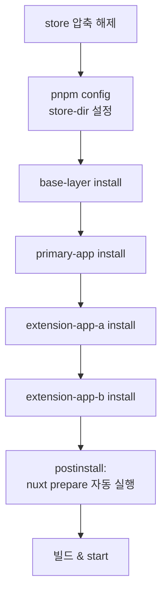
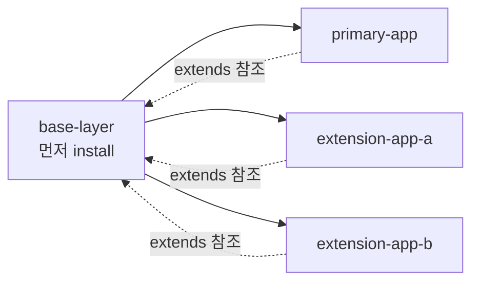

> 폐쇄망 PC에서 store 압축을 해제하고, 다중 Nuxt 프로젝트를 올바른 순서로 install·build·start하는 절차. 그리고 흔히 만나는 에러 6가지의 원인과 해결.

## 전체 흐름



핵심: **install 순서는 결정적이다.** base-layer를 반드시 먼저 install해야 다른 프로젝트의 `nuxt prepare`가 성공한다.

## 1. store 압축 해제

이전 챕터에서 가져온 `pnpm-store.tar.gz`를 풀고, pnpm이 그 위치를 store로 인식하게 설정한다.

### Windows (PowerShell)

```powershell
# 1. store 디렉토리 생성
mkdir $HOME\pnpm\store

# 2. 압축 해제
tar -xzf pnpm-store.tar.gz -C $HOME\pnpm\store

# 3. pnpm config에 store 경로 등록
pnpm config set store-dir $HOME\pnpm\store

# 4. 확인 (출력: C:\Users\admin\pnpm\store\v10)
pnpm store path

# 5. 구조 확인 (v10\files\ 디렉토리가 있어야 정상)
dir $HOME\pnpm\store\v10\files\
```

### Linux

```bash
# 1. store 디렉토리 생성
sudo mkdir -p ~/pnpm/store

# 2. 압축 해제
sudo tar -xzf pnpm-store.tar.gz -C ~/pnpm/store

# 3. (필요시) Docker가 접근 가능하도록 권한 설정
sudo chown -R $(id -u):$(id -g) ~/pnpm/store

# 4. pnpm config 등록
pnpm config set store-dir ~/pnpm/store

# 5. 확인
pnpm store path
```

### 압축 해제 결과 검증

```sh
# v10 (또는 v3 등 버전 디렉토리) 안에 files/ 가 있어야 함
$ ls ~/pnpm/store/v10/
files/  ...

# files/ 안에는 hash 디렉토리가 가득
$ ls ~/pnpm/store/v10/files/ | head
00/
01/
02/
...
```

`v*/files/` 구조가 보이지 않으면 압축 해제가 잘못된 것 — 02 챕터에서 `tar -C` 옵션을 빼먹은 경우다.

## 2. 오프라인 install — 순서가 결정적



다른 3개 프로젝트의 `nuxt.config.ts`가 다음과 같이 base-layer를 참조하기 때문이다.

```ts
// primary-app/nuxt.config.ts
export default defineNuxtConfig({
  extends: ['../base-layer'],
  // ...
})
```

`pnpm install`의 `postinstall`로 자동 실행되는 `nuxt prepare`가 base-layer를 읽어 타입을 생성하기 때문에, **base-layer가 먼저 install되어 있지 않으면 다른 프로젝트의 install 자체가 실패**한다.

### Windows (PowerShell)

```powershell
# 1. base-layer (반드시 먼저)
cd base-layer
pnpm install --frozen-lockfile --offline

# 2. primary-app
cd ..\primary-app
pnpm install --frozen-lockfile --offline

# 3. extension-app-a
cd ..\extension-app-a
pnpm install --frozen-lockfile --offline

# 4. extension-app-b
cd ..\extension-app-b
pnpm install --frozen-lockfile --offline
```

### Linux

```bash
cd base-layer && pnpm install --frozen-lockfile --offline && \
cd ../primary-app && pnpm install --frozen-lockfile --offline && \
cd ../extension-app-a && pnpm install --frozen-lockfile --offline && \
cd ../extension-app-b && pnpm install --frozen-lockfile --offline
```

### 플래그 의미

| 플래그 | 역할 |
|---|---|
| `--frozen-lockfile` | lockfile 변경 없이 **정확히 lockfile대로** 설치. 누락이나 차이가 있으면 즉시 실패 |
| `--offline` | 네트워크 접근 시도 자체를 차단. store에 없으면 fallback으로 다운로드하지 않고 실패 |

이 두 플래그가 함께 있어야 “**store에 없으면 fail-fast**”가 된다. 어느 쪽이든 빠지면 누락된 패키지가 silent로 재다운로드를 시도하다 hang 걸린다.

### 성공 출력 예시

```
Packages: +794
Progress: resolved 794, reused 794, downloaded 0, added 794, done

base-layer postinstall$ nuxt prepare
ℹ Nuxt Icon server bundle mode is set to local
◆ Types generated in .nuxt
```

핵심 지표:
- `downloaded 0` — 네트워크에서 받은 게 0개여야 함
- `nuxt prepare` 가 자동 실행되어 `.nuxt/` 디렉토리 생성

## 3. nuxt prepare 수동 실행 (필요 시)

`pnpm install`의 `postinstall`이 자동으로 `nuxt prepare`를 실행하지만, 다음 경우에는 수동 실행이 필요하다:

- `--ignore-scripts` 플래그를 사용한 경우
- postinstall이 실패해 부분적으로만 prepare된 경우
- 원본 `tsconfig.json`이 참조하는 `.nuxt/tsconfig.json`이 누락된 경우

### nuxt prepare가 하는 일

- `.nuxt/` 디렉토리 생성
- `.nuxt/tsconfig.json` 생성 (원본 `tsconfig.json`이 이걸 extends)
- 자동 import, 컴포넌트 타입 생성
- **이 디렉토리 없이는 `nuxt build`도 `nuxt dev`도 동작 안 함**

### 주의: nuxt는 글로벌 명령어가 아님

```sh
# 이렇게 하면 안 됨 — nuxt가 PATH에 없으므로
$ nuxt prepare
bash: nuxt: command not found
```

`nuxt`는 `node_modules/.bin/`에 있으므로 **반드시 `pnpm exec`** 로 실행한다.

```sh
# 올바른 호출
pnpm exec nuxt prepare
```

### 수동 실행 순서 (install과 동일)

```sh
cd base-layer && pnpm exec nuxt prepare && \
cd ../primary-app && pnpm exec nuxt prepare && \
cd ../extension-app-a && pnpm exec nuxt prepare && \
cd ../extension-app-b && pnpm exec nuxt prepare
```

### 성공 확인

각 프로젝트에 `.nuxt/tsconfig.json`이 생성되어야 한다.

```sh
ls base-layer/.nuxt/tsconfig.json
ls primary-app/.nuxt/tsconfig.json
ls extension-app-a/.nuxt/tsconfig.json
ls extension-app-b/.nuxt/tsconfig.json
```

## 4. 빌드 및 실행

```sh
cd primary-app
pnpm build
pnpm start
```

`pnpm start`가 운영 서버를 띄우고 nuxt 앱이 응답하면 성공.

## 트러블슈팅 — 자주 만나는 6가지 에러

### 에러 1: `ERR_PNPM_NO_OFFLINE_TARBALL`

**증상**:
```
ERR_PNPM_NO_OFFLINE_TARBALL  A package is missing from the store
```

**원인**: store에 해당 패키지가 없음. 주로
- 온라인에서 fetch 시 일부 프로젝트를 빠뜨림
- `node_modules`가 남아 있어 `pnpm fetch`가 “이미 됐다”고 건너뛴 경우
- 멀티플랫폼 native 패키지가 빠진 경우

**해결**:
1. 온라인 PC에서 `node_modules` 전부 삭제
2. `pnpm fetch`를 처음부터 다시 (모든 프로젝트)
3. `.npmrc`에 멀티플랫폼 아키텍처 설정 추가
4. store 재압축 → 폐쇄망 재전송

### 에러 2: 플랫폼별 바이너리 오류 (esbuild, sass-embedded 등)

**증상**: install은 성공했는데 build 시
```
Error: Cannot find module '@esbuild/win32-x64'
```

**원인**: 온라인 fetch 시 다른 OS·아키텍처의 native binary가 빠진 채 store에 들어감.

**해결**: 모든 프로젝트의 `.npmrc`에 다음을 추가하고 store 재준비.

```ini
supportedArchitectures.os=linux,win32,current
supportedArchitectures.cpu=x64,arm64,current
```

### 에러 3: `postinstall (nuxt prepare) 실패`

**증상**:
```
primary-app postinstall: nuxt prepare failed
ENOENT: no such file or directory, open '../base-layer/.nuxt/tsconfig.json'
```

**원인**: base-layer가 먼저 install되지 않음. extends가 base-layer의 `.nuxt/tsconfig.json`을 찾지 못함.

**해결**: install 순서를 base-layer → 나머지 3개로 강제. base-layer만 먼저 단독 install.

### 에러 4: `failed to resolve "extends": "./.nuxt/tsconfig.json"`

**증상**: IDE 또는 빌드 시
```
Cannot find file '.nuxt/tsconfig.json' to extend from
```

**원인**: `nuxt prepare`가 실행되지 않아 `.nuxt/tsconfig.json`이 없음.

**해결**: `pnpm exec nuxt prepare` 수동 실행. 이미 install이 끝난 상태에서도 가능.

### 에러 5: `pnpm install`이 hang (멈춤)

**증상**: install 명령이 진행되지 않고 한참 동안 멈춤.

**원인**: `--offline` 플래그가 빠져 있어 누락된 패키지를 네트워크에서 다운로드하려고 시도. 폐쇄망이라 네트워크 호출이 timeout으로 hang.

**해결**: `Ctrl+C`로 중단 → 반드시 `--offline` 플래그를 붙여 재실행. 누락 패키지가 있으면 즉시 에러로 알 수 있다.

### 에러 6: store 경로가 틀려서 install 실패

**증상**:
```
ERR_PNPM_NO_OFFLINE_TARBALL  Tarball not found in store
```

라고 떠도 store에는 분명히 패키지가 있는 경우.

**원인**: `pnpm config set store-dir`로 등록한 경로와 실제 압축 해제한 경로가 다름. 또는 store의 버전 디렉토리(`v10/`)가 한 단계 더 깊게 들어가 있음.

**해결**:
```sh
# 등록된 store 경로
pnpm store path
# 출력: C:\Users\admin\pnpm\store\v10

# 실제 디렉토리 구조 확인 — 이 경로 안에 files/ 가 있어야 함
ls $(pnpm store path)/files
# 또는
dir (pnpm store path)\files
```

`files/`가 한 단계 더 깊으면 (`v10/v10/files/`) 압축 시 `-C` 옵션을 빠뜨린 것이므로 재압축.

## 검증 — “정말 오프라인으로 동작했는가”

install이 성공해도 silent로 일부 다운로드를 받은 게 아닌지 확인:

```sh
pnpm install --frozen-lockfile --offline 2>&1 | grep -E "downloaded|reused|added"
# 정상: downloaded 0, reused N, added N
```

`downloaded`가 0이 아니면 네트워크에서 뭔가 받은 것 — 폐쇄망 환경이 아닌 곳에서 검증한 것이거나, `--offline`이 적용되지 않은 것.

## 핵심 체크리스트

- [ ] store 압축 해제 후 `pnpm config set store-dir` 등록
- [ ] `pnpm store path` 출력 안에 `files/` 디렉토리 존재
- [ ] **base-layer를 먼저** install
- [ ] 모든 install 명령에 `--frozen-lockfile --offline` 둘 다 사용
- [ ] 출력에 `downloaded 0` 확인
- [ ] 각 프로젝트에 `.nuxt/tsconfig.json` 생성 확인
- [ ] `pnpm build` 성공
- [ ] `pnpm start`로 운영 모드 응답 확인

## 자주 놓치는 점

- **install 한 번이 모두를 자동으로 해주지 않는다.** base-layer install 후 `nuxt prepare`가 끝나야 다음 프로젝트가 install될 수 있다 — 4개를 “한 번에” 시작하면 race로 실패한다.
- **`postinstall`이 자동 실행됐다고 가정하지 말 것.** 일부 환경에서는 `--ignore-scripts`가 default일 수 있다. install 후 항상 `.nuxt/`가 생성됐는지 확인.
- **pnpm 버전 불일치는 store metadata 호환을 깬다.** 온라인 PC와 폐쇄망 PC의 pnpm 버전이 다르면 같은 store인데도 “패키지 못 찾음” 에러가 난다.

## 종합 — 운영 단계의 한 줄 정리

> store 해제 → store-dir 등록 → **base-layer 먼저 install** → 나머지 프로젝트 install → 빌드.
> 각 install에 `--frozen-lockfile --offline` 필수. 모든 단계에서 `downloaded 0`을 확인.

← 처음부터 다시: [[index|개요]]
← 의사결정: [[001_decision_journey|01. 의사결정 진화]]
← 온라인 단계: [[002_online_preparation|02. 온라인 단계]]
← pnpm 설치: [[003_pnpm_install_in_airgapped|03. 폐쇄망 pnpm 설치]]
→ Docker 이미지 옵션: [[005_docker_image_options|05. Docker 이미지 두 가지 옵션 — Lean vs Full deps]]
