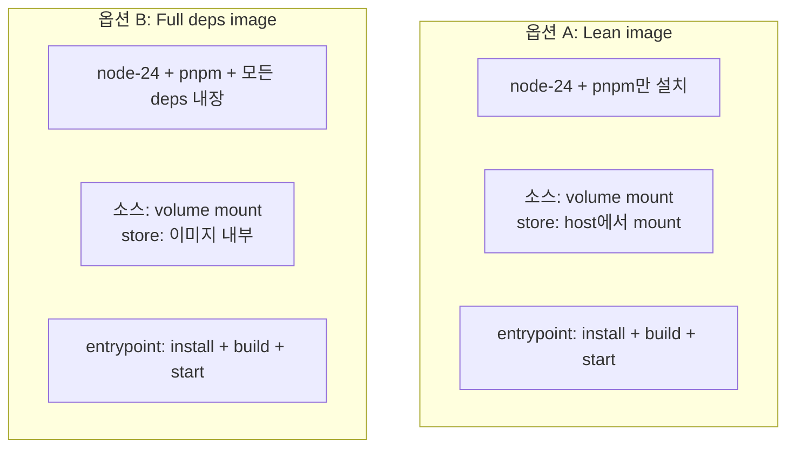
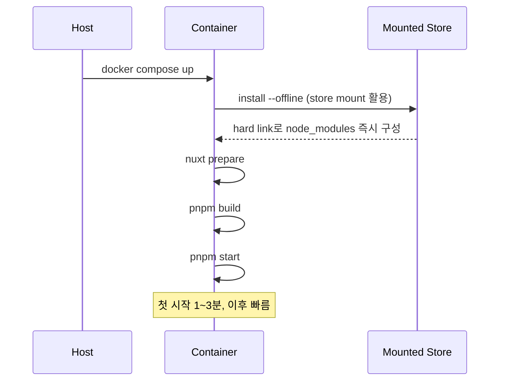
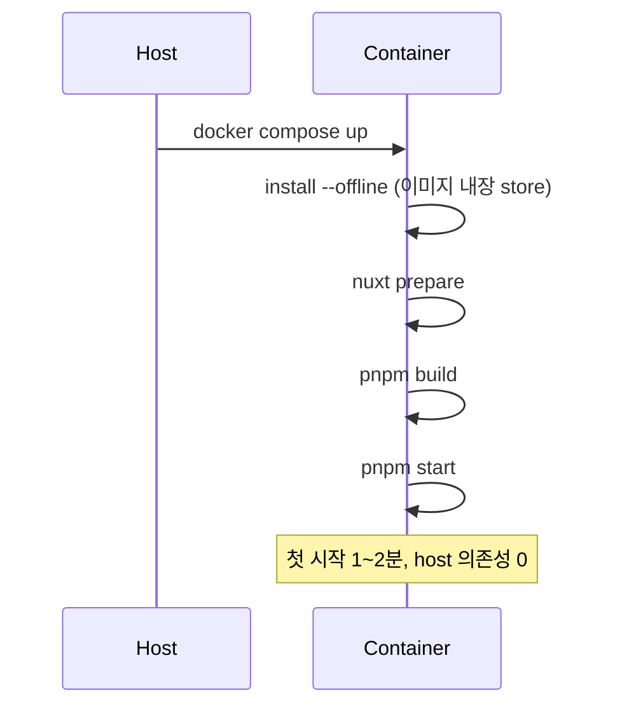

> 폐쇄망에 옮길 단위를 “store tar.gz”가 아니라 **Docker 이미지**로 잡는 두 가지 방식. 이미지에 deps를 넣지 않는 경량 옵션과 deps까지 통째로 굽는 풀 옵션을 만드는 과정·운영 패턴·트레이드오프를 정리한다.

## 왜 Docker 이미지로 옮기는가

이전 챕터에서 다룬 “store tar.gz + 소스 + pnpm 실행 파일을 USB로 옮기는” 방식은 가장 단순한 폐쇄망 배포 형태다. 다만 다음 운영 환경에서는 Docker 이미지 단위로 옮기는 것이 더 깔끔하다.

- **운영 PC가 Docker 기반**으로 표준화돼 있음
- **여러 애플리케이션을 함께 운영** (BE + FE 다수)
- **공유 base 이미지 패턴**을 쓰고 있음 (BE쪽도 “공유 이미지 + volume mount JAR” 패턴이라면 FE도 동일 패턴이 운영 일관성에 유리)
- **컨테이너 격리** 가 필요한 보안 요구사항

이 환경에서 Docker 이미지에 무엇을 “굽고” 무엇을 “mount”할지가 결정의 핵심이다. 두 극단의 옵션이 있다.

## 두 옵션 한눈에



핵심 차이는 **deps(pnpm store)를 어디에 두느냐** 한 가지다. 이 한 가지 결정이 이미지 크기·전송 단위·컨테이너 시작 시간·운영 패턴 모두를 바꾼다.

---

## 옵션 A: Lean image (node-24 + pnpm only)

### 의도

- 이미지는 **실행 환경(node + pnpm)만** 들고 있는다
- 의존성은 **호스트의 pnpm store**를 mount해서 사용
- 소스는 항상 그래왔듯 volume mount

### Dockerfile

```dockerfile
# fe/Dockerfile.lean
FROM node:24-slim

ENV PNPM_HOME="/pnpm"
ENV PATH="$PNPM_HOME:$PATH"
ENV PNPM_STORE_DIR=/pnpm/store

# pnpm 설치 (npm 글로벌)
RUN npm i -g pnpm@10.23.0

WORKDIR /app

# entrypoint 권한
COPY entrypoint.sh /entrypoint.sh
RUN chmod +x /entrypoint.sh

ENTRYPOINT ["/entrypoint.sh"]
```

### entrypoint.sh

```sh
#!/bin/sh
set -e

# pnpm store 경로 설정 (host에서 mount된 디렉토리)
pnpm config set store-dir ${PNPM_STORE_DIR}

# base-layer 먼저
cd /app/base-layer
pnpm install --frozen-lockfile --offline
pnpm exec nuxt prepare

# 메인 앱
cd /app/primary-app
pnpm install --frozen-lockfile --offline
pnpm exec nuxt prepare
pnpm build

exec pnpm start
```

### docker-compose.yml

```yaml
services:
  fe-app:
    image: fe-lean:latest
    restart: always
    container_name: fe-app
    volumes:
      - ./source:/app                       # 소스 mount
      - /app/base-layer/node_modules        # 컨테이너 전용 (host 무시)
      - /app/primary-app/node_modules       # 동일
      - ${HOME}/pnpm/store:/pnpm/store      # ★ host store mount
    ports:
      - "3000:3000"
    environment:
      - NODE_ENV=production
```

### 빌드 과정

```sh
# 온라인 PC에서
docker build -f fe/Dockerfile.lean -t fe-lean:latest fe/

# 폐쇄망 전송용 tar
docker save -o fe-lean.tar fe-lean:latest

# 폐쇄망에서
docker load -i fe-lean.tar
```

폐쇄망에 옮길 자산:
- `fe-lean.tar` (이미지, 약 200MB)
- `pnpm-store.tar.gz` (host에 풀어 mount 대상으로 사용)
- 소스 코드 폴더

### 운영 흐름



---

## 옵션 B: Full deps image (모든 dependency 포함)

### 의도

- 이미지에 **모든 deps의 pnpm store까지 통째로** 굽는다
- 호스트는 store를 따로 관리할 필요 없음
- 이미지 단독으로 자기 완결

### 핵심 패턴 — Multi-stage build

`pnpm fetch`를 build stage에서 실행해 store만 뽑은 뒤, 최종 stage에 그 store를 복사한다.

```dockerfile
# fe/Dockerfile.full
# ──────────────── Stage 1: deps fetcher ────────────────
FROM node:24-slim AS deps

ENV PNPM_HOME="/pnpm"
ENV PATH="$PNPM_HOME:$PATH"
ENV PNPM_STORE_DIR=/pnpm/store

RUN npm i -g pnpm@10.23.0

WORKDIR /workspace

# 모든 프로젝트의 lockfile만 먼저 복사 (캐시 활용)
COPY base-layer/pnpm-lock.yaml         base-layer/
COPY primary-app/pnpm-lock.yaml        primary-app/
COPY extension-app-a/pnpm-lock.yaml    extension-app-a/
COPY extension-app-b/pnpm-lock.yaml    extension-app-b/

# 멀티플랫폼 native binary를 위한 .npmrc
COPY .npmrc.shared                     ./.npmrc

# 각 프로젝트에서 fetch (store에만 다운로드, node_modules 안 만듦)
RUN cd base-layer       && pnpm fetch --store-dir $PNPM_STORE_DIR
RUN cd primary-app      && pnpm fetch --store-dir $PNPM_STORE_DIR
RUN cd extension-app-a  && pnpm fetch --store-dir $PNPM_STORE_DIR
RUN cd extension-app-b  && pnpm fetch --store-dir $PNPM_STORE_DIR

# ──────────────── Stage 2: runtime ────────────────
FROM node:24-slim

ENV PNPM_HOME="/pnpm"
ENV PATH="$PNPM_HOME:$PATH"
ENV PNPM_STORE_DIR=/pnpm/store

RUN npm i -g pnpm@10.23.0

# Stage 1의 store만 복사 (소스는 안 들고 옴)
COPY --from=deps /pnpm/store /pnpm/store

WORKDIR /app

COPY entrypoint.sh /entrypoint.sh
RUN chmod +x /entrypoint.sh

ENTRYPOINT ["/entrypoint.sh"]
```

핵심 포인트:
- **Multi-stage**로 fetch 환경과 runtime을 분리. 빌드 도구·캐시는 최종 이미지에 남기지 않는다.
- **Stage 1에 lockfile만 먼저 복사**하면 lockfile이 안 바뀌는 한 fetch layer가 캐시되어 재빌드가 빠르다.
- **`.npmrc.shared`**: 멀티플랫폼 아키텍처 설정을 별도 파일로 관리.

### .npmrc.shared

```ini
supportedArchitectures.os=linux,win32,current
supportedArchitectures.cpu=x64,arm64,current
```

### entrypoint.sh

옵션 A와 동일하다 — `--offline` install이 이미지 내장 store에서 동작한다.

```sh
#!/bin/sh
set -e

pnpm config set store-dir ${PNPM_STORE_DIR}

cd /app/base-layer
pnpm install --frozen-lockfile --offline
pnpm exec nuxt prepare

cd /app/primary-app
pnpm install --frozen-lockfile --offline
pnpm exec nuxt prepare
pnpm build

exec pnpm start
```

### docker-compose.yml

```yaml
services:
  fe-app:
    image: fe-full:latest
    restart: always
    container_name: fe-app
    volumes:
      - ./source:/app                       # 소스 mount
      - /app/base-layer/node_modules        # 컨테이너 전용
      - /app/primary-app/node_modules
      # ★ host store mount 없음 — 이미지에 내장
    ports:
      - "3000:3000"
    environment:
      - NODE_ENV=production
```

### 빌드 과정

```sh
# 온라인 PC
docker build -f fe/Dockerfile.full -t fe-full:latest fe/

# 폐쇄망 전송용 tar
docker save -o fe-full.tar fe-full:latest

# 폐쇄망
docker load -i fe-full.tar
```

폐쇄망에 옮길 자산:
- `fe-full.tar` (이미지, 약 600MB ~ 1GB)
- 소스 코드 폴더
- (호스트 store 불필요)

### 운영 흐름



---

## 두 옵션 비교

| 항목 | Lean (A) | Full (B) |
|---|---|---|
| **이미지 크기** | ~200MB | ~600MB–1GB |
| **전송 단위** | 이미지 + store tar.gz + 소스 | 이미지 + 소스 |
| **컨테이너 시작 시간** | 첫 시작 1~3분 | 첫 시작 1~2분 |
| **호스트 store 관리** | 필요 (`~/pnpm/store` mount) | 불필요 |
| **deps 변경 시** | host store만 갱신 | 이미지 rebuild |
| **이미지 재사용성** | 높음 (다수 앱 공유) | 중간 (앱마다 별도) |
| **여러 FE 앱 운영** | store 1개로 N개 앱 | 앱마다 이미지 내장 deps 중복 |
| **휴먼 에러 표면** | host store 누락·경로 불일치 | 이미지 rebuild 누락 |
| **운영 단순성** | 중간 | 높음 |
| **빌드 시간** | 짧음 (~30초) | 김 (~5~10분) |
| **CI 파이프라인 적합성** | host 환경 의존 | 단독 빌드 깔끔 |

## 시나리오별 권장

### 옵션 A를 선택해야 할 때

- **한 호스트에 여러 FE 앱이 운영**된다 (BE+FE+여러 admin 페이지 등)
- **deps가 자주 바뀐다** (주간 단위로 패키지 업데이트 발생)
- **이미지 빌드 시간을 줄이고 싶다** — store 변경만으로 끝
- **BE도 “공유 이미지 + volume mount” 패턴**이라 FE도 같은 패턴으로 통일하고 싶음
- 운영자가 Docker volume·host 디렉토리에 익숙

### 옵션 B를 선택해야 할 때

- **단일 FE 앱**만 운영
- **deps가 안정적**으로 거의 안 바뀜 (월간 단위 미만)
- **운영자 숙련도가 낮음** — host에 store를 mount하라는 절차 자체가 휴먼 에러 매개체
- **CI에서 단일 artifact**만 만들어 떨어뜨리는 깔끔한 파이프라인이 우선
- **컨테이너 격리·재현성**이 매우 중요한 보안 환경

## 트레이드오프의 본질

이 결정은 **“복잡성을 어디에 둘 것인가”** 의 결정이다.

- **옵션 A**는 host에 store를 mount하는 책임을 운영자에게 둔다. 그 대가로 이미지가 가볍고 재사용 가능.
- **옵션 B**는 빌드 시점에 store까지 굽는 책임을 CI/빌드 환경에 둔다. 그 대가로 운영이 단순.

쉬운 곳을 어렵게 만들지 말고, 운영 단계의 **가장 약한 고리**가 어디인지를 보고 결정해야 한다.

- 운영 단계가 약하면 → 옵션 B (운영 단순화)
- 빌드 단계는 자동화돼 있고 운영 인력이 다양한 환경을 다룬다 → 옵션 A (자원 효율)

## 하이브리드 — “기본은 B, 빠른 반복이 필요하면 A”

실제 운영에서는 두 옵션을 동시에 만들고 상황에 따라 선택하는 패턴도 가능하다.

```sh
# 안정 운영용
docker build -f fe/Dockerfile.full -t fe-full:stable .

# 개발자 빠른 반복용 (host store 직접 변경)
docker build -f fe/Dockerfile.lean -t fe-lean:dev .
```

`docker-compose.yml`에 두 서비스를 정의하고 환경변수로 토글:

```yaml
services:
  fe-app:
    image: ${FE_IMAGE:-fe-full:stable}
    # ... volume 정의는 lean용으로 작성, full에서는 mount되지 않을 뿐
```

다만 이 패턴은 운영 복잡도를 높이므로 정말 필요할 때만.

## 핵심 교훈

1. **이미지에 무엇을 굽고 무엇을 mount할지는 운영 패턴 결정과 같다.** 단순한 “이미지 빌드” 작업이 아니라 운영 인력·CI 환경·다중 앱 구성에 따라 달라진다.
2. **Multi-stage build의 가치는 store만 추출할 때 가장 크다.** 단일 stage로 deps를 굽으면 빌드 도구·캐시까지 최종 이미지에 남는다. Stage 분리로 “store만 깔끔히 추출”하는 게 옵션 B의 핵심.
3. **lockfile-only 복사로 캐시 효율을 극대화하라.** Stage 1에 lockfile만 먼저 복사하면, 소스가 바뀌어도 store 캐시는 재사용된다. 이걸 빠뜨리면 빌드가 매번 5~10분.
4. **옵션 A의 store mount는 “복원 가능한 상태”를 호스트에 두는 것이다.** 호스트의 store가 손상되면 모든 앱이 일제히 install 실패한다. 호스트 store는 backup 정책을 함께 설계해야 한다.

← 처음부터: [[index|개요]]
← 의사결정: [[001_decision_journey|01. 의사결정 진화]]
← 온라인 단계: [[002_online_preparation|02. 온라인 단계]]
← pnpm 설치: [[003_pnpm_install_in_airgapped|03. 폐쇄망 pnpm 설치]]
← 오프라인 빌드: [[004_offline_install_and_build|04. 오프라인 설치 + 빌드]]
