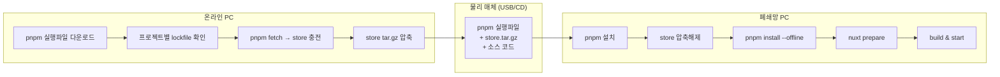

> 인터넷이 차단된 환경에 여러 Nuxt 프로젝트를 한 번에 배포하기 위한 pnpm store 기반 오프라인 워크플로우 종합 정리.

## 배경

운영 환경의 특성상 다음 흐름을 거쳐야 한다.

1. **온라인 PC** — 자유로운 의존성 다운로드 가능
2. **폐쇄망 PC** — 인터넷 차단. CD/USB 등 물리 매체로 파일을 옮겨 설치

또한 단일 Nuxt 앱이 아니라 **base layer 1개 + 확장 프로젝트 여러 개**가 같은 의존성을 공유하는 구조다. 각 프로젝트가 독립적으로 의존성을 들고 있으면 디스크·전송 용량이 폭증한다.

이 두 조건을 만족하는 방식을 찾는 과정에서 여러 차례 구조 변경을 거쳤고, 최종적으로 **공유 deps 이미지 + volume mount 소스** 패턴으로 안착했다.

## 전체 흐름

## 챕터 구성

| 챕터 | 내용 |
|---|---|
| [[001_decision_journey\|01. 의사결정 진화 — 왜 이 구조에 도달했는가]] | 4단계 변형 시도와 최종 선택 |
| [[002_online_preparation\|02. 온라인 단계 — pnpm 실행파일 + store 준비]] | 다운로드, fetch, 압축, 전송 목록 |
| [[003_pnpm_install_in_airgapped\|03. 폐쇄망 pnpm 설치 — 4가지 방법 비교]] | exe 직접 / PATH 등록 / npm pack / corepack |
| [[004_offline_install_and_build\|04. 오프라인 설치 + nuxt prepare + 트러블슈팅]] | store 해제, install 순서, postinstall 처리 |
| [[005_docker_image_options\|05. Docker 이미지 두 가지 옵션 — Lean vs Full deps]] | node+pnpm only 이미지 vs deps 통째 이미지, multi-stage 빌드, 비교 |

## 핵심 인사이트

- **pnpm fetch + tar 압축**으로 store를 통째로 박제하면 폐쇄망에서도 같은 의존성 트리를 재현할 수 있다.
- **공유 base layer가 있으면 install 순서가 결정적**이다 (base layer를 반드시 먼저).
- **`--frozen-lockfile --offline` 조합**으로 네트워크 fallback을 차단해야 install 단계에서 누락을 즉시 감지할 수 있다.
- **`postinstall`(nuxt prepare)이 실패하면 빌드도 실패**하므로, install 순서 + lockfile 무결성이 모두 갖춰져야 한다.
- **이미지에 store를 내장 vs 호스트 store를 mount**의 트레이드오프가 운영 패턴 결정의 핵심이다.

## 회고 핵심

**잘 된 점**
- 다수 프로젝트가 store를 공유하므로 디스크·전송 용량이 큰 폭으로 절감
- `--offline` 플래그로 fail-fast — 누락 패키지가 있으면 즉시 알 수 있음
- 표준 npm 워크플로우와 호환되어 팀 러닝커브가 거의 없음

**다음에는 다르게 할 점**
- store 준비 자동화 부재 — 매번 수동 스크립트 실행. CI에서 nightly로 store snapshot을 굽는 파이프라인이 필요했다
- pnpm 버전·Node 버전·OS·아키텍처를 모두 고정 관리해야 했음. 한 곳이라도 어긋나면 store metadata 호환이 깨진다
- 트러블슈팅 데이터를 처음부터 모았어야 했다 — 같은 에러를 두 번 디버깅한 경우가 많았음

각 챕터에서 더 자세한 코드와 결정 과정을 다룬다.
