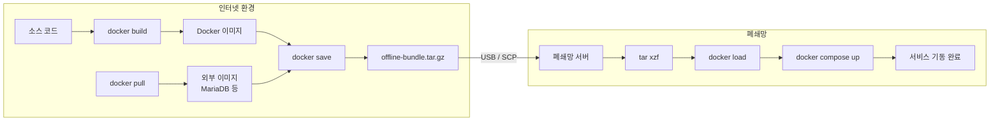

## 개요

폐쇄망에 Docker 기반 서비스를 배포하려면, 인터넷 환경에서 이미지를 파일로 내보내고 대상 서버에서 복원하는 과정이 필요하다. 전체 흐름을 정리한다.

## docker save / docker load

Docker 이미지는 레지스트리 없이도 파일로 전달할 수 있다.

```bash
# 내보내기
docker save myapp:latest -o myapp.tar

# 복원
docker load -i myapp.tar
```

## 전체 흐름



## prepare.sh — 번들 생성

인터넷 환경에서 실행. 모든 이미지를 tar로 저장하고 설정 파일과 함께 하나로 묶는다.

```bash
#!/bin/bash
set -e

BUNDLE_DIR="./offline-bundle"
mkdir -p "$BUNDLE_DIR/images"

# 외부 이미지 pull + save
docker pull mariadb:11
docker save mariadb:11 -o "$BUNDLE_DIR/images/mariadb-11.tar"

# 자체 이미지 save
docker save backend-app -o "$BUNDLE_DIR/images/backend-app.tar"
docker save frontend-app -o "$BUNDLE_DIR/images/frontend-app.tar"

# 설정 + 설치 스크립트 복사
cp docker-compose.yml .env.example install.sh "$BUNDLE_DIR/"

# 압축
tar czf "offline-bundle-$(date +%Y-%m-%d).tar.gz" offline-bundle
```

## install.sh — 폐쇄망 설치

```bash
#!/bin/bash
set -e

for tar_file in ./images/*.tar; do
  docker load -i "$tar_file"
done

docker compose up -d
```

## 플랫폼 주의

Apple Silicon에서 빌드한 이미지는 `linux/arm64`이므로, x86 서버에서 실행 불가. 반드시 타겟 플랫폼을 지정해야 한다.

```bash
docker build --platform linux/amd64 -t myapp .
```
