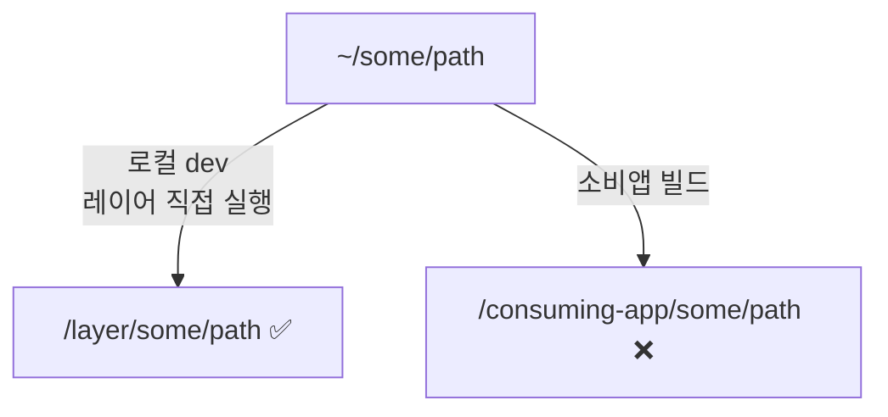

## 1. Nuxt Layer — `~` alias 프로덕션 빌드 실패

### 증상

Nuxt Layer 구조에서 레이어 내부 페이지가 `~` alias로 같은 레이어의 파일을 import할 때, 소비앱 빌드 시 파일을 찾지 못한다.

```
Could not load /app/consuming-app/app//some/path/index.vue
(imported by ../layer/pages/some-page.vue)
```

### 원인

Nuxt의 `~` alias는 항상 **소비앱(consuming app)** 의 루트로 해석된다. 레이어 내부 디렉토리가 아니다.



### 시도한 접근

| 접근 | 결과 |
|------|------|
| 상대 경로 `../some/path` | Rollup이 Vue SFC 가상 모듈에서 해석 실패 |
| `#layer` alias + `createResolver` | 소비앱 빌드 컨텍스트에서 해석 안 됨 |
| Dockerfile에서 해당 페이지 삭제 | **성공** |

### 해결

개발 전용 페이지는 프로덕션 빌드에서 제거한다.

```dockerfile
RUN rm -f /app/layer/pages/dev-only-page.vue \
 && cd /app/consuming-app && npm run build
```

소스 코드는 변경하지 않으므로 로컬 개발에 영향 없음.

### 교훈

Nuxt Layer 내부에서 `~` alias로 레이어 자체 파일을 import하는 것은 단독 실행에서만 동작한다. 소비앱에서 상속받아 빌드하면 반드시 깨진다.

## 2. pnpm fetch — node_modules가 있으면 스킵

### 증상

`pnpm fetch`로 오프라인 store를 준비했는데, 일부 패키지가 누락된다.

### 원인

`node_modules`가 이미 존재하면 `pnpm fetch`가 "Already up to date"로 건너뛴다.

### 해결

```bash
rm -rf node_modules
pnpm fetch
```

## 3. postinstall 스크립트 — deps 단계 실패

### 증상

Dockerfile의 의존성 설치 단계에서 소스 코드 없이 `pnpm install`하면 `postinstall: nuxt prepare`가 실패한다.

### 해결

`--ignore-scripts`로 postinstall을 건너뛴다. `nuxt build`가 prepare를 포함하므로 빌드 단계에서 자동 처리된다.

```dockerfile
# deps 단계 — 소스 없이 lockfile만으로 설치
RUN pnpm install --no-frozen-lockfile --ignore-scripts

# build 단계 — 소스 복사 후 빌드 (prepare 포함)
COPY . .
RUN pnpm build
```

## 4. MariaDB 초기화 SQL 재실행 안 됨

### 증상

`docker compose up -d` 했는데 테이블이 없다.

### 원인

`/docker-entrypoint-initdb.d`의 SQL은 **볼륨이 비어있을 때만** 실행된다. 이전 실행의 볼륨이 남아있으면 스킵.

### 해결

```bash
docker compose down -v   # 볼륨까지 삭제
docker compose up -d     # 초기화 SQL 재실행
```
