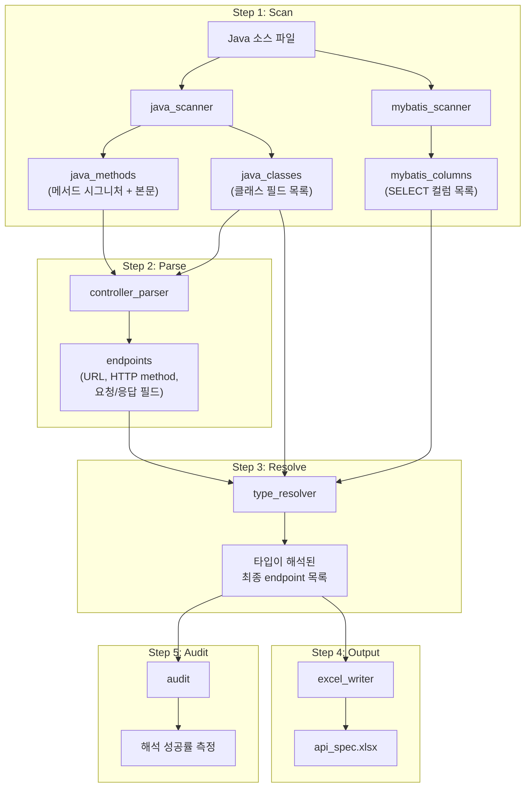

## 문제

Spring 기반 백엔드 API가 늘어날수록 명세서 관리가 사실상 불가능해진다. Swagger/OpenAPI는 어노테이션을 별도로 달아야 하고, 커스텀 프레임워크를 쓰면 지원 자체가 안 되는 경우도 있다.

## 접근: 소스 코드 정적 분석

어노테이션 기반 자동 문서화가 어려우면, 소스 코드 자체를 파싱해서 필요한 정보를 추출한다. Java 코드는 구조가 비교적 정형화되어 있어 정규식 기반 분석이 가능하다.

## 전체 파이프라인



## Step 1: Scan — 소스 코드 수집

전체 Java 소스 트리를 순회하며 세 가지 정보를 수집한다.

### java_methods
모든 `public` 메서드의 시그니처와 본문을 추출한다. 중괄호 균형 매칭으로 메서드 바디를 정확히 잘라낸다.

```python
# 입력: public ResponseEntity<User> getUser(Long id) { ... }
# 출력: {
#   "UserController.getUser": {
#     "return_type": "ResponseEntity<User>",
#     "params": "Long id",
#     "body": "..."
#   }
# }
```

### java_classes
모든 클래스의 필드 선언을 추출한다. 상속 관계도 추적하여 부모 클래스 필드를 자식에 병합한다.

```python
# 입력: private String name;  private List<Role> roles;
# 출력: {
#   "User": [
#     {"name": "name", "type": "String"},
#     {"name": "roles", "type": "List", "generic": "Role"}
#   ]
# }
```

### mybatis_columns
MyBatis XML 매퍼에서 SELECT 쿼리의 컬럼 목록을 추출한다. Java 코드만으로 타입을 알 수 없을 때 폴백으로 사용한다.

## Step 2: Parse — Controller 분석

`@Controller` / `@RestController` 클래스를 찾고, 각 엔드포인트의 요청/응답 구조를 추출한다.

### 추출 대상

| 항목 | 소스 |
|------|------|
| HTTP method | `@GetMapping`, `@PostMapping` 등 |
| URL path | `@RequestMapping` 클래스 레벨 + 메서드 레벨 조합 |
| 요청 파라미터 | `@Param`, `@Header`, `@RequestBody` 등 |
| 요청 바디 필드 | 커스텀 request 객체의 getter 호출 패턴 분석 |
| 응답 필드 | response 객체의 setter/put 호출 패턴 분석 |

### 요청 파라미터 분류

```
@Header("name")          → header 영역
@Param("id") + URL 바인딩 → path 영역  
@Param("name")           → query 영역
MultipartFile             → body (type: file)
@RequestBody             → body 영역 (필드 개별 추출)
```

## Step 3: Resolve — 타입 추론

응답 필드의 값 표현식에서 실제 타입을 추론한다. 10가지 이상의 패턴을 우선순위대로 적용한다.

```
stream().map(Cls::method).toList() → List<returnType>
.builder().build()                  → 클래스명
"literal"                           → string
isEmpty(), equals()                 → boolean
변수 선언 룩업                        → 선언된 타입
getXxx()                            → 필드 xxx의 타입
최종 폴백                            → object
```

비원시 타입(DTO)은 재귀적으로 내부 필드를 펼쳐서 명세에 포함한다. 깊이 제한(5)으로 순환 참조를 방지한다.

## Step 4: Output — Excel 생성

엔드포인트별로 구조화된 행을 생성한다.

```
[엔드포인트 제목]
  설명 | 컨트롤러명
  방식 | GET/POST/PUT/DELETE
  URL  | /api/v1/...
  
[요청]
  번호 | 변수명 | 영역 | 필드명 | 타입 | 필수 | 비고
  1    | id    | path | 식별자 | long | Y   |
  
[응답]
  번호 | 변수명    | 영역 | 필드명 | 타입    | 필수 | 비고
  1    | user.name | data | 이름   | string |     |
```

중첩 필드는 `user.name` 형태로 평탄화(flatten)하되, 예제 JSON에서는 원래 중첩 구조를 복원한다.

## Step 5: Audit — 품질 측정

응답 `data` 필드의 타입 해석 성공률을 측정한다.

| 판정 | 조건 |
|------|------|
| 성공 | 원시 타입 (string, integer, boolean 등) |
| 성공 | 컬렉션<원시 타입> (List\<String\> 등) |
| 성공 | DTO 타입이면서 하위 필드가 존재 |
| 실패 | 타입이 object (미해석) |
| 실패 | DTO인데 하위 필드가 비어있음 |

실패 항목은 별도 시트에 원인별로 분류하여 개선 포인트를 제공한다.

## 실행 방법

```bash
# 기본 실행
python -m spec-generator.api.main

# 중간 과정 디버깅 (7개 추가 시트 생성)
python -m spec-generator.api.main --trace

# 해석 성공률만 측정
python -m spec-generator.api.audit
```
