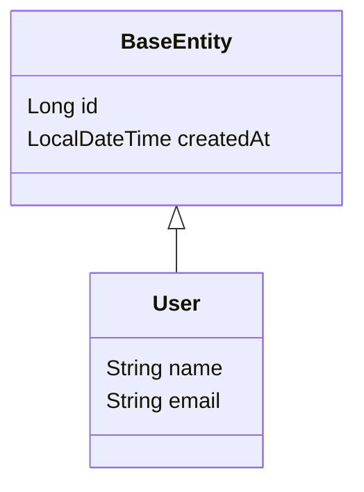

## 목표

Java 소스 파일에서 메서드 시그니처/본문, 클래스 필드, 상속 관계를 추출한다. AST 파서 없이 정규식과 문자열 처리만으로 구현한다.

## 왜 정규식인가

Java용 Python AST 파서(javalang 등)는 최신 문법 지원이 느리고, 의존성을 최소화하고 싶었다. Java 코드는 구조가 정형화되어 있어 정규식만으로 실용적 수준의 파싱이 가능하다.

단, 완벽한 파싱이 아닌 **실용적 파싱**이 목표다. 100%가 아닌 90%+ 해석률을 빠르게 달성하는 것이 핵심이다.

## 메서드 스캔 (java_scanner)

### 시그니처 추출

```python
# 패턴: public [static] ReturnType methodName(
METHOD_RE = r'public\s+(?:static\s+)?(\S+)\s+(\w+)\s*\('
```

### 본문 추출 — 중괄호 균형 매칭

정규식으로는 중괄호 깊이를 추적할 수 없으므로, 문자열 순회로 처리한다.

```python
def extract_body(source: str, start: int) -> str:
    depth = 0
    in_string = False
    for i in range(start, len(source)):
        ch = source[i]
        if ch == '"' and source[i-1] != '\\':
            in_string = not in_string
        if in_string:
            continue
        if ch == '{':
            depth += 1
        elif ch == '}':
            depth -= 1
            if depth == 0:
                return source[start:i+1]
    return ""
```

핵심 주의점:
- **문자열 리터럴 내부의 중괄호 무시** — `"{"` 같은 경우
- **생성자 제외** — 메서드명 == 클래스명이면 스킵
- **인터페이스** — `public` 없는 메서드도 스캔 (인터페이스는 기본 public)

## 클래스 필드 스캔

### 필드 추출

```python
# 패턴: (접근자) [final] [static] Type fieldName [= ...];
FIELD_RE = r'(private|protected|public)\s+(?:final\s+)?(?:static\s+)?(\S+)\s+(\w+)'
```

### 제네릭 분리

`List<String>` 같은 타입에서 컨테이너와 내부 타입을 분리한다.

```python
def split_generic(type_str: str) -> tuple:
    if '<' in type_str:
        base = type_str[:type_str.index('<')]
        inner = type_str[type_str.index('<')+1:-1]
        return base, inner
    return type_str, None

# "List<String>"     → ("List", "String")
# "Map<String,User>" → ("Map", "String,User")
# "String"           → ("String", None)
```

### 제외 규칙

```python
# static 필드 제외 (상수이므로 명세 불필요)
if 'static' in modifiers:
    continue

# @JsonIgnore 필드 제외 (직렬화 대상 아님)
if has_annotation(field, 'JsonIgnore'):
    continue
```

## 상속 처리

자식 클래스가 부모를 상속하면 부모의 필드도 명세에 포함되어야 한다.



파싱 결과에서 `extends`를 감지하면, 부모 클래스의 필드를 자식에 병합한다. 다단계 상속도 재귀적으로 처리한다.

```python
def merge_inherited_fields(classes: dict):
    for cls_name, cls_info in classes.items():
        parent = cls_info.get('extends')
        if parent and parent in classes:
            parent_fields = classes[parent]['fields']
            cls_info['fields'] = parent_fields + cls_info['fields']
```

## Lombok 지원

Lombok 어노테이션이 있으면 getter/setter가 존재한다고 간주한다.

```python
LOMBOK_ANNOTATIONS = {'Data', 'Getter', 'Builder', 'Value'}

# @Data가 있으면 모든 필드에 getter 존재
# → 타입 추론 시 getXxx() 호출을 필드 룩업으로 치환 가능
```

## 한계와 트레이드오프

| 항목 | 지원 | 미지원 |
|------|------|--------|
| 일반 클래스 | O | 익명 클래스, 람다 내부 클래스 |
| 단일/다단계 상속 | O | 다이아몬드 상속 (인터페이스 default) |
| 제네릭 1단계 | O | 와일드카드 `? extends T` |
| 주석 내 코드 | 무시 | 주석으로 감싸진 실제 코드 |

정규식 기반이므로 엣지 케이스에서 실패할 수 있지만, audit 시스템으로 실패율을 측정하고 패턴을 보강하는 방식으로 점진적 개선이 가능하다.
