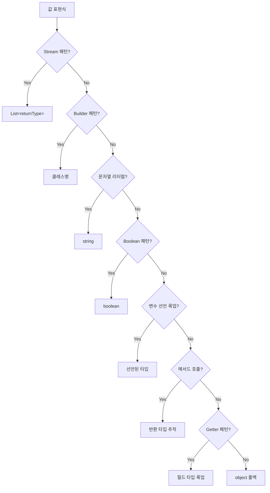
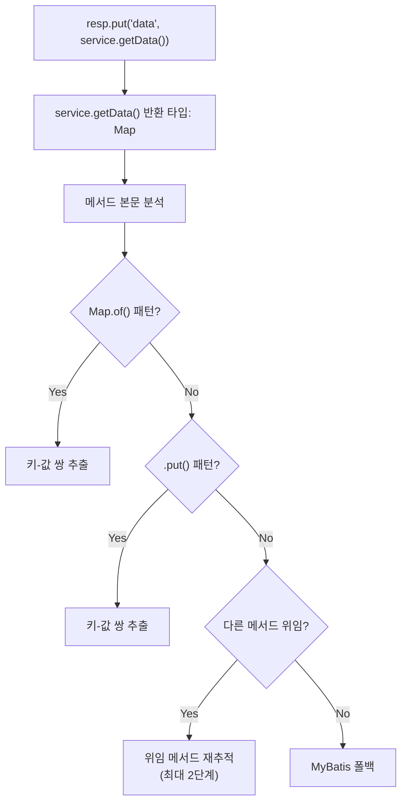

## 문제

API 응답에 `resp.put("user", userService.getUser(id))`처럼 값을 넣으면, 명세서에는 단순히 "user: object"가 아니라 User 클래스의 내부 필드까지 펼쳐서 보여줘야 한다.

## 타입 추론 우선순위 체인

값 표현식에서 타입을 추론할 때, 10가지 패턴을 우선순위대로 시도한다.



### 주요 패턴 상세

**Stream 패턴**
```java
items.stream().map(Item::getName).toList()
// → Item.getName()의 반환 타입 → String → List<String>
```

**변수 선언 룩업**
```java
List<User> users = userRepo.findAll();
resp.put("users", users);
// → 메서드 본문에서 "List<User> users" 선언을 찾아 타입 결정
```

**메서드 호출 추적**
```java
resp.put("data", userService.getUser(id));
// → java_methods에서 UserService.getUser의 반환 타입 → User
```

## 재귀적 DTO 확장

타입이 원시 타입이 아니면, 해당 클래스의 필드를 재귀적으로 펼친다.

```python
def resolve_type_fields(type_name: str, depth: int = 0):
    if depth > 5:  # 순환 참조 방지
        return []
    
    if type_name in PRIMITIVE_TYPES:
        return []  # string, integer 등은 더 펼칠 필요 없음
    
    fields = java_classes.get(type_name, [])
    result = []
    
    for field in fields:
        if field['type'] in PRIMITIVE_TYPES:
            result.append(field)
        else:
            # 비원시 타입 → 재귀 확장
            sub_fields = resolve_type_fields(field['type'], depth + 1)
            result.append({**field, 'children': sub_fields})
    
    return result
```

### 확장 예시

```java
class User {
    String name;
    Address address;
    List<Role> roles;
}

class Address {
    String city;
    String zipCode;
}

class Role {
    String name;
    Integer level;
}
```

펼친 결과:
```
user          → User
user.name     → string
user.address  → Address
user.address.city    → string
user.address.zipCode → string
user.roles    → List<Role>
user.roles[].name  → string
user.roles[].level → integer
```

## Map 추적 — 가장 어려운 부분

`Map<String, Object>`를 반환하는 서비스 메서드는 타입 정보가 없다. 메서드 본문을 분석해서 Map에 어떤 키-값을 넣는지 추적한다.



### 패턴 A: Map.of()
```java
return Map.of(
    "name", user.getName(),
    "count", userRepo.count()
);
// → name: string, count: long
```

### 패턴 B: .put()
```java
Map<String, Object> result = new HashMap<>();
result.put("name", user.getName());
result.put("items", itemList);
return result;
// → name: string, items: List<Item>
```

### 패턴 C: 위임
```java
public Map<String, Object> getData(Long id) {
    return dataRepo.findById(id);  // 2단계까지 추적
}
```

### 최종 폴백: MyBatis
Java 코드에서 타입을 해석할 수 없으면, 해당 메서드명과 매칭되는 MyBatis 매퍼의 SELECT 컬럼 목록을 사용한다.

## 깊이 제한의 중요성

재귀 확장 시 깊이를 5로 제한한다. 이유:

1. **순환 참조**: `User → Team → List<User>` 같은 양방향 관계
2. **실용성**: 5단계 이상 중첩된 응답은 실무에서 거의 없음
3. **성능**: 무한 재귀 방지

```python
MAX_DEPTH = 5

def resolve(type_name, depth=0):
    if depth > MAX_DEPTH:
        return [{"name": "...", "type": type_name, "note": "depth limit"}]
```

## 결과: 평탄화와 복원

### 평탄화 (Excel 행 생성용)
```python
# 중첩 구조 → 점 표기법
{"user": {"name": "홍길동", "address": {"city": "서울"}}}
→ [
    ("user.name", "string"),
    ("user.address.city", "string")
  ]
```

### 복원 (예제 JSON 생성용)
```python
# 점 표기법 → 원래 중첩 구조
[("user.name", "string"), ("user.address.city", "string")]
→ {"user": {"name": "", "address": {"city": ""}}}
```

동일한 데이터로 행 표시와 예제 JSON을 모두 생성한다.
